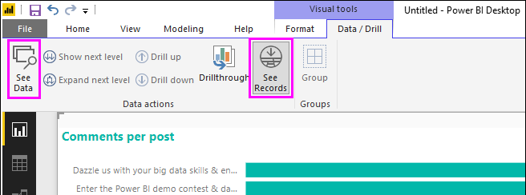
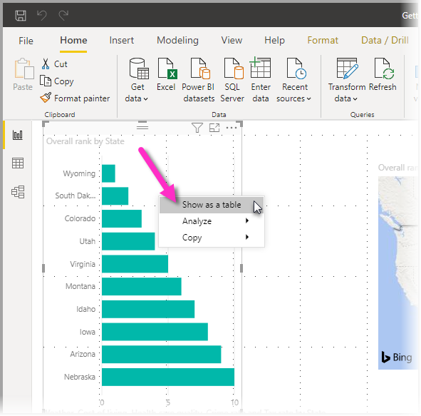
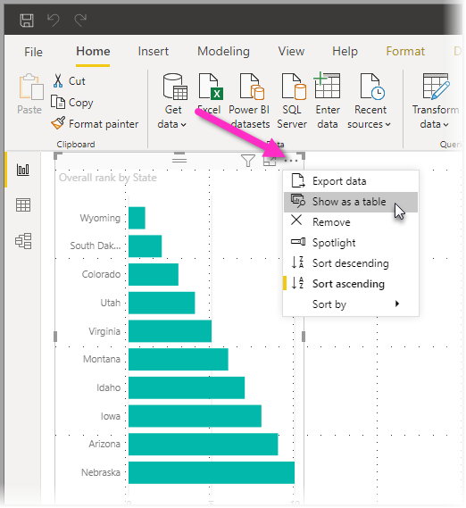
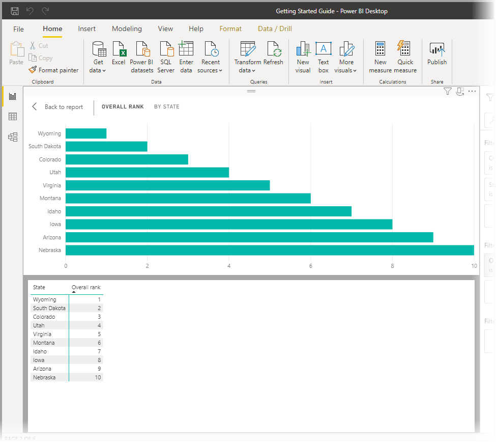
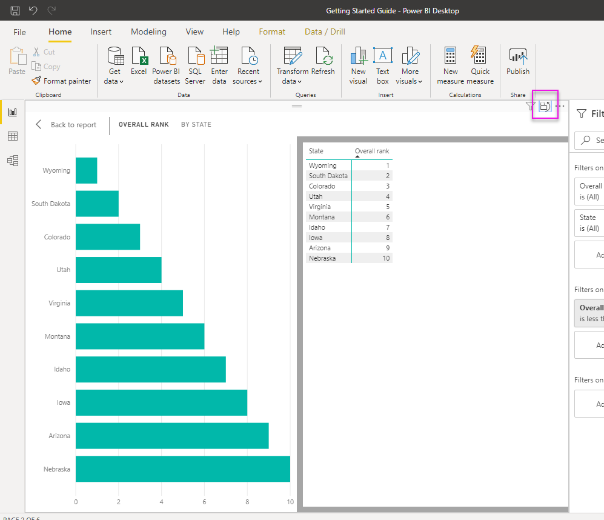
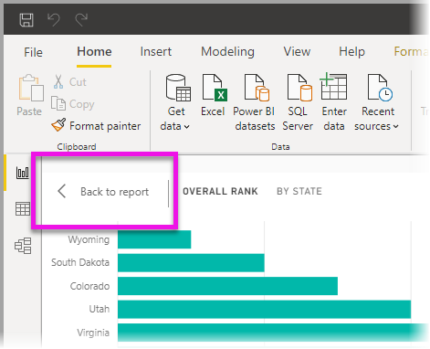
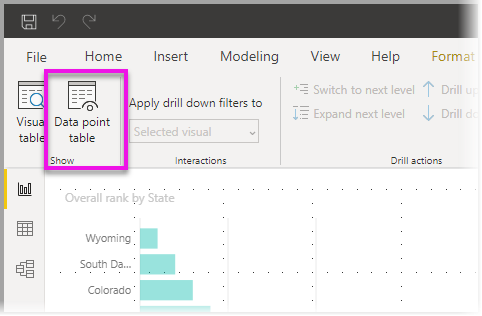
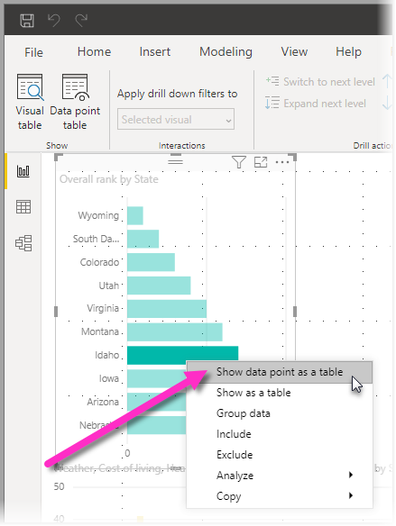
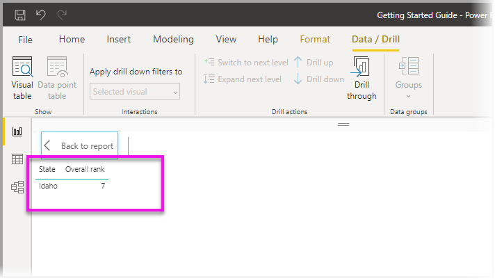

# Use Visual table and Data point table in Power BI Desktop
In **Power BI Desktop** you can drill into the details of a visualization, and see textual representations of the underlying data or the individual data records for the selected visual. These features are sometimes referred to as *click-through*, *drillthrough*, or *drillthrough to details*.

You can use **Visual table** to view the data in a visual as a table, or use **Data point table** to view a table of the data used to calculate a single data point. 

>[!IMPORTANT]
>**Visual table** and **Data point table** support only the following visualization types:
>  - Bar chart
>  - Column chart
>  - Donut chart
>  - Filled map
>  - Funnel
>  - Map
>  - Pie chart
>  - Treemap

## Use Visual table in Power BI Desktop

**Visual table** shows you the data underlying a visualization. **Visual table** appears in the **Data/Drill** tab in the ribbon when a visual is selected.

You can also see the data by right-clicking on a visualization, and then selecting **Show as a table** from the menu that appears; or by selecting **More options** (...) in the upper-right corner of a visualization, and then selecting **Show as a table**.

&nbsp;&nbsp;

> [!NOTE]
> You must be hovering over a data point in the visual for the right-click menu to be available.

When you select **Visual table** or **Data point table**, the Power BI Desktop canvas displays both the visual and the textual representation of the data. In the *horizontal view*, the visual is displayed on the top half of the canvas, and the data is shown on the bottom half. 

You can toggle between the horizontal view and a *vertical view* by selecting the icon in the upper-right corner of the canvas.

To get back to the report, select **< Back to Report** in the upper-left corner of the canvas.

## Use Data point table in Power BI Desktop

You can also focus on one data record in a visualization, and drill into the data behind it. To use **Data point table**, select a visualization, then select **Data point table** in the **Data/Drill** tab of the ribbon, and then select a data point or row on the visualization. 

> [!NOTE]
> If the **Data point table** button in the ribbon is disabled and grayed-out, it means the selected visualization does not support **Data point table**.

You can also right-click a data element and select **Show data point as a table** from the menu that appears.

When you select **Data point table** for a data element, the Power BI Desktop canvas displays all the data associated with the selected element. 

To get back to the report, select **< Back to Report** in the upper-left corner of the canvas.

> [!NOTE]
>**Data point table** has the following limitations:
> - You can't change the data in the **Data point table** view and save it back to the report.
> - You can't use **Data point table** when your visual uses a calculated measure in a (multidimensional) measure group.
> - You can't use **Data point table** when you are connected to a live multidimensional (MD) model.

## Next steps
There are all sorts of report formatting and data management features in **Power BI Desktop**. Check out the following resources for a few examples:

* [Use grouping and binning in Power BI Desktop](desktop-grouping-and-binning.md)
* [Use gridlines, snap-to-grid, z-order, alignment and distribution in Power BI Desktop reports](desktop-gridlines-snap-to-grid.md)

