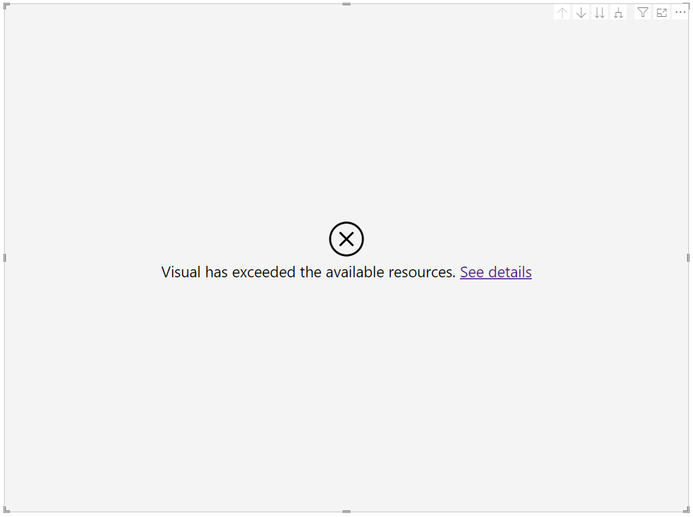
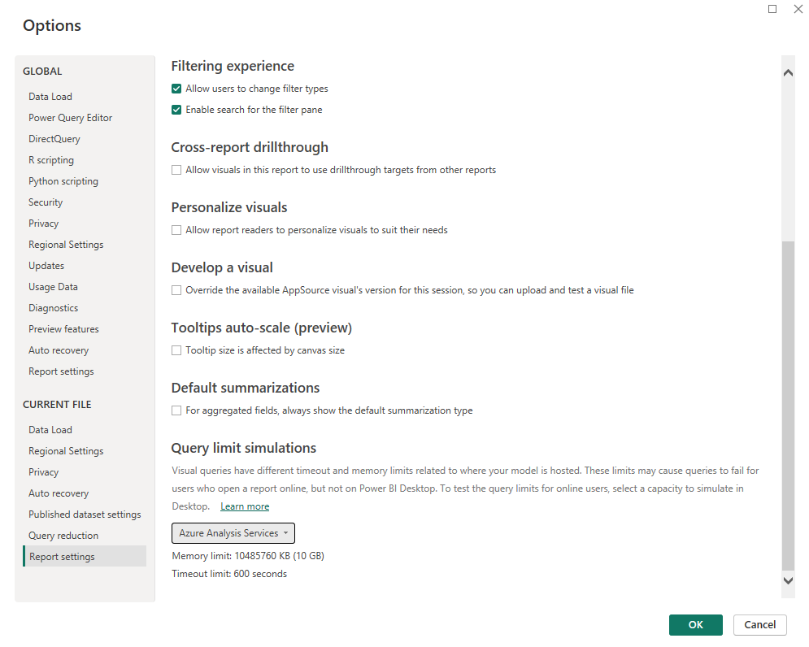

# Set visual query limits in Power BI Desktop

[!INCLUDE [applies-yes-desktop-no-service](../includes/applies-yes-desktop-no-service.md)]

When you load a report page or make changes to the fields in a visual, that visual sends a query to your report's data source. Processing these queries requires both time and computer memory. To prevent any single query from consuming too many resources, queries in published reports are subject to limits on the time a query can run (timeouts) and the amount of memory that query can use (memory limits). These limits may change based on where your data is hosted.

The following table shows the timeouts and memory limits applied by different capacities.

| Capacity | Timeout | Memory limit |
| -------- | ------- | ------------ |
| Shared | 225 seconds | 1,048,576 KB (1 GB) | 
| Premium | 225 seconds | 10,485,760 KB (10 GB) | 
| SQL Server Analysis Services | 600 seconds | 1,048,576 KB (1 GB) | 
| Azure Analysis Services | 600 seconds | 10,485,760 KB (10 GB) | 

If a visual sends a query that reaches one of the limits applied by the hosting capacity, that visual then displays an error. 

Power BI Desktop does not naturally apply any of these limits to local models. However, you can use query limit simulations to test any limits that may be applied to your report after you publish it. 

## Apply query limits in the Options menu

1. Select **File** > **Options and settings** > **Options**
2. Under **Current file**, select **Report settings**.
3. Scroll to the **Query limit simulations** section. 
   
4. Using the dropdown menu, select a capacity to simulate. You can choose from:
   - Auto (recommended)
   - Shared capacity
   - Premium capacity
   - SQL Server Analysis Services
   - Azure Analysis Services
   - Custom limits
   - No query limits

By default, new reports have "auto (recommended)" selected. With auto limits, Power BI will do its best to identify where the model is hosted and apply those limits. Otherwise, it will default to the Shared capacity limits to ensure that queries which complete on Desktop will complete for published reports, regardless of where the report's data ends up hosted. Below the dropdown, you can see the exact timeout and memory limits currently being applied for the chosen capacity. 

If you choose to apply custom limits, enter specific timeout and memory limits in the input field. When you set your own limits, you can use "0" to indicate "no limits." 

## Considerations and troubleshooting

- Reports created before this feature was available are set to "no query limits."  If a visual or report seems to be working without error on Power BI Desktop, but other users are running into errors trying to view the published report, consider applying query limits as described in this article.
- Limits defined using this report setting apply to all queries sent from the report view. Queries sent from the data or model views will not be affected.
- With live connected reports, you may notice visuals erroring before they reach query limits you set. This might occur if the external Analysis Services engine to which your report is live connected has its own stricter query limits. Even when Power BI Desktop applies query limits through the report setting described in this article, queries will still be subject to any other limits imposed by the data source. 
