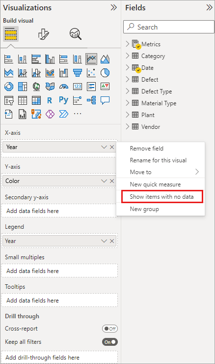
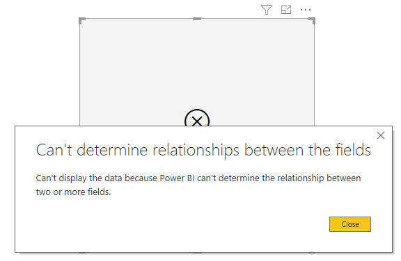
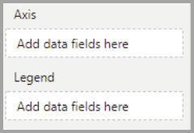
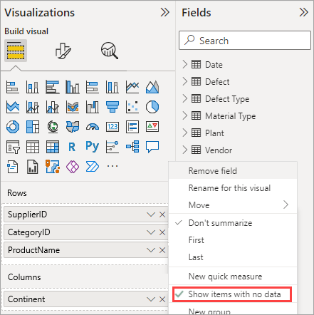
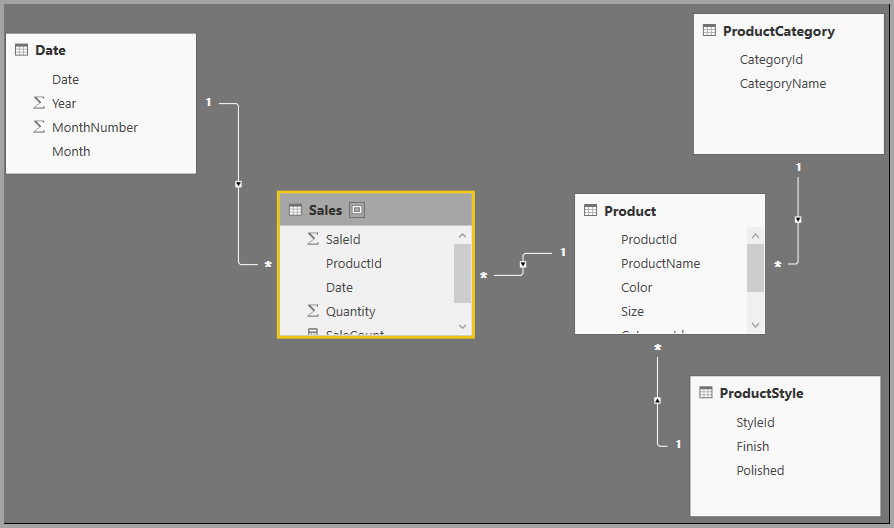

# Show items with no data in Power BI

[!INCLUDE [applies-yes-desktop-yes-service](../includes/applies-yes-desktop-yes-service.md)]

Power BI lets you visualize data from various sources. When you create a visual, Power BI only shows relevant data to properly manage how data is presented and displayed. Power BI determines which data is relevant based on the configuration of the visual and the underlying data model. This article describes how Power BI behaves when determining relevant data. We've also included examples that show how determinations are made.

## Determining relevant data

To illustrate how Power BI determines which data is relevant to display, let's look at a table as a simple example. Using the model represented in the [example data model](#example-data-model) section, found at the end of this article, consider a table built with the following settings:

**1. Groups from the same table:** *Product[Color] - Product[Size]*

|*Product[Color]*  |*Product[Size]*  |
|---------|---------|
|Blue     |Large         |
|Blue     |Medium         |
|Blue     |Small         |
|Red     |Large         |

In this example, Power BI displays the combinations of *[Color-Size]* that exist in the table *[Product]*.

Now let's look at a different combination:

**2. Groups from different but directly related tables and a measure:** *ProductStyle[Finish] - Product[Color] - Sum(Sales[Quantity])*

|*ProductStyle[Finish]*  |*Product[Color]* |*Sum(Sales[Quantity])*  |
|---------|---------|---------|
|Gloss     |Blue         |10         |
|Matte     |Blue         |15         |

In this example, Power BI displays only combinations that exist. Combinations that don't exist in the model, such as ("None" + "Blue") or ("Matte" + "Red") won't be displayed. The condition that determines which combinations exist is the value for *Sum(Sales[Quantity])* not being blank.

Let's look at a different case:

**3. Groups from different but related tables and no measure:** *ProductStyle[Finish] - Product[Color]*

|*ProductStyle[Finish]*  |*Product[Color]*  |
|---------|---------|
|Gloss     |Blue         |
|Gloss     |Red         |
|Matte     |Blue         |

Because there's no explicit measure and the two tables are directly related, Power BI attempts to inject a measure to constrain the resulting combinations. In this case, Power BI injects a `CALCULATE(COUNTROWS('Product'))` measure, which shouldn't be blank, since *Product* is what is common to both tables.

In this case, Power BI displays the combinations that have entries in the Product table, which excludes the combinations of *("None" + "Blue")* and *("Matte" + "Red")*.

**4. Groups from different and unrelated tables**

The sample model doesn't include this combination, but if there are groups from different and unrelated tables, Power BI can't relate two columns. The result would be a cross join of all the values of each column. In that situation, Power BI issues an error of the type *unconstrained join* because such cross joins are expensive to compute in the database, and they don't provide much information to a user.

## Showing items with no data

The previous section describes how Power BI determines which data is relevant to display. However, there may be times when you *want* to show items with no data.

The **Show items with no data** feature lets you include data rows and columns that don't contain measure data (blank measure values).

To enable the **Show items with no data** feature, follow these steps:

1. Select a visual.
1. In the **Values** fields well, right-click the field and select **Show items with no data** from the menu that appears, as shown in the following image:

The **Show items with no data** feature doesn't have any effect in the following circumstances:

* There's no measure added to the visual, and the grouping columns come from the same table.
* Groups are unrelated. Power BI doesn't run queries for visuals that have unrelated groups.
* The measure is unrelated to any of the groups. In this case, the measure will never be blank for only some group combinations.
* There's a user-defined measure filter that excludes blank measures. For example: *SalesAmount > 0*

>[!CAUTION]
>Enabling the option to show items with no data may negatively affect performance and can cause slow rendering of visuals or a time-out of data export.

### How Show items with no data works

The most interesting uses of **Show items with no data** are when measures are present. Consider the situation when the groups are from the same table or can be related through a path in the model. For example, *ProductStyle* is directly related to *Product* and indirectly related to *Sales*. *ProductStyle* and *ProductCategory* can be related through the *Product* table.

Let's look at a couple interesting cases and compare when **Show items with no data** is off and then on.

**1. Grouping columns from the same table:** *Product[Color] - Product[Size] - Sum(Sales[Quantity])*

How it appears when the **Show items with no data** feature is off:

|*Product[Color]*  |*Product[Size]* |*Sum(Sales[Quantity])*  |
|---------|---------|---------|
|Blue     |Medium         |15         |
|Blue     |Small         |10         |

How it appears when the **Show items with no data** feature is on:

|*Product[Color]*  |*Product[Size]*  |*Sum(Sales[Quantity])*  |
|---------|---------|---------|
|Blue     |Large         |         |
|Blue     |Medium         |15         |
|Blue     |Small         |10         |
|Red     |Large         |         |

Notice how two new combinations show up with the feature turned on: *Blue - Large* and *Red - Large*. Both of those entries have no corresponding *Quantity* in the *Sales* table. However, they show up in the *Product* table.

**2. Grouping columns from related tables:** **ProductStyle[Finish] - Product[Color] - Sum(Sales[Quantity])**

How it appears when the **Show items with no data** feature is off:

|*ProductStyle[Finish]*  |*Product[Color]*  |*Sum(Sales[Quantity])*  |
|---------|---------|---------|
|Gloss     |Blue         |10         |
|Matte     |Blue         |15         |

How it appears when the **Show items with no data** feature is on:

|*ProductStyle[Finish]*  |*Product[Color]*  |*Sum(Sales[Quantity])*  |
|---------|---------|---------|
|Gloss     |Blue         |10         |
|Gloss     |Red         |         |
|Matte     |Blue         |15         |
|None     |         |         |

Notice how **Gloss-Red** and **None, blank** appear as combinations. Here's why they appeared:

* Power BI first considers **ProductStyle[Finish]** and selects all the values to display, which results in *Gloss*, *Matte*, *None*.
* Using each of these values, Power BI selects all the corresponding **Product[Color]** entries.
* *None* doesn't correspond to any **Product[Color]**, so a blank appears for that value.

It's important to note that the mechanism of selecting values for the columns is order-dependent, and can be thought of as a **Left outer join** operation between tables. If the order of the columns is changed, the results change as well.

Now look at an example of changing the order, and how it impacts results. This example is the same as the second item in this section, with the ordering changed.

**Product[Color] - ProductStyle[Finish] - Sum(Sales[Quantity])**

This is how it appears with **Show items with no data** feature on:

|*Product[Color]* |*ProductStyle[Finish]*  |*Sum(Sales[Quantity])*  |
|---------|---------|---------|
|Blue     |Gloss         |10         |
|Blue     |Matte         |15         |
|Red     |Gloss         |         |

Notice how *ProductStyle[Finish]=None* doesn't appear in the table. In this case, Power BI first selects all the *Color* values in the *Product* table. Then, for each color, Power BI selects the corresponding *Finish* values that contain data. Since *None* doesn't show up in any combination of *Color*, it's not selected.

## Power BI visual behavior

When **Show items with no data** is enabled on one field in a visual, the feature is automatically enabled for all other fields that are in that same *visual bucket* or hierarchy. A visual bucket or hierarchy can be its **Axis** or **Legend**, or **Category**, **Rows**, or **Columns**.

For example, on a matrix visual with four fields in the **Rows** bucket, if one field has **Show items with no data** enabled, then all items in the matrix have it enabled. In the following image, the **Show items with no data** is enabled on the first field in the **Rows** bucket, the *SupplierID* field. The other fields in the **Rows** bucket also have it automatically enabled.

In contrast, the *Continent* field shown in the **Columns** bucket doesn't have **Show items with no data** automatically enabled.

This visual behavior is often seen if a visual is converted to a different type, such as converting a matrix visual to a table visual. In such conversions, the **Show items with no data** is automatically enabled for any field moved to a bucket where a field in that bucket has the feature enabled. In the previous example, if *SupplierID* has the **Show items with no data** feature enabled and the visual is converted to a table, the *Continent* field from the **Columns** bucket is moved (along with the fields in the **Rows** bucket) into the only bucket used in a table visual, the **Values** bucket. As a result, all fields in the **Values** bucket then have **Show items with no data** enabled.

### Exporting data

When you use the **Export summarized data** feature, the behavior of the **Show items with no data** feature is the same as if the export were converted to a table visual. As such, when you export a visual such as a chart matrix visual, the exported data may appear differently than the visual that's displayed. This behavior results because the conversion to a table visual, as part of the export process, enables **Show items with no data** for all fields being exported.

## Example data model

This section shows the sample data model used in the examples in this article.

**Model**:

**Data**:

|Product[ProductId]|	Product[ProductName]|	Product[Color]|	Product[Size]|	Product[CategoryId]|	Product[StyleId]|
|---------|---------|---------|---------|---------|---------|
|1	|Prod1	|Blue	|Small	|1	|1 |
|2	|Prod2	|Blue	|Medium	|2	|2 |
|3	|Prod3	|Red	|Large	|1	|1 |
|4	|Prod4	|Blue	|Large	|2	|2 |

|ProductCategory[CategoryId]|	ProductCategory[CategoryName]|
|---------|---------|
|1	|Phone   |
|2	|Camera |
|3	|TV |

|ProductStyle[StyleId]|	ProductStyle[Finish]|	ProductStyle[Polished]|
|---------|---------|---------|
|1	|Gloss	|Yes |
|2	|Matte	|No |
|3	|None	|No |

|Sales[SaleId]|	Sales[ProductId]|	Sales[Date]|	Sales[Quantity]|
|---------|---------|---------|---------|
|1	|1	|1/1/2012 0:00|	10 |
|2	|2	|1/1/2013 0:00|	15 |

## Related content

This article described how you can enable the **Show items with no data** feature in Power BI. You might also be interested in the following articles:

* [Default member in multidimensional models in Power BI](../connect-data/desktop-default-member-multidimensional-models.md)
