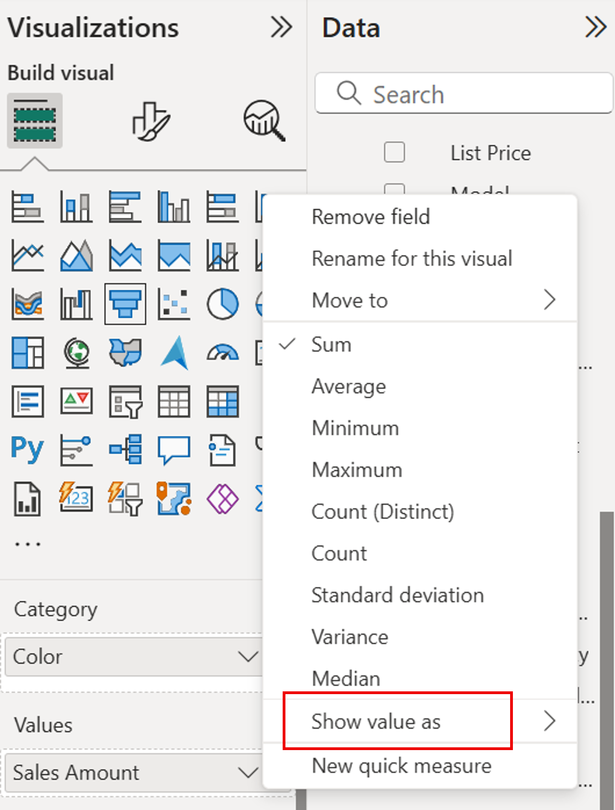
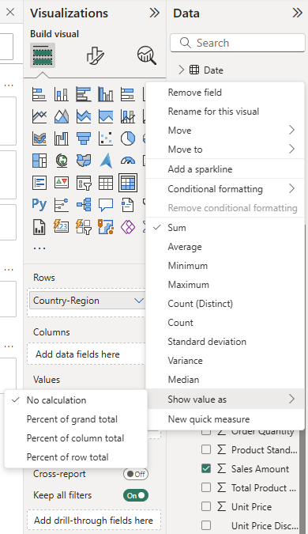
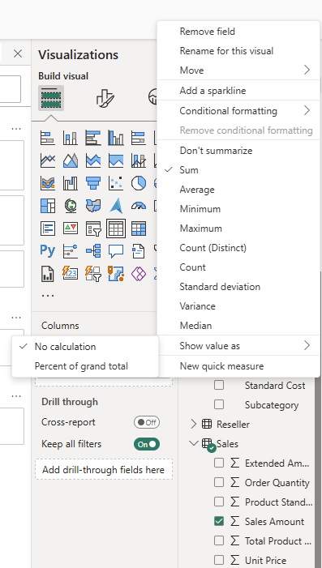
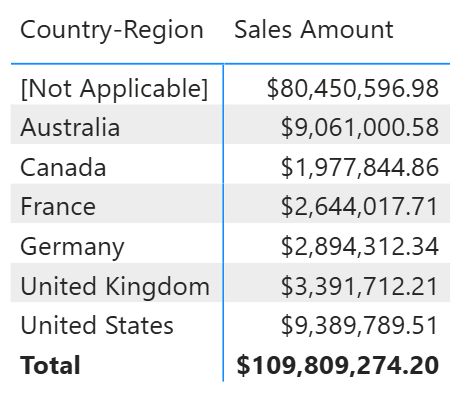
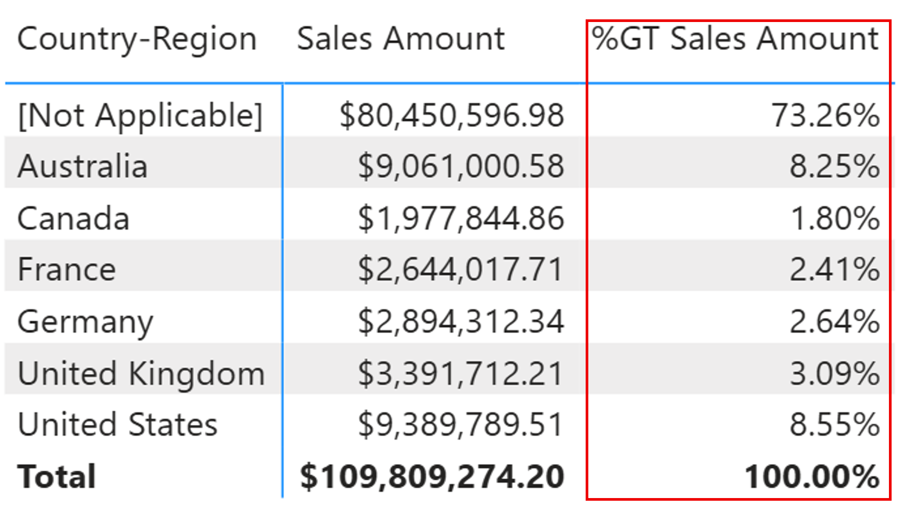
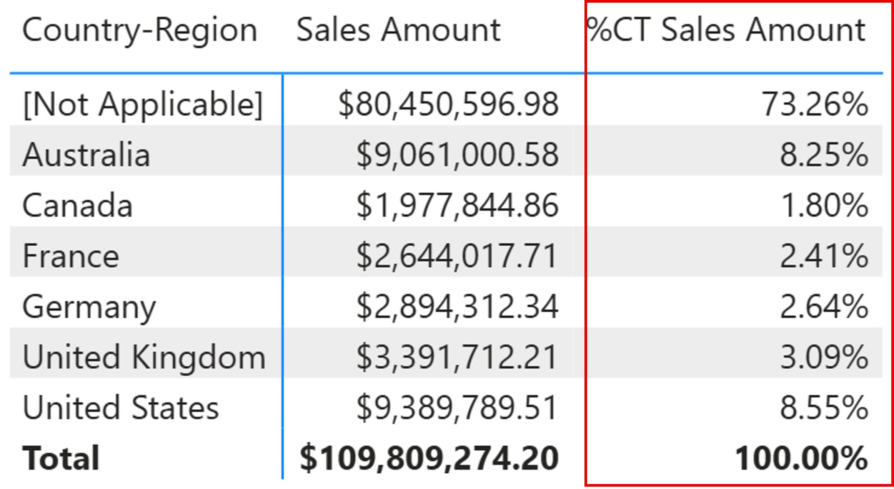
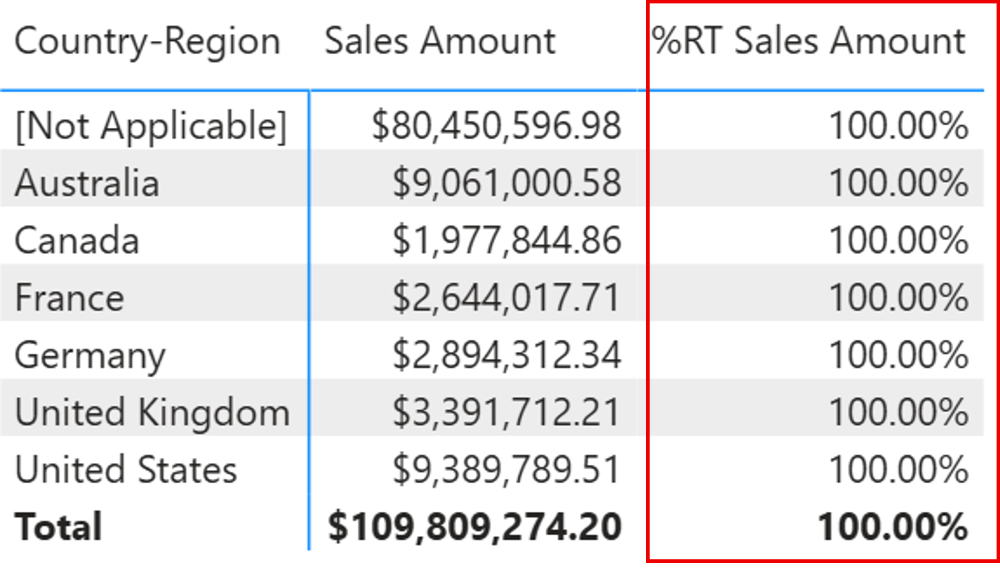
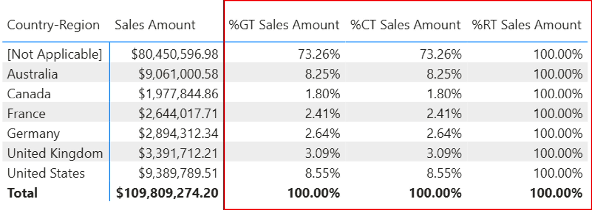
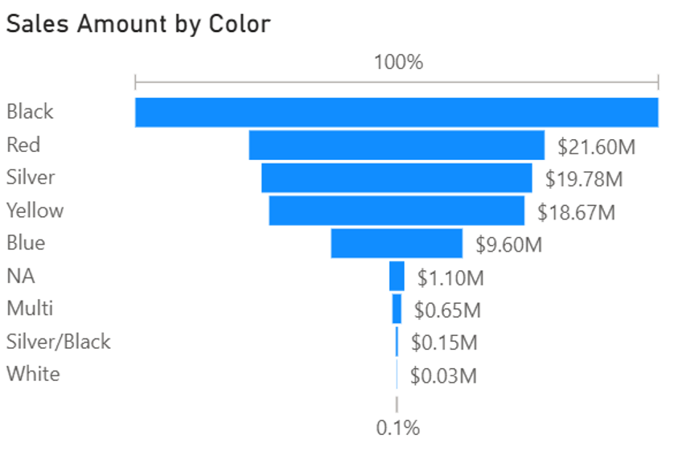
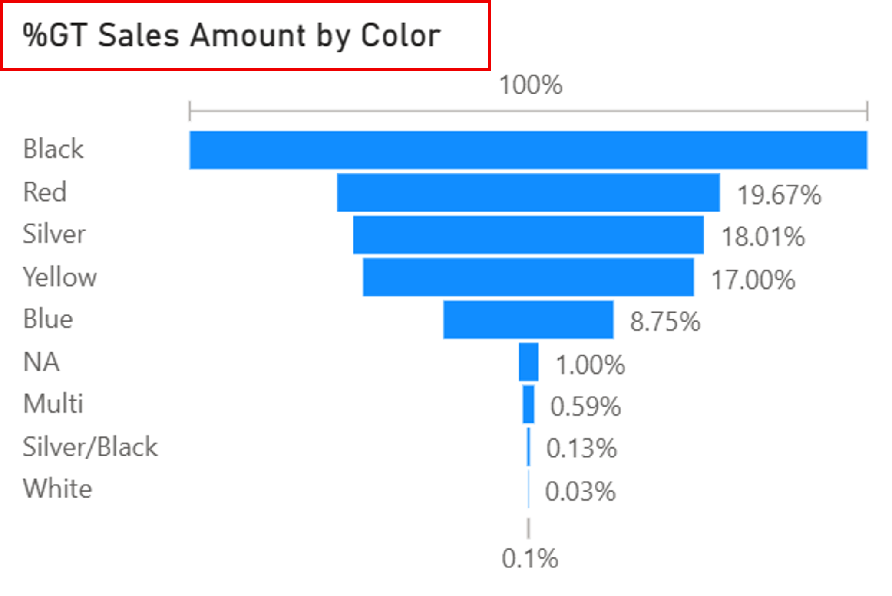

# Show value as in Power BI

The Show value as feature in Power BI lets you display your data as percentages of totals, such as percent of grand total, row total or column total, instead of just raw values. This can help provide context for values in visuals and is particularly useful when creating executive dashboards, performance reports, or comparative views.

This feature is available in the context menu for numerical values or fields placed in the Values of matrix, table or chart visualizations.

## Access the "Show value as" menu

To apply "Show value as" to a measure in a Matrix:
  1. Add a **Matrix visual** to your report.
  1. Drag a numeric field (for example, Sales) into the **Values** section.
  1. Select the dropdown arrow within the field.
  1. Hover over **Show value as**.
  1. Select from options:
		- No calculation
  		- Percent of grand total
		- (Matrix only) Percent of column total
		- (Matrix only) Percent of row total

Matrix options:

Table options:

## Show value as options
The following table describes each option in the **Show value as** menu:

|**Option**  |**Description**  |
|---------|---------|
|No calculation     |Displays the raw value (default behavior).         |
|Percent of grand total     |Displays each value as a percentage of the total value of all cells.         |
|Percent of column total     |Displays each value as a percentage of the total for its column (available for Matrix only).         |
|Percent of row total     |Displays each value as a percentage of the total for its row (available for Matrix only).        |

## Example of Matrix Visualizaiton

Let’s use the AdventureWorks DW 2020 dataset and build a Matrix with Country-Region from the Customer table in Rows, and Sales Amount from the Sales table to Values. Then, we’ll apply various "Show value as" options to compare results.

### Original Matrix

### Show value as → Percent of grand total

### Show value as → Percent of column total (Matrix only)

### Show value as → Percent of row total (Matrix only)

> [!Tip]
> You can add the same measure multiple times to the Values area and apply a different “Show value as” option to each one. This allows for side-by-side comparisons.

## Example Funnel Visualization

Let’s use the AdventureWorks DW 2020 dataset and build a Funnel visualization with Color from the Product table in Category, and Sales Amount from the Sales table in Values. Then, we’ll apply various "Show value as" options to compare results.

### Original Funnel

### Show value as → Percent of grand total

## Considerations

Use this feature when:
- You need to display **percent contributions** across categories.
- You want to **compare performance** between rows or columns.
- You are creating **executive summaries** that prioritize percentages over raw numbers.

## Related content

This article described how you can enable the **Show value as** feature in Power BI. You might also be interested in the following articles:

* [Use quick measures for common calculations](../transform-model/desktop-quick-measures.md)
