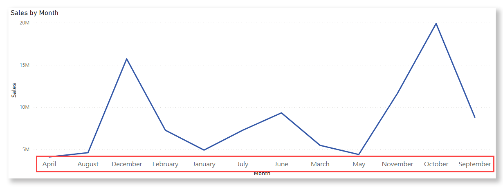
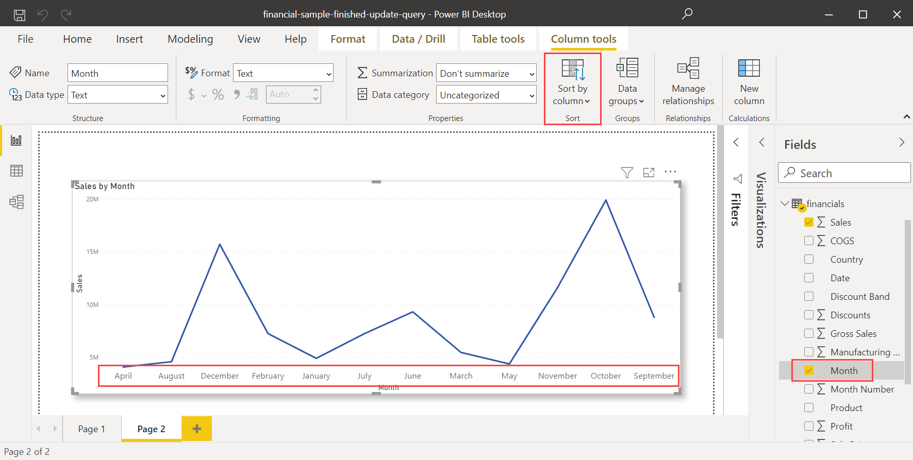
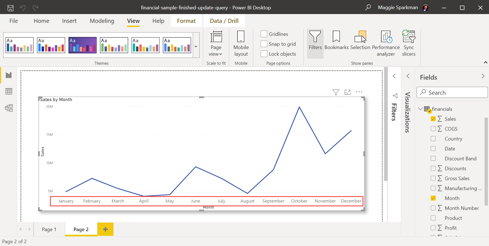

# Sort one column by another column in Power BI Desktop

When you're editing a report in Power BI Desktop, you can choose a column to define the sort order of another column by setting the **Sort by column**.

Here's a common example. You have a Month Name column, and when you add it to a visual, the months are being sorted alphabetically: April, August, December, February, and so on. Not ideal. You want them to be sorted chronologically. This article shows how to set the sort order of one column by a different column.

> [!NOTE]
> When you're reading a report, you can also change how the values in a visual are sorted. See [Change how a chart is sorted in a Power BI report](../consumer/end-user-change-sort.md) for details.

## Set the Sort by column

To set a different column to sort by, both columns need to be at the same level of granularity. For example, to sort a column of month *names*, you need a column that contains a *number* for each month. The sort order will apply to any visual in the report that contains the sorted column. In the following example, the months are being sorted alphabetically, but we want them to be sorted chronologically.

1. Select the column that you want to sort, in our case, **Month**. Note that the months in the visual are sorted alphabetically. In the **Fields** pane, the **Column tools** tab becomes active.
   
    

1. Select **Sort by Column**, then select the field you want to sort the other field by, in this case, **Month Number**.

    

1. The visual automatically sorts in the order we want: chronologically by the order of months in a year.

    

<!---
This functionality is no longer active.

## Getting back to default column for sorting
You can sort by any column you'd like, but there may be times when you want the visual to return to its default sorting column. No problem. For a visual that has a sort column selected, open the **More options** menu and select that column again, and the visualization returns to its default sort column.

For example, here's our previous chart:

When we go back to the menu and select **SalesQuantity** again, the visual defaults to being ordered alphabetically by **Manufacturer**, as shown in the following image.

With so many options for sorting your visuals, creating just the chart or image you want is easy.
--->

## Next steps

You might also be interested in the following articles:

* [Change how a chart is sorted in a Power BI report](../consumer/end-user-change-sort.md)
* [Use cross-report drillthrough in Power BI Desktop](desktop-cross-report-drill-through.md)
* [Slicers in Power BI](../visuals/power-bi-visualization-slicers.md)
