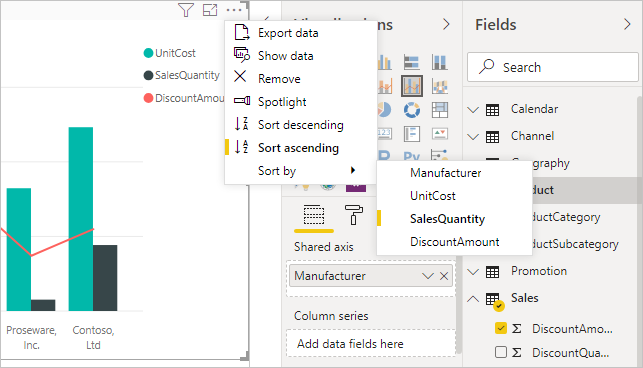
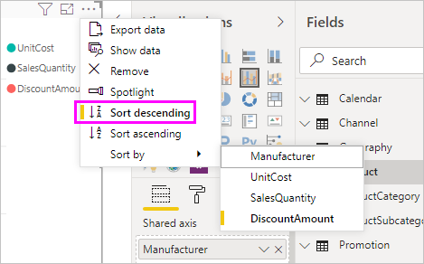
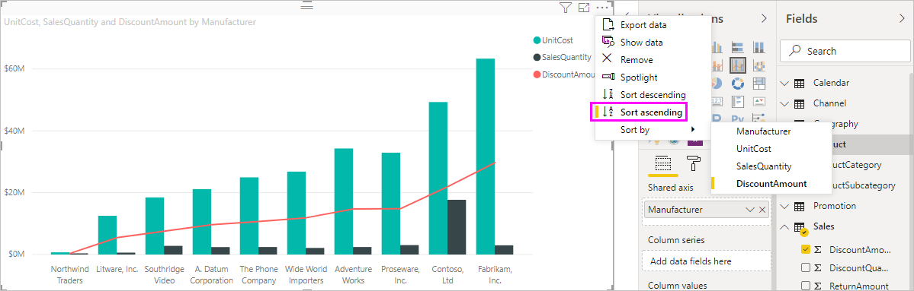
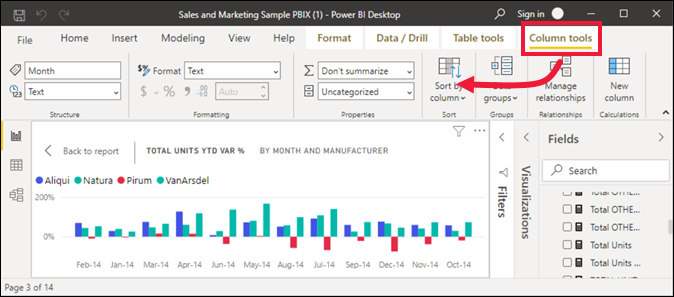
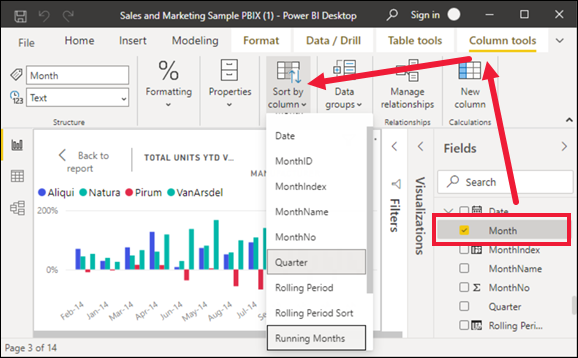
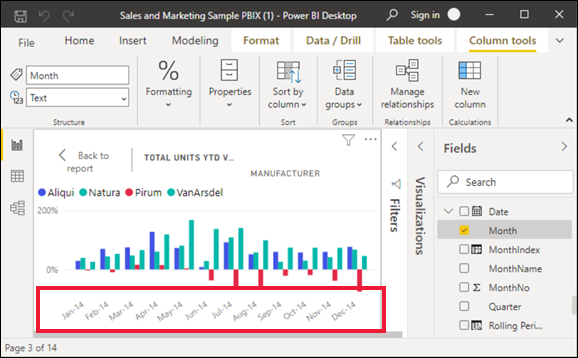

# Sort by column in Power BI Desktop
In Power BI Desktop and the Power BI service, you can change how a visual looks by sorting it by different data fields. By changing how you sort a visual, you can highlight the information you want to convey, and ensure the visual reflects that trend (or emphasis).

Whether you're using numeric data (such as sales figures) or text data (such as state names), you can sort your visualizations, and make them look like you want them to. Power BI provides much flexibility for sorting, and quick menus for you to use. To sort any visual, select its **More options** (...) menu, select **Sort by**, and then select the field by which you want to sort.

## Sorting example
Let's use an example that has more depth, and see how it works in Power BI Desktop.

The following visualization shows costs, quantities, and amounts by manufacturer name. Here's the visualization as it looks before we do any further sorting:

The visual is currently sorted by the **SalesQuantity** column. We can determine the sort column by matching the color of the ascending bars to the legend, but there's a better way: the **More options** menu, which you access by selecting the ellipses (...).

The sorting selections are as follows:

* The current sorting field is **SalesQuantity**, indicated by **SalesQuantity** in bold preceded by a yellow bar. 

* The current sorting direction is ascending, as shown by **Sort ascending** in bold preceded by a yellow bar.

We'll look at the sorting field and sorting direction in the next two sections.

## Select which column to use for sorting
You noticed the yellow bar preceding **SalesQuantity** in the **More options** menu, which indicates that the visual is sorted by the **SalesQuantity** column. Sorting by another column is easy: select the ellipses (...) to show the **More options** menu, select **Sort by**, and then select a different column.

In the following image, we select **DiscountAmount** as the column by which we want to sort. That column appears as one of the lines on the visual, rather than one of the bars. 

Notice how the visual has changed. The values now are ordered from the highest **DiscountAmount** value, Fabrikam Inc., down to the lowest, Northwind Traders. 

But what if we want to sort ascending, instead of descending? The next section shows how easy that is to do.

## Select the sort order
When we take a closer look at the **More options** menu from the previous image, we see that **Sort descending** is in bold preceded by a yellow bar.

When **Sort descending** is selected, it means the visual is being sorted by the selected column in order of greatest value to smallest value. Want to change that? No problem, just select **Sort ascending** and the sort order of the selected column changes from smallest to greatest value.

Here's our same visual, after changing the ordering of **DiscountAmount**. Notice that Northwind Traders is now the first manufacturer listed, and Fabrikam Inc. is the last; the opposite sorting from before.

You can sort by any column included in the visual; we could have easily selected **SalesQuantity** as the column by which we want to sort, to show the manufacturers with the most sales first, and still retain the other columns in the visual as they apply to that manufacturer. Here's a look at the visual with those settings:

## Sort using the Sort by Column button
There's another way to sort your data, by using **Sort by Column** in the **Column tools** tab.

This approach to sorting requires that you first select the column (field) to sort from the **Fields** pane, and then select **Column tools** > **Sort by Column** to sort your visual. If you don't select a column from the **Fields** pane first, the **Sort by Column** button is inactive.

Let's look at a common example. You have data from each month of the year, and it's currently sorted by quarter. You want to sort it based on chronological order. The following steps show you how:

1. When we select the column by which we want to sort, in the **Fields** pane, the **Column tools** tab becomes active. In this example we see that the visual is being sorted on the **Month** field by **Quarter**.
   
       
3. Now, with the visual selected, we can select **MonthNo**, and the visual sorts in the order we want: chronologically by the month of the year.
   
   

<!---
This functionality is no longer active.

## Getting back to default column for sorting
You can sort by any column you'd like, but there may be times when you want the visual to return to its default sorting column. No problem. For a visual that has a sort column selected, open the **More options** menu and select that column again, and the visualization returns to its default sort column.

For example, here's our previous chart:

When we go back to the menu and select **SalesQuantity** again, the visual defaults to being ordered alphabetically by **Manufacturer**, as shown in the following image.

With so many options for sorting your visuals, creating just the chart or image you want is easy.
--->

## Next steps

You might also be interested in the following articles:

* [Use cross-report drillthrough in Power BI Desktop](desktop-cross-report-drill-through.md)
* [Slicers in Power BI](../visuals/power-bi-visualization-slicers.md)
