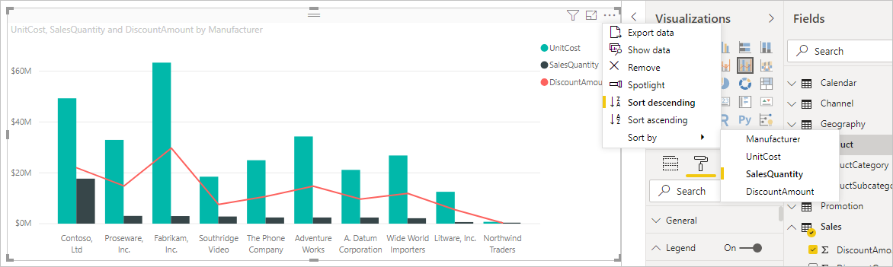
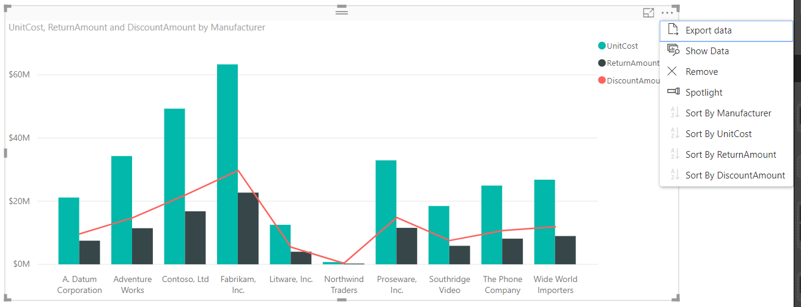

# Sort one column by another column in Power BI

[!INCLUDE [applies-yes-desktop-yes-service](../includes/applies-yes-desktop-yes-service.md)]

When you edit a report in Power BI, you can choose a column to define the sort order of another column.
Here's a common example. You have a Month Name column, and when you add it to a visual, the months are sorted alphabetically: April, August, December, February. However, you want them sorted chronologically. This article shows how to set the sort order of one column by a different column, in Power BI Desktop or in the Power BI service. It also provides troubleshooting guidance for common sort by column errors.

:::image type="content" source="media/desktop-sort-by-column/power-bi-alphabetical-sort-chart.png" alt-text="Screenshot showing a line chart with months sorted alphabetically.":::

> [!NOTE]
> When you're reading a report, you can also change how the values in a visual are sorted. See [Change how a chart is sorted in a Power BI report](../explore-reports/end-user-change-sort.md) for details.

## Set the column to use for sorting

To set a different column for sorting in Power BI Desktop, both columns need to be at the same level of granularity. For example, to sort a column of month names correctly, you need a column that contains a number for each month. The sort order applies to any visual in the report that contains the sorted column. In the following example, the months are sorted alphabetically, but they should be sorted chronologically.

> [!IMPORTANT]
> You must be in **Report view** to access the **Column tools** tab. If you're in Model view or Table view, switch to Report view first by selecting the Report view icon in the left navigation.

1. In **Report view**, select the column that you want to sort, in this case, **Month**. You can select the column from the **Data** pane or from a visual on the canvas. Months in the visual are sorted alphabetically. When you select a column, the **Column tools** tab appears in the ribbon.

   :::image type="content" source="media/desktop-sort-by-column/power-bi-alphabetical-sort.png" alt-text="Screenshot showing the Column tools tab where you select Sort by Column.":::

1. Select **Sort by Column**, and then select the field you want to sort the other field by, in this case, **Month Number**.

   :::image type="content" source="media/desktop-sort-by-column/power-bi-new-sort.png" alt-text="Screenshot showing the Sort by Column menu where you select Month Number.":::

1. The visual automatically sorts chronologically by the order of months in a year.

   :::image type="content" source="media/desktop-sort-by-column/power-bi-chronological-sort.png" alt-text="Screenshot showing a line chart with months sorted chronologically.":::

## Set a different column to sort

To set a different column to sort by in the Power BI service, both columns need to be at the same level of granularity. For example, to sort a column of month *names*, you need a column that contains a *number* for each month. In the following example, the months are sorted alphabetically, but they should be sorted chronologically.

1. On the canvas, select the visual. Then locate the **Month Number** field in the **Fields** pane.

   :::image type="content" source="media/desktop-sort-by-column/service-month-number-field.png" alt-text="Screenshot showing the Month Number field in the Fields pane.":::

1. In the **Visualizations** pane, in the **Fields** section, locate the **Tooltip** fields bucket.

   :::image type="content" source="media/desktop-sort-by-column/service-tooltips-fields-bucket.png" alt-text="Screenshot showing the Tooltip fields bucket in the Visualizations pane.":::

1. Drag the **Month Number** field from the **Fields** pane to the **Tooltip** fields bucket in the **Visualization** pane.

   :::image type="content" source="media/desktop-sort-by-column/service-drag-month-number.png" alt-text="Screenshot showing the Month Number field added to the Tooltip fields bucket.":::

1. In the upper-right corner of the visual, select **More options**. Select **Sort axis**, and then select **Month Number**.

   :::image type="content" source="media/desktop-sort-by-column/service-sort-month-number-ascending.png" alt-text="Screenshot showing the More options menu where you select Sort axis and then Month Number.":::

   Power BI sorts the visual chronologically by the order of months in a year.

   :::image type="content" source="media/desktop-sort-by-column/service-line-chart-month-number-sort.png" alt-text="Screenshot showing the line chart with months sorted chronologically.":::

1. The **Month Number** is now visible in the visual's default tooltip.

   :::image type="content" source="media/desktop-sort-by-column/service-line-chart-default-tooltip.png" alt-text="Screenshot showing the default tooltip with the Month Number value.":::

   If you don't want the tooltip to contain the **Month Number**, use a custom tooltip that doesn't include that value. To learn how to create a custom tooltip, see [Create tooltips based on report pages in Power BI Desktop](desktop-tooltips.md).

   :::image type="content" source="media/desktop-sort-by-column/service-line-chart-custom-tooltip.png" alt-text="Screenshot showing a custom tooltip without the Month Number value.":::

---

<!---
This functionality is no longer active.

## Getting back to default column for sorting
You can sort by any column you want, but you might want to return the visual to its default sorting column. For a visual that has a sort column selected, open the **More options** menu and select that column again. The visualization returns to its default sort column.

For example, here's the previous chart:

Go to the menu and select **SalesQuantity** again. The visual defaults to being ordered alphabetically by **Manufacturer**, as shown in the following image.

With so many options for sorting your visuals, creating just the chart or image you want is easy.
--->

## Troubleshooting sort by column

If you're having trouble setting or using sort by column, review these common problems and solutions.

### Sort by column option is disabled or unavailable

**Cause:** The column you're trying to sort might have dependencies that prevent sorting.

**Solution:**

- Verify you're in **Report view**, not Model view or Table view.
- Check that the column isn't already sorted by another column. Remove the existing sort first, then apply the new one.
- If the column is marked as a key column, its sort order is ignored and defaults are used.

### "Cannot use this column for sorting" error

**Cause:** The sort-by column contains duplicate values. Each value in the column you want to sort must have exactly one matching value in the sort-by column.

**Solution:**

1. Check for duplicate values in the sort-by column:
   - Select the sort-by column in the **Data** pane.
   - Review the column profile in the **Column tools** tab to check for duplicates.
   - Alternatively, in Power Query, use **View** > **Column quality** to see if there are duplicates.

1. Remove or fix duplicates:
   - If duplicates exist, you need a different column for sorting. For example, if sorting month names by month number, ensure each month name has only one month number (January = 1, not 1 and 01).
   - Use Power Query to create a unique identifier column if needed.

> [!NOTE]
> A common scenario is trying to use a numeric rank column that contains duplicate rank values. For example, if multiple products share the same rank (two products both ranked "1"), you can't use that rank column for sorting. The sort-by column must have unique values. Consider creating a unique sequential number instead, or use a different sorting approach for ties.

### Sort order doesn't work as expected

**Cause:** Data type mismatch or text values sorted as numbers.

**Solution:**

1. Verify data types match:
   - The sort-by column should typically be numeric, date, or text.
   - Select the sort-by column and check the **Data type** in the **Column tools** tab.
   - Common issue: Month numbers stored as text ("1", "2", "3") instead of whole numbers (1, 2, 3).

1. Convert data types if needed:
   - In Power Query, change the column type to the correct data type.
   - For example, convert text month numbers to whole numbers by selecting **Transform** > **Data Type** > **Whole Number**.

### Sort by column produces unexpected grouping

**Cause:** The sort-by column has a different granularity than the sorted column.

**Solution:**

- Both columns must be at the same level of detail. For example:
  - To sort **Month Name** (January, February), use **Month Number** (1, 2) at the same grain.
  - Don't try to sort **Month Name** by **Day Number** (different granularity).
- Each unique value in the sorted column must map to exactly one value in the sort-by column.

### Sort by column is reset or ignored

**Cause:** You changed the data model or column properties.

**Solution:**

- Check if the sort-by column still exists in the model.
- Verify you didn't remove the sort-by column from the data source.
- Reapply the sort by column setting if you refreshed or modified the model.

## Considerations

Keep these requirements in mind when using sort by column:

- Both columns must be at the same level of granularity.
- The sort-by column must contain unique values for each value in the sorted column.
- If you mark a column as a key column, its sort order is ignored and defaults are used.
  
## Related content

You might also be interested in the following articles:

- [Change how a chart is sorted in a Power BI report](../explore-reports/end-user-change-sort.md)
- [Use cross-report drillthrough in Power BI Desktop](desktop-drillthrough.md)
- [Slicers in Power BI](../visuals/power-bi-visualization-slicers.md)
