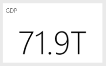

# Tips and tricks for creating reports in Power BI Desktop
To get the most out of your data, sometimes you need a little extra help. We’ve put together some tips & tricks you can use when creating reports in the Microsoft Power BI Desktop *and* in Microsoft Excel 2016, or Excel 2013 Pro-Plus editions with the Power Pivot add-in enabled and Power Query installed and enabled. 

## Learning to use the Query Editor
Query Editor in Power BI Desktop is similar to the Power Query add-in capability in Excel 2013. While there are several helpful articles in Power BI Support, you might also want to review the Power Query documentation on support.office.com to get started.

You can get additional information from the [Power Query Resource Center](https://support.office.com/article/Microsoft-Power-Query-for-Excel-Help-2b433a85-ddfb-420b-9cda-fe0e60b82a94).

You can also view the [Formula Reference](https://support.office.com/Article/Learn-about-Power-Query-formulas-6bc50988-022b-4799-a709-f8aafdee2b2f).

## Data types in Query Editor
When using Query Editor in Power BI Desktop to load data, we do a best guess data type detection. When using formulas, sometimes data type settings on columns are not preserved. Ensure the data type of columns are correct after doing the following operations:  Load data initially to the query tab, First Row as Header, Add column, Group by, Merge, Append, and before pressing loading the data for the first time.

One key thing to remember: italics in the data grid do not mean the data type is correctly set, it just means the data is not considered as Text.

## Reference queries in the Query Editor
In Query Editor's navigator in Power BI Desktop, when you right-click one of the queries, an option for "Reference" is available. This is useful for the following reason:

* When you use files as the data source for a query, the absolute path to the file is stored in the query. When sharing or moving Power BI Desktop file or Excel workbook, you'll save time when you update the paths by updating it just once rather than the paths.

By default all queries load to the data model. Some queries are intermediary steps and not intended for end users. When referencing queries as mentioned above, this is often the case. You can control query loading behavior by right-clicking the query in the navigator and toggling the "Enable Load" option. When *Enable Load* does not have a checkmark next to it, the query is still available in the query tab and you can use it with other queries. It is especially useful in combination with Merge, Append, and Reference transforms. However since the query results are not loaded to the data model, the query will not clutter your reports field list or your data model. 

## Scatter charts need a point identifier
Taking an example of a simple table of Temperatures and the Time the reading was taken. If you plot this directly on a scatter chart, Power BI aggregates all the values into a single point. To show individual data points, you must add a field to the Details bucket in the field well. A simple way to do this in Power BI Desktop is on the query tab by using the "Add index column" option on the "Add Column" ribbon. 

## Reference lines in your report
You can use a calculated column in Power BI Desktop to define a reference line. Identify the table and column on which you want to create a reference line. Select "New Column" in the ribbon and, in the formula bar, type the following formula:

```console
Target Value = 100
```

This calculated column will return the value 100 regardless of where it is used. Your new column will show up in the Field List. Add the Target Value calculated column to a line chart to show how any series relates to that specific reference line. 

## Sort by another column
When you use a categorical (string) value in Power BI for chart axes or in a slicer or filter, the default order is alphabetical. If you need to override this order, for example for things like days of the week or months, then you can tell Power BI Desktop to sort by a different column. To learn more, see [Sort by Column in Power BI Desktop](desktop-sort-by-column.md).

## Building maps more easily with hints to Bing
Power BI integrates with Bing to provide default map coordinates (a process called geo-coding) so it's easier for you to create maps. Bing uses some algorithms and hints to try to get the right location, but it's a best guess. To increase the likelihood of correct geo-coding, you can use the following tips:

When you create a map, you're often looking to plot countries/regions, states, and cities. In Power BI Desktop, if you name columns after the geographic designation it will help Bing guess what you're looking to display. For example, if you have a field of US state names such as "California" and "Washington", Bing might return the location of Washington, DC instead of Washington State for the word "Washington". Naming the column "State" will improve the geocoding. The same goes for columns named "Country" and "City". 

Some designations are ambiguous when considered in the context of multiple countries/regions. In some cases what one country/region considers a 'state' is treated as a 'province' or a 'county' or some other designation. You can increase the accuracy of geo-coding by building columns that append multiple fields together and use those for plotting data locations. An example would be instead of passing only "Wiltshire", you can pass "Wiltshire, England" to get a more accurate geo-coding result. 

You can always provide specific latitude and longitude locations in Power BI service or Desktop. When you do this, you'll also need to pass a Location field,  otherwise the data is aggregated by default, so the location of the latitude and longitude may not match what you expected.

## Categorizing geographic fields to hint Bing's geocoding
Another way to ensure fields are correctly geocoded is by setting the Data Category on the data fields. In Power BI Desktop, select the desired table, go to the Advanced ribbon, and then set the Data Category to Address, City, Continent, Country/Region, Country, Postal Code, State, or Province. These data categories help Bing to correctly encode the data. To learn more, see [Data categorization in Power BI Desktop](../transform-model/desktop-data-categorization.md).

## Better geocoding with more specific locations
Sometimes, even setting the data categories for mapping is insufficient. Build a more specific location like a street address using the Query Editor in Power BI Desktop. Use the Add Column feature to build a custom column. Then build the desired location as follows: 

```console
= [Field1] & " " & [Field2]
```

Then use this resulting field in the map visualizations. This is very useful for building street addresses from shipping address fields that are common in data sets. One note is that the concatenation only works with text fields. If needed, convert the street number to a text data type before using it to build an address.

## Histograms in the query stage
There are several ways to build histograms in Power BI Desktop, we'll start with the simplest and go from there:

Simplest Histograms - Determine which query has the field you want to build a histogram on. Use the "Reference" option for the query to create a new query and name it "FieldName Histogram". Use the "Group by" option in the "Transform" ribbon and select the "count rows" aggregate. Ensure the data type is a number for the resulting aggregate column. Then visualize this data on the reports page. This is fast and easy to build, but doesn't work well if you have many data points and does not allow brushing across visuals.

Defining buckets to build a histogram - Determine which query has the field you want to build a histogram on. Use the "Reference" option for the query to create a new query and name it "FieldName". Now define the buckets with a rule. Use the Add Custom Column option on the Add Column ribbon and build a custom rule. A simple bucketing rule might look like this:

```console
if([FieldName] \< 2) then "\<2 min" else
if([FieldName] \< 5) then "\<5 min" else
if([FieldName] \< 10) then "\<10 min" else
if([FieldName] \< 30) then "\<30 min" else
"longer")
```

Ensure the data type is a number for the resulting aggregate column. Now you can use the group by technique described in Simplest Histogram to achieve the histogram. This option handles more data points but still does not help with brushing.

Defining a histogram that supports brushing -  Brushing is when visuals are linked together so that when a user selects a data point in one visual, other visuals on the report page highlight or filter data points related to the selected data point. Since we're manipulating data at query time, we will need to create a relationship between tables and ensure we know which detail item relates to the bucket in the histogram and vice-versa.

Start the process by using the "Reference" option on the query that has the field you want to build a histogram on. Name the new query "Buckets". For this example, let's call the original query "Details". Next remove all columns except the column you'll use as the bucket for the histogram. Now use the "Remove Duplicates" feature in query, it's on the right click menu when you select the column, so the remaining values are the unique values in the column. If you have decimal numbers, you can first use the tip for defining buckets to build a histogram to get a manageable set of buckets. Now, check the data shown in the query preview. If you see blank values or null, you'll need to fix those up before creating a relationship. See "Creating a relationship if my data has null or blank values". Using this approach can be problematic due to the need to sort. To get the buckets to sort correctly, see "Sorting order: make categories appear in the order I want". 

>[!NOTE]
>It's useful to think about the sort order before building any visuals. 

Next step in the process is to define a relationship between the "Buckets" and "Details" queries on the buckets column. In Power BI Desktop, click **Manage Relationships** in the ribbon. Create a relationship where Buckets is in the left table and Details in on the right table and select the field you're using for the histogram. 

Last step is to create the histogram. Drag the Bucket field from the "Buckets" table. Remove the default field from the resulting column chart. Now from the "Details" table drag the histogram field into the same visual. In the field well, change the default aggregate to Count. The result is the histogram. If you create another visual like a treemap from the Details table, select a data point in treemap to see the histogram highlight and show the histogram for the selected data point relative to the trend for the entire data set.

## Histograms
In Power BI Desktop, you can use a calculated field to define a Histogram. Identify the table and column on which you want to create a histogram. In the calculation area, type the following formula:

> Frequency:=COUNTROWS(\<Column Name\>)
> 
> 

Save your changes and return to your report. Add the \<Column Name\> and the Frequency to a table then convert to a bar chart. Ensure the \<Column Name\> is on the x-axis and the calculated field Frequency is on the y-axis.

## Tips and tricks for creating relationships in Power BI Desktop
Often when loading detail data sets from multiple sources, issues like null values, blank values, or duplicate values prevent you from creating relationships. 

Let's look at an example: 

If we load data sets from of active customer support requests and another data set of work items that have schemas as follows:

> CustomerIncidents: {IncidentID, CustomerName, IssueName, OpenedDate, Status} 
> WorkItems: {WorkItemID, IncidentID, WorkItemName, OpenedDate, Status, CustomerName } 
> 
> 

When we want to track all incidents and work items that relate to a specific a CustomerName, we cannot simply create a relationship between these two data sets. Some WorkItems may not be related to a CustomerName, so that field would be blank or NULL. There might be multiple records in WorkItems and CustomerIncidents for any given CustomerName. 

### Creating relationships in Power BI Desktop when the data has null or blank values
Often data sets contain columns with null or blank values. This can cause problems when trying to use relationships. You have essentially two options for addressing the issues. You can remove the rows that have null or blank values. You can do this using either the filter feature in the query tab or if you're merging queries, select the "keep only matching rows" option. Alternatively, you can replace the null or blank values with values that work in relationships, typically strings like "NULL" and "(Blank)". There's no right approach here - Filtering out rows at the query stage removes rows and can affect summary statistics and calculations. The latter approach preserves that data rows but can make unrelated rows appear related in the model leading to miscalculations. If you adopt the latter solution ensure you use filters at the View/Chart where appropriate to ensure you're getting accurate results. Most importantly, evaluate which rows are kept/removed and understand overall impact on the analysis.. 

### Creating relationships in Power BI Desktop when the data has duplicate values
Often when loading detailed data sets from multiple sources, duplicate data values prevent you from creating relationships. You can overcome this by creating a dimension table with the unique values from both data sets. 

Let's look at an example: 

If we load data sets from of active customer support requests and another data set of work items that have schemas as follows:

> CustomerInicdents: {IncidentID, CustomerName, IssueName, OpenedDate, Status} 
> WorkItems: {WorkItemID, IncidentID, WorkItemName, OpenedDate, Status, CustomerName } 
> 
> 

When we want to track all incidents and work items that relate to a specific CustomerName we cannot simply create a relationship between these two data sets. Some WorkItems may not be related to a CustomerName, so that field would be blank or NULL. If you have any blank values or null in the CustomerNames table, you might still not be able to create a relationship - see Creating relationships if my data has null or blank values. There might be multiple WorkItems and CustomerIncidents for a single CustomerName. 

To create a relationship in this case, we need to create a logical data set of all the CustomerNames across the two data sets. In the Query tab, you can use the following sequence to create the logical data set:

1. Duplicate both queries, naming the first **Temp** and the second **CustomerNames**.
2. In each query, remove all columns *except* the CustomerName column
3. In each query, use  **Remove Duplicate**.
4. In the **CustomerNames** query, select the **Append** option in the ribbon, select the query **Temp**.
5. In the **CustomerNames** query, select **Remove Duplicates**.

Now you have a dimension table that you can use to relate to CustomerIncidents and WorkItems that contains all the values of each. 

## Patterns to jump-start your use of the Query Editor
Query Editor is very powerful in how it can manipulate data to shape and clean it so it is ready to be visualized or modeled. There are a few patterns you should be aware of.

### Temporary columns can be deleted after computing a result
Often you need to build a calculation in Power BI Desktop that transforms data from multiple columns into single new column. This can be complex. One easy way to overcome the problem is do decompose the operation into steps. Start by duplicating the initial columns. Then build the temporary columns. Then create the column for the final result. You can then delete the temporary columns so the final data set is not cluttered. This is possible because the query tab executes steps in order. 

### Duplicate or Reference queries followed by merge to original query
Sometimes it's useful to compute summary statistics for a data set. The easy way to do this is to duplicate or reference the query in the query tab. Then use **Group by** to compute the summary statistics. Summary statistics help you normalize the data in the original data so they're more comparable. This is especially useful for comparing individual values to the whole. To do this go to the original query, and select the merge option. Then merge the data from the summary statistics query matching on the appropriate identifiers. Now you're ready to normalize the data as needed for your analysis.

## Using DAX for the first time
DAX is the calculations formula language in Power BI Desktop. It's optimized for BI analytics. It's a little different than what you might be familiar with if you've only used a SQL like query language. There are very good resources online and in literature for learning DAX. 

[Learn DAX Basics in Power BI Desktop](../transform-model/desktop-quickstart-learn-dax-basics.md)

[Data Analysis Expressions (DAX) Reference](/dax/)

[DAX Resource Center](https://social.technet.microsoft.com/wiki/contents/articles/1088.dax-resource-center.aspx)

## Power BI service *and* Power BI Desktop

### Read or watch "How to design visually stunning reports (and dashboards)"
Community member Miguel Myers is a data scientist as well as a graphic designer. 


* [Read the blog](https://powerbi.microsoft.com/blog/how-to-design-visually-stunning-reports/)
* [Watch the webinar](https://community.powerbi.com/t5/Webinars-and-Video-Gallery/5-3-17-Webinar-How-to-Design-Visually-Stunning-Power-BI-Reports/m-p/168204?Is=Website)

### Consider your audience
What are the key metrics that will help them make decisions? How will the report be used? What learned or cultural assumptions may affect design choices? What information does your audience need to be successful?

Where is the report going to be displayed? If it will be on a large monitor, you can put more content on it. If readers will view it on their tablets, then fewer visualizations will be more readable.

### Tell a story and keep it to one screen
Each report page should tell a story at a glance. Can you avoid scroll bars on your pages? Is the report too cluttered or too busy?  Remove all but essential information that can be easily read and interpreted.

### Make the most important information biggest
If the text and visualizations on your report page are all the same size, your readers will have a hard time focusing on what's most important. For example, card visualizations are a good way to display an important number prominently:  


### But be sure to provide context  

Use features such as textboxes and tooltips to add context to your visualizations.

### Put the most important information in the upper corner
Most people read from top to bottom, so put the highest level of detail at the top and show more detail as you move in the direction the audience uses for reading (left-to-right, right-to-left).

### Use the right visualization for the data and format it for easy reading
Avoid visualization variety for the sake of variety.  Visualizations should paint a picture and be easy to "read" and interpret.  For some data and visualizations, a simple graphic visualization is enough. But other data may call for a more-complex visualization - be sure to make use of titles and labels and other customization to help the reader.  

* Be careful using charts that distort reality, such as 3-D charts and charts that don't start at zero. Keep in mind that it is more difficult for the human brain to interpret circular shapes. Pie charts, donut charts, gauges and other circular chart types may look pretty but perhaps there's a different visual you can use instead?    
* Be consistent with chart scales on axes, chart dimension ordering and also the colors used for dimension values within charts.    
* Be sure to encode quantitative data nicely. Don’t exceed three or four numerals when displaying numbers. Display measures to one or two numerals left of the decimal point and scale for thousands or millions i.e. 3.4 million not 3,400,000.    
* Try to avoid mixing levels of precision and time. Make sure that time frames are well understood.  Don’t have one chart that has last month next to filtered charts from a specific month of the year.    
* Also try to avoid mixing big and small measures on the same scale, such as on a line or bar chart.  For example one measure can be in the millions and the other measure in the thousands.  With such a large scale, it would be difficult to see the differences of the measure that is in the thousands.  If you need to mix, choose a visualization, like a combo chart, that allows the use of a second axis.    
* Avoid cluttering your charts with data labels that are not needed. The values in bar charts, ***if large enough***, are usually well understood without displaying the actual number.   
* Pay attention to how [charts are sorted](../consumer/end-user-change-sort.md). If you want to draw attention to the highest or lowest number, sort by the measure. If you want people to be able to quickly find a particular category within many other categories, sort by the axis.  
* Pie charts are best if they have fewer than eight categories. Because you can't compare values side by side, it’s harder to compare values in a pie chart than in bar and column charts. Pie charts can be good for viewing part-to-whole relationships rather than for comparing the parts. And Gauge charts are great for displaying the current status in the context of a goal.    

For more visualization-specific guidance, see [Visualization types in Power BI](../visuals/power-bi-visualization-types-for-reports-and-q-and-a.md).  

### Learn more about Best Practice Dashboard Design
A few of our favorite books include:

* *Storytelling with Data* by Cole Nussbaumer Knafic
* *Data points* by Nathan Yau
* *The truthful Art* by Alberto Cairo
* *Now You See It* by Stephen Few  
* *Envisioning Information* by Edward Tufte  
* *Advanced Presentations Design* by Andrew Abela   

## Next steps
* [Design effective reports in Power BI](/learn/paths/power-bi-effective/)
* [Basic concepts for designers in the Power BI service](../fundamentals/service-basic-concepts.md)
* [Reports in Power BI](../consumer/end-user-reports.md)

More questions? [Try the Power BI Community](https://community.powerbi.com/)
