# Create tooltips based on report pages

[!INCLUDE [applies-yes-desktop-yes-service](../includes/applies-yes-desktop-yes-service.md)]

You can create visually rich **report tooltips** that appear when you hover over visuals, based on report pages you create in **Power BI Desktop** and the **Power BI service**. By creating a report page that serves as your tooltip, your custom tooltips can include visuals, images, and any other collection of items you create in the report page.
Just getting started modifying tooltips? Check out [Customize tooltips](desktop-custom-tooltips.md).
You can create as many tooltip pages as you want. Each tooltip page can be associated with one or more fields in your report, so that when you hover over a visual that includes the selected field, the tooltip you created on your tooltip page appears when you hover over the visual, filtered by the datapoint over which your mouse is hovering.
There are all sorts of interesting things you can do with report tooltips. Let's take a look at how to create tooltips and what you must do to configure them.

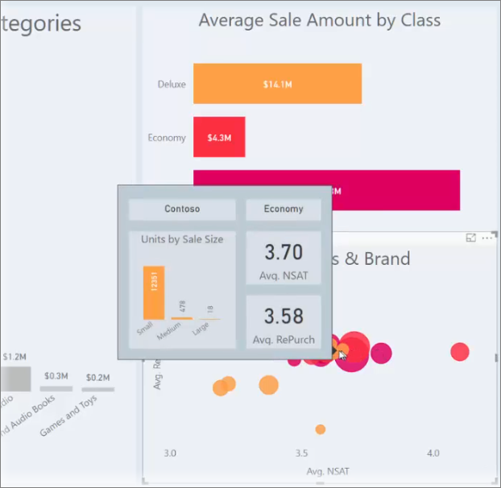

> [!TIP]
> You may be interested in trying the new visual tooltips, currently in preview. They can include drill-down and drillthrough actions, and can reflect report theme styling. Read more about [visual tooltips](desktop-visual-tooltips.md).

## Create a report tooltip page

To get started, create a new report page by clicking the **+** button, found along the bottom of the **Power BI Desktop** canvas, in the page tabs area. The button is located beside the last page in the report.

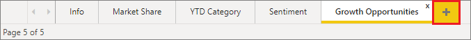

Your tooltip can be any size, but keep in mind that tooltips hover over the report canvas, so you might want to keep them reasonably small. In the **Format** pane in the **Canvas Settings** card, you can see a new page size template called *Tooltip*. This template provides a report page canvas size that's ready for your tooltip.

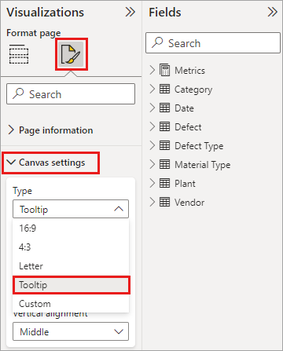

By default, **Power BI Desktop** fits your report canvas to the available space on the page. Often that's good, but not for tooltips. To get a better sense and view of what your tooltip looks like when you're done, you can change the **Page View** to actual size.

## Power BI Desktop

To see the actual size of the tooltip, select the **View** tab from the ribbon. From there, select **Page View > Actual Size**, as shown in the following image.

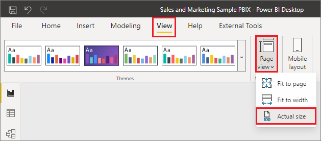

## Power BI service

To see the actual size of the tooltip, select the **View** tab from the ribbon. From there, select **Actual Size**, as shown in the following image.

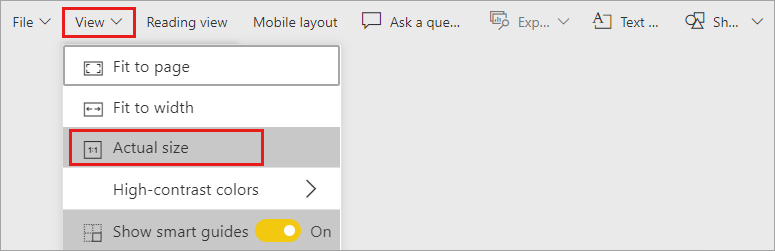

---

You can also name the report page so its purpose is clear. Just select the **Page Information** card in the **Format** pane, then type the name into the **Name** field you find there. In the following image, the tooltip report name is *Tooltip 1*, but feel free to name yours something more inspired.

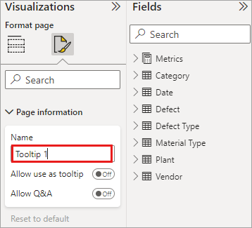

From there, you can create whatever visuals you would like to show up in your tooltip. In the following image, there are two cards and one clustered bar chart on the tooltip page, along with a background color for the page itself, and backgrounds for each of the visuals, to give it the look we wanted.

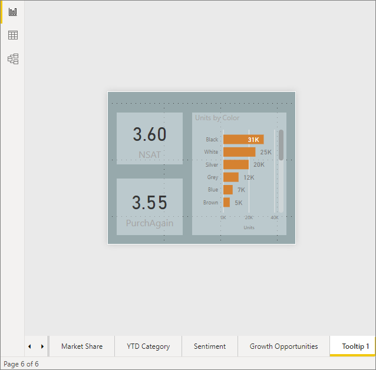

There are more steps to complete before your tooltip report page is ready to work as a tooltip. You need to configure the tooltip page in a few ways, as described in the next section. 

## Configure your tooltip report page

Once you have the tooltip report page created, you need to configure the page in order to register it as a tooltip, and to ensure it appears in over the right visuals.

To begin with, you need to turn the **Tooltip** slider to **On**, in the **Page Information** card, to make the page a tooltip.

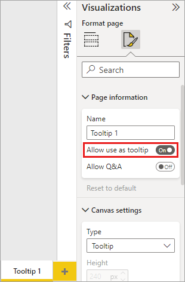

Once that slider is set to on, you specify the fields for which you want the report tooltip to appear. For visuals in the report that include the field you specify, the tooltip appears. You specify which field or fields apply by dragging them into the **Tooltip fields** bucket, found in the **Fields** section of the **Visualizations** pane. In the following image, the *Total Defect Qty* field is dragged into the **Tooltips fields** bucket.

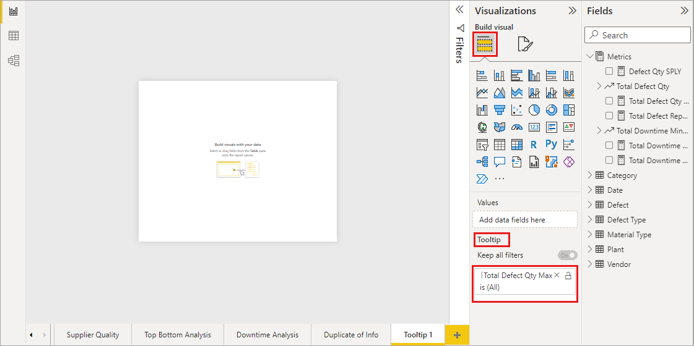

You can include both categorical and numerical fields in the **Tooltips fields** bucket, including measures.

Once completed, the tooltip report page you created is used as a tooltip in visuals in the report that use any fields you placed into the **Tooltips fields** bucket, replacing the default Power BI tooltip.

## Manually setting a report tooltip

In addition to creating a tooltip that automatically appears when hovering over a visual that contains the specified field, you can manually set a tooltip.

Any visual that supports report tooltips now has a **Tooltip** card in its **Formatting** pane.

To set a tooltip manually, select the visual for which you want to specify the manual tooltip, then in the **Visualizations** pane, select the **Format** section and expand the **Tooltips** card.

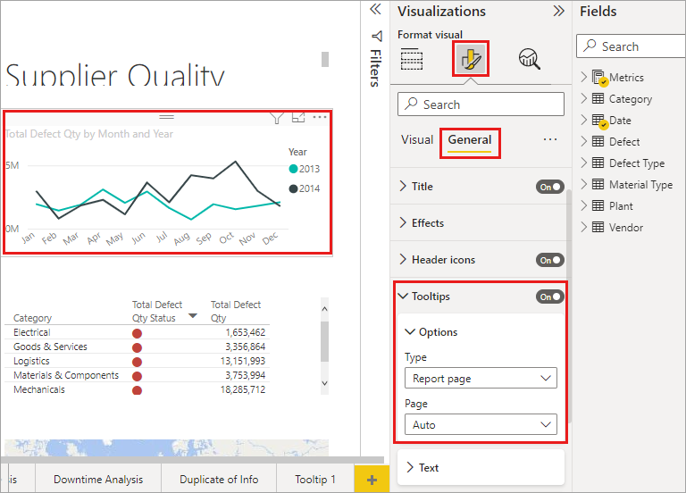

Then, in the **Page** dropdown, select the tooltip page you want to use for the selected visual. Only report pages that are specified as **Tooltip** pages show up in the dialog.

Being able to manually set a tooltip has many uses. You can set a blank page for a tooltip, and override the default Power BI tooltip selection. Another use is when you don't want the tooltip automatically selected by Power BI to be the tooltip. For example, if you have a visual that includes two fields, and both of those fields have an associated tooltip, Power BI selects only one to show. You might not want that to be the case, so you could manually select which tooltip should be displayed.

## Reverting to default tooltips

If you create a manual tooltip for a visual but decide you want the default tooltip instead, you can always return to the default tooltip that Power BI provides. To do so, when a visual is selected and the **Tooltips** card is expanded, just select *Auto* from the **Page** dropdown to go back to the default.

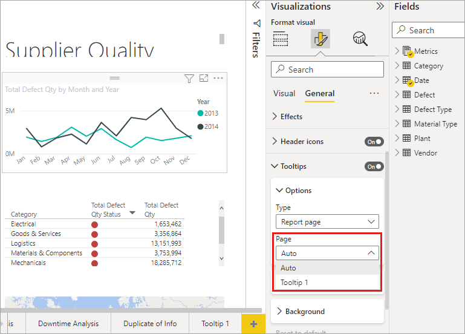

## Custom report tooltips and line charts

There are a few considerations to keep in mind when your report tooltips are interacting with line chart visuals, and with visuals when cross-highlighting.

### Report tooltips and line charts

When a report tooltip is displayed for a line chart, only one tooltip for all lines in the chart is displayed. This behavior is similar to the default tooltip behavior for line charts, which also displays only one tooltip.

The field in the legend doesn't get passed through as a filter for the tooltip. In the following image, the tooltip being displayed is showing all units sold on that day across all three classes displayed in the report tooltip (in this example, Deluxe, Economy, and Regular).

### Report tooltips and cross-highlighting

When a visual is being cross-highlighted in a report, report tooltips always show the cross-highlighted data, even if you're hovering over the faded section of the data point. In the following image, the mouse is hovering over the faded section of the bar graph (the section that isn't highlighted), but the report tooltip still shows data for the highlighted portion of that datapoint (the highlighted data).

## Considerations and limitations

There are a few considerations and limitations for **tooltips** to keep in mind.

* Button visuals also support tooltips.
* Dashboards don't support page tooltips.
* Python and R visuals aren't currently supported to be shown in report tooltips.
* Clusters aren't currently supported as fields that can be shown in report tooltips.
* When choosing a field to be shown for report tooltips, when using a field versus a category, visuals that contain that field will only show the specified tooltip when summarization with the selected field matches.
* You can turn off tooltips completely for a visual in Power BI reports. However, when you pin that visual to a dashboard in the Power BI service, the basic tooltip will still be displayed.

## Related content

For more information about features that are similar or interact with report tooltips, take a look at the following articles:

* [Use drillthrough in Power BI Desktop](desktop-drillthrough.md)
* [Display a dashboard tile or report visual in Focus mode](../consumer/end-user-focus.md)