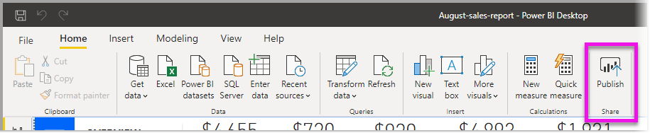
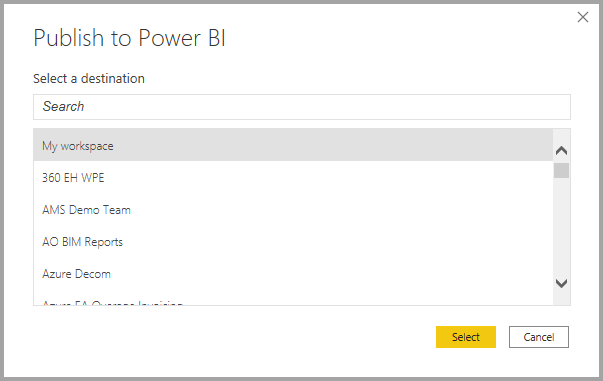
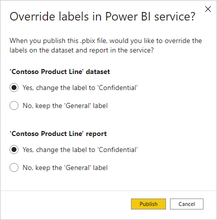

# Publish semantic models and reports from Power BI Desktop

[!INCLUDE [applies-yes-desktop-yes-service](../includes/applies-yes-desktop-yes-service.md)]

When you publish a Power BI Desktop file to the Power BI service, you publish the data in the model to your Power BI workspace. The same is true for any reports you created in **Report** view. You’ll see a new semantic model with the same name and any reports in your Workspace navigator.

Publishing from Power BI Desktop has the same effect as using **Get Data** in Power BI to connect to and upload a Power BI Desktop file.

> [!NOTE]
> Any changes you make to the report in Power BI won't be saved back to the original Power BI Desktop file. This includes when you add, delete, or change visualizations in reports.

## To publish a Power BI Desktop semantic model and reports
1. In Power BI Desktop, choose **File** > **Publish** > **Publish to Power BI** or select **Publish** on the **Home** ribbon.

   

2. Sign in to Power BI if you aren't already signed in.
3. Select the destination. You can search your list of available workspaces to find the workspace into which you want to publish. The search box lets you filter your workspaces. Select the workspace, and then click the **Select** button to publish.

   

When publishing is complete, you receive a link to your report. Select the link to open the report in your Power BI site.

> [!NOTE]
> If your Desktop file has a sensitivity label, the semantic model and report that are published will inherit that label, and the label will be considered automatically or manually applied depending on whether the label on the Desktop file was automatically or manually applied. This affects the behavior of sensitivity label downstream inheritance from the semantic model to its associated report. See [Downstream inheritance between semantic models and reports published from *.pbix* files](/fabric/governance/service-security-sensitivity-label-downstream-inheritance#downstream-inheritance-between-semantic-models-and-reports-published-from-.pbix-files) for detail.

## Republish or replace a semantic model published from Power BI Desktop
The semantic model, and any reports you created in Power BI Desktop, upload to your Power BI site when you publish a Power BI Desktop file. When you republish your Power BI Desktop file, the semantic model in your Power BI site is replaced with the updated semantic model from the Power BI Desktop file.

This process is straightforward, but you should know the following:

* Two or more semantic models in Power BI with the same name as the Power BI Desktop file could cause publishing to fail. Make sure you have only one semantic model in Power BI with the same name. You can also rename the file and publish, creating a new semantic model with same name as the file.
* If you rename or delete a column or measure, any visualizations you already have in Power BI with that field could be broken.
* Power BI ignores some format changes of existing columns. For example, if you change a column’s format from 0.25 to 25%.
* Say you have a refresh schedule that is configured for your existing semantic model in Power BI. When you add new data sources to your file and then republish, you’ll have to sign into them before the next scheduled refresh.
* When you republish a semantic model published from Power BI Desktop and have a refresh schedule defined, a semantic model refresh is started as soon as you republish.
* When you make a change to a semantic model and then republish it, a message shows you how many workspaces, reports, and dashboards are potentially impacted by the change. The message then asks you to confirm that you want to replace the currently published semantic model with the one you modified. The message also provides a link to the full semantic model impact analysis in the Power BI service. From there, you can see more information and take action to mitigate the risks of your change.

   

* If the semantic model (and, if one exists, the report) in the Power BI service that you're overwriting has sensitivity labels that differ from the label in your *.pbix* file, a dialog appears. The dialog will prompt you to choose whether to keep the existing labels or overwrite them with the ones coming from your *.pbix* file.

    

   [Learn more about semantic model impact analysis](../collaborate-share/service-dataset-impact-analysis.md).

> [!NOTE]
> Some data connection in Power BI reports may include links to data, rather than including the data in the semantic model that's imported into the Power BI service. For example, DirectQuery connections link to data as updates or interactions occur, rather than importing the data itself. If linked data sources in your report are on premises, you may need a gateway to access them from Power BI. For more information, see [what is an on-premises data gateway?](../connect-data/service-gateway-onprem.md).

## Publish semantic models and reports from Power BI Desktop to a folder in a workspace (preview)

The ability to publish reports and semantic models from Power BI Desktop into a folder in a workspace is now in preview, and enabled by default. To use this feature, follow the established pattern for publishing a semantic model and report. The workspace navigator provides the option for you to select a folder within a workspace to which it will publish. Folders are organizational units inside a workspace that enable users to efficiently organize and manage artifacts in the workspace. 

To turn the capability off, deselect the **Publish dialogs support folder selection** setting using the **Options and settings > Options > Preview features** menu in Power BI Desktop.

To learn more about creating folders in Microsoft Fabric workspaces, read the [create folders in Microsoft Fabric workspaces](/fabric/get-started/workspaces-folders) article.

## Considerations and Limitations

The following storage mode conversions are not supported during republish:

- If you first publish a report using Import mode, you won't be able to overwrite the report and the semantic model with a DirectQuery or Live Connect based report. This will not work.
- If you first publish a report using a live connection, then change the storage mode or the target semantic model in Power BI Desktop, you won't be able to overwrite the report when you republish.

## Related content

You can do all sorts of things with Power BI Desktop. For more information on its capabilities, check out the following resources:

* [What is Power BI Desktop?](../fundamentals/desktop-what-is-desktop.md)
* [Query overview with Power BI Desktop](../transform-model/desktop-query-overview.md)
* [Data types in Power BI Desktop](../connect-data/desktop-data-types.md)
* [Tutorial: Shape and combine data in Power BI Desktop](../connect-data/desktop-shape-and-combine-data.md)
* [Common query tasks in Power BI Desktop](../transform-model/desktop-common-query-tasks.md)
