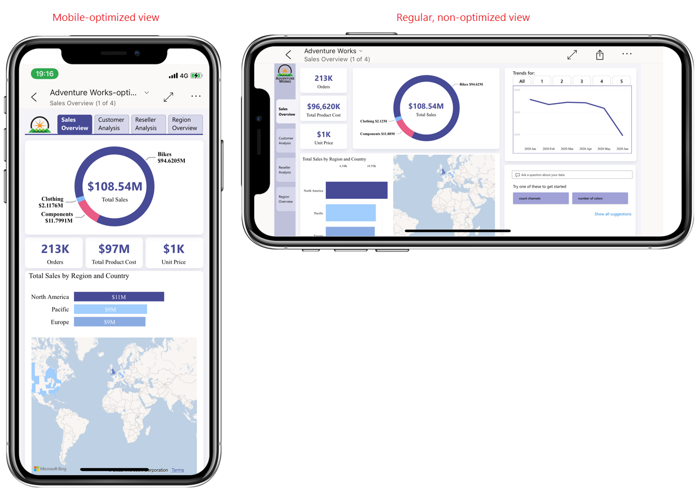

# About mobile-optimized Power BI reports

[!INCLUDE [applies-yes-desktop-yes-service](../includes/applies-yes-desktop-yes-service.md)]

Mobile users can view any Power BI report page in the Power BI mobile apps. However, reports designed for use on a computer can be difficult to read and interact with on phones.

In Power BI, after you create a report, you can create additional mobile-optimized views of the report's pages. When a mobile-optimized view exists for a page, it automatically displays when the mobile device is held in portrait orientation. If the user wants to see the regular non-optimized view of the page as they would see it on their computer, they can tip the phone onto its side, as shown in the following image:

In the Power BI mobile app, reports that have mobile-optimized pages are indicated with a special icon:

>[!NOTE]
> Mobile-optimized report views display only when you use the Power BI mobile apps for iOS and Android. When viewed through a web browser, reports always display in the standard, non-optimized view.  

## Mobile authoring features

Power BI provides several features to help you create mobile-optimized versions of your reports:
- A **mobile layout view** where you create mobile-optimized reports by dragging and dropping visuals onto a phone emulator canvas.
- A **formatting pane** (preview) that enables you to precisely format your report visuals by changing their format settings.
- **Visuals and slicers** that can be optimized for use on small, mobile screens.

With these mobile authoring capabilities, you can select, rearrange, and reformat just those visuals that make sense for mobile users, enabling you to create report page views that are attractive, focused, and easy to read and use on mobile devices.

See [Mobile layout view](power-bi-create-mobile-optimized-report-mobile-layout-view.md) to learn more about Power BI's mobile authoring capabilities and to get started creating your mobile-optimized reports.

## Publish a mobile-optimized report

If you created your mobile-optimized report in Power BI Desktop, all you have to do is publish the main report from Desktop to the Power BI service. This publishes the mobile-optimized version at the same time.

If you created the mobile-optimized report in the Power BI service, just save the report.

## Next steps
* [Start creating a mobile optimized report in mobile layout view](power-bi-create-mobile-optimized-report-mobile-layout-view.md)
* [View Power BI reports optimized for your phone](../consumer/mobile/mobile-apps-view-phone-report.md).
* [Create a phone view of a dashboard in Power BI](service-create-dashboard-mobile-phone-view.md).
