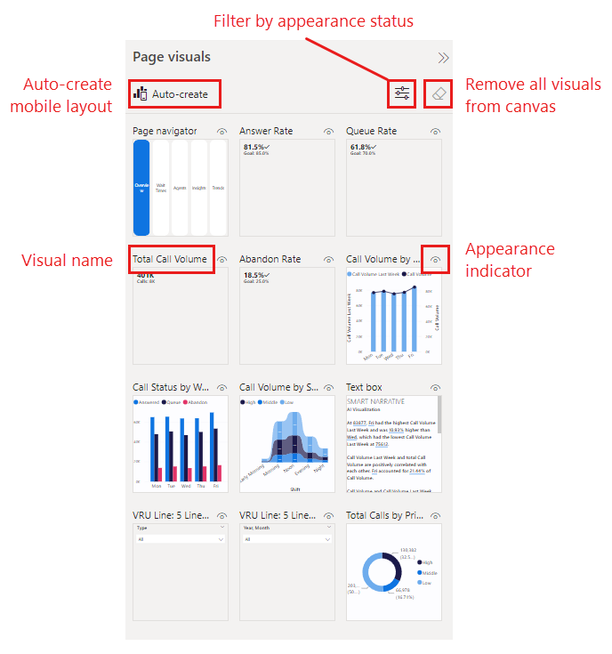

# Create an initial layout

Use the page visuals pane to create an initial layout for your mobile-optimized view.

## The page visuals pane

The page visuals pane lists all of the visuals (both shown and hidden) that are on the original report page. The following features to help you select the visuals you want to use in your mobile-optimized view:

* **Visual name**: Helps to identify the visual.
* **Appearance status**: Indicates the appearance status of the visual - visible or hidden. This indicator changes depending on the appearance status of the visual in the current state of the web report view. The appearance indicator is useful when working with bookmarks.
* **Filter by appearance status**: You can filter the visuals according to appearance status to make it easier to find the visual you're looking for.
* **Remove all visuals from canvas**: Removes all visuals from the canvas. Removing visuals from the canvas does not remove them from the Page visuals pane. They remain available for you to use.

## Lay out visuals on the canvas

To place a visual on the canvas, drag and drop the visual you want to use from the page visuals pane onto the mobile layout canvas. When you drag a visual to the canvas, by default it snaps to the grid. Alternatively, you can double-click the visual on the page visuals pane and it will be added to the canvas.

Once you've placed a visual on the canvas, resize it if necessary by dragging the handles that appear around the edge of the visual when you select it. To maintain the visual's aspect ratio while resizing, press the **Shift** key while dragging the resize handles.

Each time you drag a visual onto the canvas, it's added on its own layer on top of any other visuals that are already on the canvas. Visuals can be layered one on top of the other to create interactive reports using bookmarks, or to build attractive reports by layering visuals over images. Use the [Selection pane](power-bi-create-mobile-optimized-report-order-layers.md) to change the layering order of the visuals.

The image below illustrates dragging and dropping visuals from the page visuals pane onto the canvas, as well as resizing and overlaying some of them.

>[!NOTE]
> * You can add some or all of the visuals in the Page visuals pane to the mobile-optimized report page.
> * You can drag and drop hidden visuals onto the canvas. They will be placed, but not shown unless their visibility status changes in the current desktop report view.

### Removing visuals from the mobile layout canvas

* To remove a single visual from the mobile layout, click the **X** in the top-right corner of the visual on the phone canvas, or select the visual and press **Delete**.

* To remove all the visualizations from the canvas, click the eraser on the **Page visuals** pane.

Removing visuals from the mobile layout canvas removes them from the mobile layout canvas only. The visuals remain available for use in the **Page visuals** pane, and the original desktop layout report remains unaffected.

## Next steps
* [Style and format visuals for mobile mobile layout](power-bi-create-mobile-optimized-report-format-visuals.md)