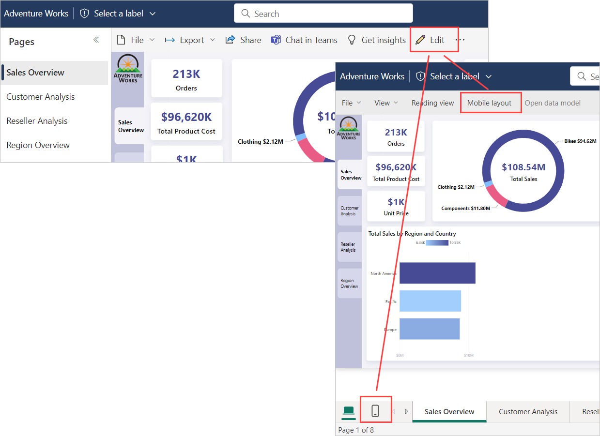
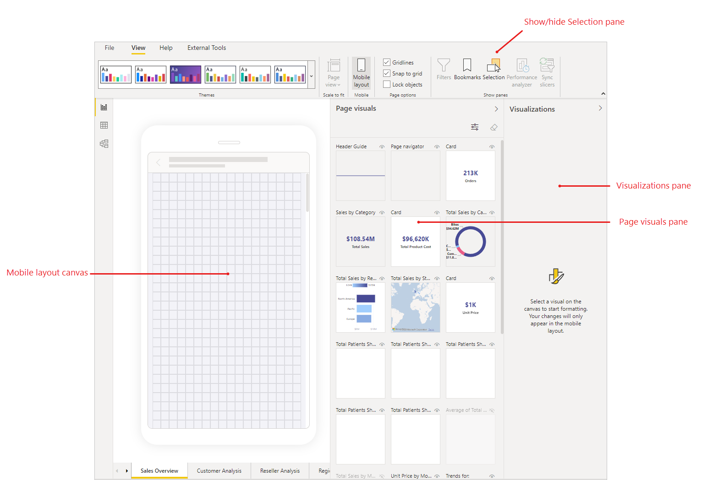

# Mobile layout view

[!INCLUDE [applies-yes-desktop-yes-service](../includes/applies-yes-desktop-yes-service.md)]

Power BI's mobile layout view is used to create views of report pages that are optimized for viewing on mobile devices. Mobile layout view is available in both Power BI Desktop and in the Power BI service. This article explains how to open the mobile layout view and describes the features it provides.

## How to open mobile layout view

You can open mobile layout view in both Power BI Desktop and the Power BI service.

# [Power BI Desktop](#tab/powerbi-desktop)

Select the **View** ribbon and choose **Mobile layout**.

# [Power BI service](#tab/powerbi-service)

Choose **Edit report > Mobile Layout**. If the Edit option isn't visible, look under **More options (...)**.

   

---

The mobile layout view will open.

The features of the mobile layout view are described below.

* **Mobile layout canvas**: You'll create your mobile optimized layout on the mobile layout canvas. The canvas features a fine-grained grid to help you lay out your visuals. Canvas controls enable you to turn off the grid, enable/disable snap-to-grid, and lock visuals in place to prevent them from accidentally being moved around. The grid scales across phones of different sizes, so your report looks good on small- and large-screen phones.
* **Page visuals pane**: The page visuals pane lists all of the visuals that are included on the original report page. You'll create your mobile-optimized layout by dragging and dropping visuals from page visuals pane onto the layout canvas. See [Create an initial layout](power-bi-create-mobile-optimized-report-initial-layout.md).
* **Visualizations pane**: The visuals pane shows the format settings of the visual that is selected on the canvas. You'll use the visualizations pane to style and format visuals. See [Optimize visual formatting](power-bi-create-mobile-optimized-report-format-visuals.md). The visualizations pane is empty until you select a visual on the canvas.
* **Selection pane**: The selection pane enables you to change the layering order of visuals on the canvas. See [Rearrange visual layering](power-bi-create-mobile-optimized-report-order-layers.md).

Start creating your mobile-optimized view by [choosing your visuals and creating an initial layout](power-bi-create-mobile-optimized-report-initial-layout.md).

## Next steps

* [Create an initial layout for a mobile-optimized report](power-bi-create-mobile-optimized-report-initial-layout.md)