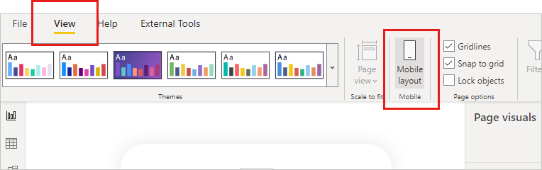

# Mobile layout view

[!INCLUDE [applies-yes-desktop-yes-service](../includes/applies-yes-desktop-yes-service.md)]

Power BI's mobile layout view is used to create views of report pages that are optimized for viewing on mobile devices. Mobile layout view is available in both Power BI Desktop and in the Power BI service. This article explains how to open the mobile layout view and describes the features it provides.

## How to open mobile layout view

You can open mobile layout view in both Power BI Desktop and the Power BI service.

# [Power BI Desktop](#tab/powerbi-desktop)

Use the layout switcher at the bottom of the page to toggle between mobile and web layout.

:::image type="content" source="./media/power-bi-create-mobile-optimized-report-mobile-layout-view/power-bi-mobile-layout-switcher-desktop.png" alt-text="Screenshot showing the layout switcher in Power BI Desktop":::

Alternatively select the **View** ribbon and choose **Mobile layout**.

# [Power BI service](#tab/powerbi-service)

Choose **Edit**, and then either select **Mobile layout** or use the switcher at the bottom of the page to toggle between web and mobile layouts. If the Edit option isn't visible, look under **More options (...)**.

:::image type="content" source="./media/power-bi-create-mobile-optimized-report-mobile-layout-view/power-bi-mobile-layout-button-service.png" alt-text="Screenshot showing the layout switcher in the Power BI service" border="false":::

---

The mobile layout view will open.

:::image type="content" source="media/power-bi-create-mobile-optimized-report-mobile-layout-view/power-bi-mobile-layout-view.png" alt-text="Screenshot of mobile layout view in Power BI." lightbox="media/power-bi-create-mobile-optimized-report-mobile-layout-view/power-bi-mobile-layout-view.png" border="false":::

The features of the mobile layout view are described below.

* **Mobile layout canvas**: You create your mobile optimized layout on the interactive mobile layout canvas. The canvas features a fine-grained grid to help you lay out your visuals. Canvas controls enable you to turn off the grid, enable/disable snap-to-grid, and lock visuals in place to prevent them from accidentally being moved around. The grid scales across phones of different sizes, so your report looks good on small- and large-screen phones. The canvas is interactive, so you can see how your buttons, slicers, and visuals behave before you publish the report. Some [limitations](#considerations-and-limitations) apply.
* **Page visuals pane**: The page visuals pane lists all of the visuals that are included on the original report page. You create your mobile-optimized layout by dragging and dropping visuals from page visuals pane onto the layout canvas. See [Create an initial layout](power-bi-create-mobile-optimized-report-initial-layout.md).
* **Visualizations pane**: The visuals pane shows the format settings of the visual that is selected on the canvas. You use the visualizations pane to style and format visuals. See [Optimize visual formatting](power-bi-create-mobile-optimized-report-format-visuals.md). The visualizations pane is empty until you select a visual on the canvas.
* **Selection pane**: The selection pane enables you to change the layering order of visuals on the canvas. See [Rearrange visual layering](power-bi-create-mobile-optimized-report-order-layers.md).
* **Auto-create mobile layout option**: The auto-create mobile layout option generates a mobile-optimized view of your report on the mobile layout canvas. It puts the report visuals on the canvas and tries its best to preserve your report's functionality. For complex reports, auto-creation is a good way to start buiding your mobile-optimized reports. Once you have the initial layout on the canvas, you can start modifying it as necessary. For more information about the auto-create mobile format feature, see [Automatic mobile layout creation](#automatic-mobile-layout-creation).

Start creating your mobile-optimized view by selecting the auto-create mobile layout option or by [choosing your visuals and dragging them on to the mobile layout canvas](power-bi-create-mobile-optimized-report-initial-layout.md).

## Automatic mobile layout creation

The auto-create mobile layout feature enables you to automatically generate a mobile-optimized layout for any new or existing report page.

When you choose the auto-create mobile layout option, a new complete layout with your report's visuals is created on the mobile layout canvas. If the canvas already has a layout, it will be removed and replaced with the new automatically-generated layout.

The auto-create engine understands the desktop layout of your report and builds a mobile layout that considers the position, size, type, and order of the visuals that the report contains. It places both visible and hidden visuals, so if you have bookmarks that change a visual's visibility, they will work in the automatically created mobile layout as well.

The auto-create mobile layout feature is intended to help you get started building mobile-optimized views for your reports. The quality of the result can vary, depending on the structure and complexity of the report's desktop layout. If the auto-generated mobile layout isn't exactly what you wanted or expected, you can tweak it manually until you're satisfied, or you can use *Undo* (Ctrl+Z) to go back to the previous layout (if any). The auto-create engine uses the same logic every time, so unless you change the source desktop layout, selecting the auto-create option again won’t give you a different result.

The feature works best with simple reports. For simple reports, the auto-generated layout might be usable as is. For more complex reports, tweaking might be required. The following list describes some of the factors that affect the quality of the generated layout. The more you build your desktop layout with these considerations in mind, the better the auto-generated layout will be.

* The auto-create engine reads the report horizontally from left to right, starting from the top. Therefore, reports whose general layout follows that structure are more likely to be satisfactorily rendered than reports that have a strong vertical component, such as a left-hand report navigation bar.

* The engine can't handle background images.

* Too much overlaying is a challenge for the engine. It will do its best, but the result might not be optimal.

* If there are too many images, not all of them might fit on the mobile layout canvas, in which case you will still see unplaced visuals on the Page visuals pane after choosing the auto create option. Keep in mind that the engine places both visible and hidden images on the canvas, so if there are many hidden images (such as can be the case if images are used for layout purposes), it might look like there is room on the canvas when in fact there isn't.

The auto-create mobile layout feature is in preview. It is enabled in the Power BI service. In Power BI Desktop the feature is controlled by the **Auto-create mobile layout** preview feature switch that can be accessed by navigating to **File** > **Options and settings** > **Options** > **Preview features**. The feature switch is enabled by default.

## Considerations and limitations

* Tooltips are disabled on the mobile layout canvas; they are available when viewing in the mobile app, however.
* Metric visuals are not interactive on the mobile layout canvas.​
* Slicer selections made on the mobile layout canvas don't carry over when you switch to web layout. Also, when you switch back from web layout to mobile layout, any slicer selections will come from the web layout. Likewise, when the report is published, any slicer selections will be those that were defined in web layout, regardless of whether the report is being viewed in the regular desktop-view or a mobile-optimized view.

## Related content

* [Create an initial layout for a mobile-optimized report](power-bi-create-mobile-optimized-report-initial-layout.md)