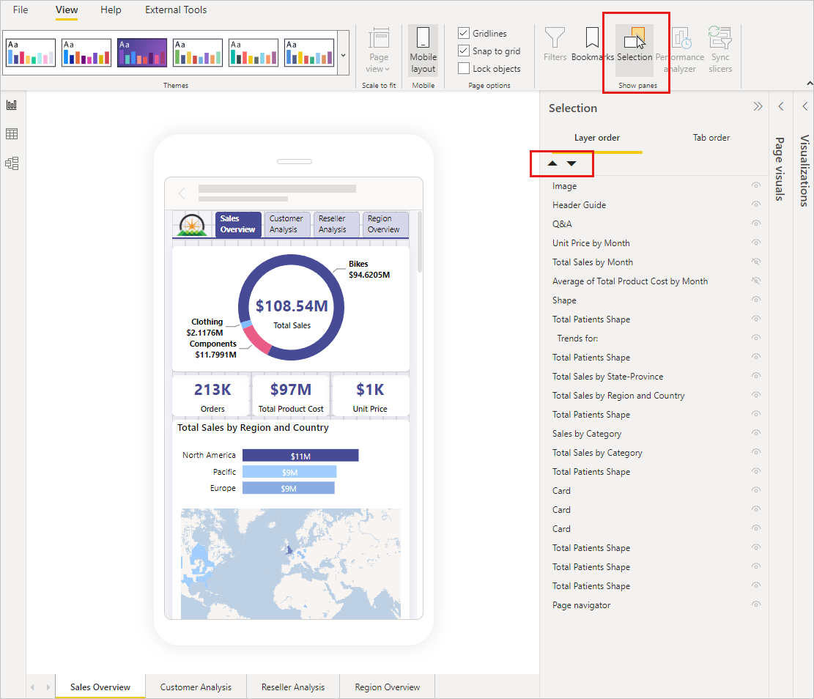

# Rearrange visual layering

After laying out visuals on the Mobile layout canvas, use the Selection pane to change the layering order of visuals on the canvas if necessary.

## Use the Selection pane to reorder visual layers

To open the Selection pane, select the **Selection** button in the **Show panes** section of the Mobile layout view.

The Selection pane lists all the visuals that are on the canvas. The order of the list reflects the layer ordering on the canvas&mdash;the first listed visual is on the top-most layer, the last listed visual is on the bottom-most layer. To change the order, you can either drag and drop a visual to another place on the list or select a visual and use the arrow buttons to move it up or down.

The Selection pane also has an appearance indication for each visual in the list, but it isn't possible to change the appearance in the Mobile layout view&mdash;this must be done in the regular desktop layout view.

## Related content

* [Mobile layout view](power-bi-create-mobile-optimized-report-mobile-layout-view.md)
* [Optimize visuals for mobile layout](power-bi-create-mobile-optimized-report-format-visuals.md)
* [Create an initial layout on the mobile layout canvas](power-bi-create-mobile-optimized-report-initial-layout.md)
* [Publish a mobile-optimized report](power-bi-create-mobile-optimized-report-about.md#publish-a-mobile-optimized-report)