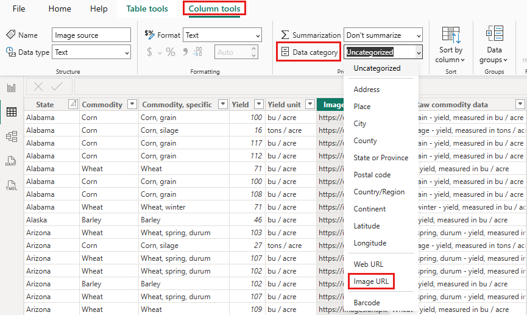

# Display images in a table, matrix, or slicer in a report

[!INCLUDE [applies-yes-desktop-no-service](../includes/applies-yes-desktop-no-service.md)]

A good way to enhance your reports is to add images to them. Static images on the page are good for some purposes. However, sometimes you want images that relate to the data in your report. This article shows you how to display images in a table, matrix, slicer, or multi-row card.

## Add images to your report

1. Create a column with the URLs of the images. See [Considerations](#considerations) later in this article for requirements.

1. Select that column. On the **Column tools** ribbon, for **Data category**, select **Image URL**.

    

1. Add the column to a table, matrix, slicer, or multi-row card.

    

### Format the images

1. In the **Visualizations** pane, select the paintbrush icon to format the images. 
1. On the **Visual** tab, expand **Image size**, and set **Height** and **Width**.

    :::image type="content" source="media/power-bi-images-tables/image-size-height-width.png" alt-text="Screenshot showing setting image height and width.":::

### Add images from a personal OneDrive storage

Images in your report need to be anonymously accessible. However, for images that are hosted on a personal OneDrive storage, you may be able to get an embed code that points directly to them. The Power BI mobile apps don't support such images, however. For the Power BI mobile apps to be able to display an image, the image URL must be anonymously accessible, regardless of whether or not the image uses an embed code.

1. On your OneDrive site, open an image and select **More options (...)** > **Embed**.

    :::image type="content" source="media/power-bi-images-tables/power-bi-onedrive-embed.png" alt-text="Screenshot of an image on OneDrive, highlighting the More Options dropdown menu and the Embed selection.":::

1. Select **Generate**.

    :::image type="content" source="media/power-bi-images-tables/power-bi-onedrive-embed-generate.png" alt-text="Screenshot of the Embed window, highlighting Generate.":::

1. Copy the URL and paste it in the **Image URL** column.

    :::image type="content" source="media/power-bi-images-tables/power-bi-onedrive-embed-copy-url.png" alt-text="Screenshot of the generated embed image URL.":::

## Considerations

- The image needs to be in one of these file formats: .bmp, .jpg, .jpeg, .gif, .png, or .svg
- The URL must be anonymously accessible, not on a site that requires a sign-in, such as SharePoint or OneDrive for work or school.
- The Power BI mobile apps display the image only if the image URL is anonymously accessible. The image cannot be hosted on a site that requires a sign-in, such as SharePoint, even if you can see the image in Power BI Desktop or in the service.

## Related content

* [Page layout and formatting](/training/modules/visuals-in-power-bi/12-formatting)
* [Basic concepts for designers in the Power BI service](../fundamentals/service-basic-concepts.md)
* More questions? [Try the Power BI community](https://community.powerbi.com/)
