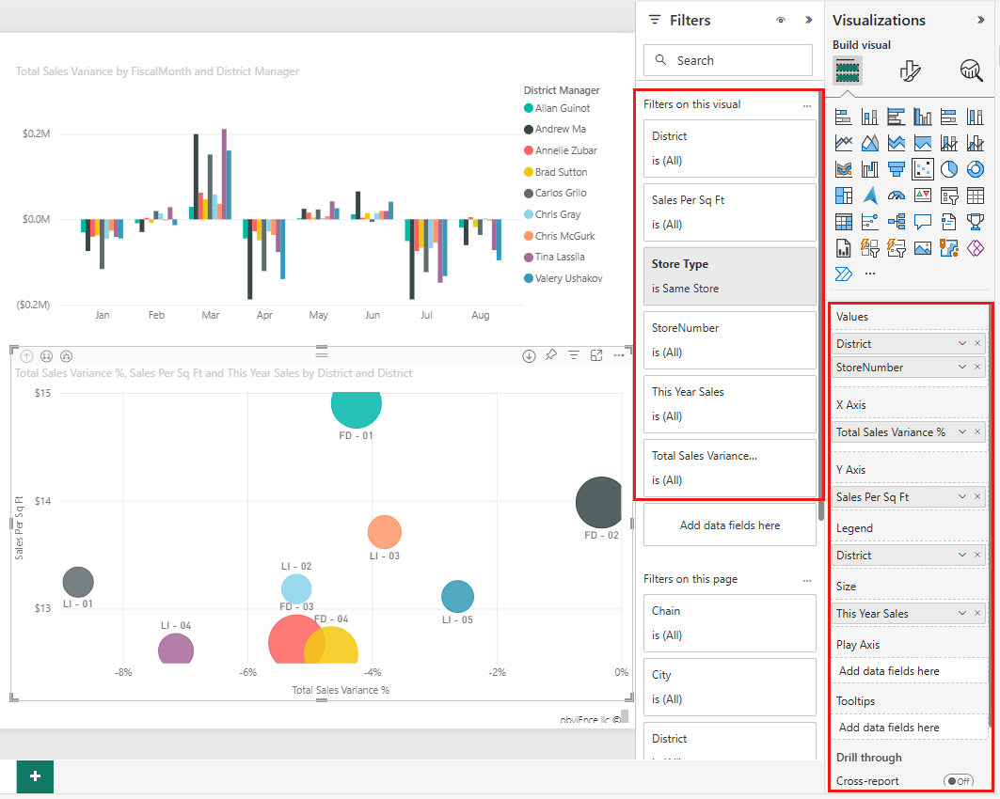

# Add a filter to a report in Power BI

This article explains how to add a visualization filter, page filter, or report filter to a report in Power BI. You need to be able to edit a report to add filters. The examples in this article are in the Power BI service, and the steps are almost identical in Power BI Desktop. Looking for an overview? Check out [Filters and highlighting in Power BI reports](power-bi-reports-filters-and-highlighting.md) first.

Power BI offers a number of different kinds of filters, from the manual and automatic to the drillthrough and pass-through. Read about the [different kinds of filters](power-bi-report-filter-types.md).

After you add filters, you can [format the filters in your Power BI reports](power-bi-report-filter.md) to look and act the way you want.

## Filters in Editing view or Reading view
You interact with reports in two different views: Reading view and Editing view. This article describes how to create filters in report **Editing view**.  For more information on filters in Reading view, see [interacting with filters in report Reading view](../consumer/end-user-report-filter.md).

Because filters *persist*, when you navigate away from the report Power BI retains the filter, slicer, and other data view changes that you've made. So you can pick up where you left off when you return to the report. If you don't want your filter changes to persist, select **Reset to default** from the top menu bar.

:::image type="content" source="../consumer/media/end-user-report-filter/power-bi-reset-icon.png" alt-text="Reset to default icon.":::

Keep in mind that as the report creator, whatever filters you save with the report become the *default filter state* for all your report readers. When they select **Reset to default**, that's what they return to.

## Levels of filters in the Filters pane
Whether you're using Power BI Desktop or Power BI service, the Filters pane displays along the right side of the report canvas. If you don't see the Filters pane, select the ">" icon from the upper-right corner to expand it.

You can set filters at three different levels for the report: visual-level, page-level, and report-level. This article explains how to set the different levels.

## Add a filter to a visual
Visuals have two different kinds of filters.
You can add a visual-level filter to a visual in two different ways. 

* The fields that are in a visual are automatically filters for that visual. 
* As the report designer, you can identify a field that isn't already the visual, and add that field directly to the **Visual level filters** bucket.
 
By the way, this article uses the Retail Analysis sample, if you'd like to install it and follow along. Install the [Retail Analysis sample](sample-retail-analysis.md#get-the-content-pack-for-this-sample) content pack.

### Filter with a field that's not in the visual

1. In the Power BI service, select **More options (...)** > **Edit** to open your report in Editing view.
   
   

2. Open the Visualizations, Filters, and Fields panes, if they're not already open.
   
   

3. Select a visual to make it active. In this case, it's the scatter chart on the Overview page. All the fields in the visual are in the **Visualizations** pane. They're also listed in the **Filters** pane, under the **Filters on this visual** heading.
   
   
  
1. From the Fields pane, select the field you want to add as a new visual-level filter, and drag it into the **Filters on this visual** area.  In this example, we drag **Category** to **Add data fields here**.
     
    

    Notice **Category** is *not* added to the visualization itself.
     
1. Select **Kids**. The scatter chart is filtered, but the other visuals stay the same.
     
    

    If you save your report with this filter, report readers can interact with the **Category** filter in Reading view, selecting or clearing values.
    
    If you drag a *numeric column* to the filter pane to create a visual-level filter, the filter is applied to the *underlying rows of data*. For example, adding a filter on the **UnitCost** field and setting it where **UnitCost** > 20 would only show data for the Product rows where the Unit Cost was greater than 20, regardless of the total Unit Cost for the data points shown in the visual.

## Add a filter to an entire page

You can also add a page-level filter to filter an entire page.

1. In the Power BI service, open the Retail Analysis report, then go to the **District Monthly Sales** page. 

2. Select **...** > **Edit report** to open your report in Editing view.
   
   

2. Open the Visualizations, Filters, and Fields panes, if they're not already open.

3. From the Fields pane, select the field you want to add as a new page-level filter, and drag it to the bottom of the **Filters on this page** area.  

   

1. Select the values you want to filter and set either  **Basic** or **Advanced** filtering controls.
   
   All the visualizations on the page are redrawn to reflect the change.
   
    If you save your report with the filter, report readers can interact with the filter in Reading view, selecting or clearing values.

## Add a report-level filter to filter an entire report

1. Select **Edit report** to open the report in Editing view.
   
   

2. Open the Visualizations and Filters pane and the Fields pane, if they're not already open.
3. From the Fields pane, select the field you want to add as a new report-level filter, and drag it into the **Report level filters** area.  
4. Select the values you want to filter.

    The visuals on the active page, and on all pages in the report, change to reflect the new filter. If you save your report with the filter, report readers can interact with the filter in Reading view, selecting or clearing values.

1. Select the back arrow to return to the previous report page.

## Considerations and troubleshooting

- If you don't see the Fields pane, make sure you're in report [Editing view](service-interact-with-a-report-in-editing-view.md).
- If you've made lots of changes to the filters and want to return to the default settings, select **Reset to default** from the top menu bar. Remember: As the report author, whatever filters are in place when you save the report *become* the default filter settings.

## Next steps

[Format the filters in your Power BI reports](power-bi-report-filter.md)

[Take a tour of the report Filters pane](../consumer/end-user-report-filter.md)

[Filters and highlighting in reports](power-bi-reports-filters-and-highlighting.md)

[Different kinds of filters in Power BI](power-bi-report-filter-types.md)

More questions? [Try the Power BI Community](https://community.powerbi.com/)
