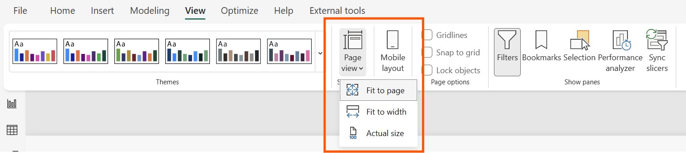
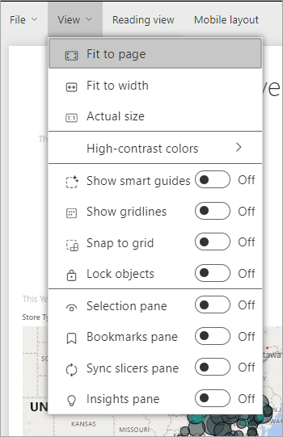
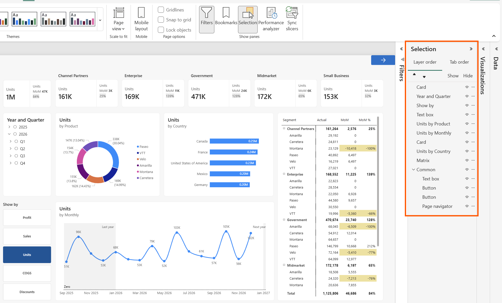
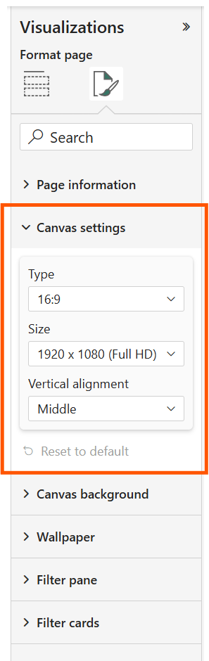

# Apply page display settings in a Power BI report

[!INCLUDE [applies-yes-desktop-yes-service](../includes/applies-yes-desktop-yes-service.md)]

We understand it's critical to keep your report layout precise. Sometimes, it can be challenging, because you and your colleagues may view those reports on screens with different aspect ratios and sizes. 

The default display view is **Fit to page** and the default display size is **16:9**. If you want to lock in a different aspect ratio, or want to fit your report in a different way, there are two tools to help you: ***Page view*** settings and ***Page size*** settings.

> [!NOTE]  
> This video might use earlier versions of Power BI Desktop or the Power BI service.

> [!VIDEO https://www.youtube.com/embed/5tg-OXzxe2g]

## Where to find page view settings

Page view settings are available in both the Power BI service and Power BI Desktop, but the interface is a little different. The following sections explain where you can find View settings in each Power BI tool.

# [Power BI Desktop](#tab/powerbi-desktop)
In Report view, select the **View** tab to open Page view settings as well as phone layout settings.

  

# [Power BI service](#tab/powerbi-service)

In the Power BI service (app.powerbi.com), open a report, select **Edit**, then select **View** from the upper left menu bar.

---

## Page view settings
The first set of Page view settings controls the display of your report page relative to the browser window. Choose between:

* **Fit to page** (default): Contents are scaled to best fit the page
* **Fit to width**: Contents are scaled to fit within the width of the page
* **Actual size**: Contents are displayed at full size

The second set of Page view settings controls the positioning of objects on the report canvas. Choose between:

* **Show gridlines**: Turn on gridlines to help you position objects on the report canvas.
* **Snap to grid**: Use with **Show gridlines** to precisely position and align objects on the report canvas. 
* **Lock objects**: Lock all objects on the canvas so that they can't be moved or resized.
* **Selection pane**: The **Selection** pane lists all objects on the canvas. You can decide which to show and which to hide.

    

## Canvas settings

**Canvas** settings, formerly called *page size* settings are in the **Visualizations** pane. They control the display ratio and actual size (in pixels) of the report canvas:

* 4:3 ratio
* 16:9 ratio (default)
* Letter
* Custom (height and width in pixels)

## Related content

* [Report view in Power BI Desktop](desktop-report-view.md)

* [Change Page view and Page size settings in your own Power BI reports](../consumer/end-user-report-view.md)

* Read more about [reports in Power BI](../consumer/end-user-reports.md)

* [Basic concepts for designers in the Power BI service](../fundamentals/service-basic-concepts.md)

More questions? [Try the Power BI Community](https://community.powerbi.com/)
