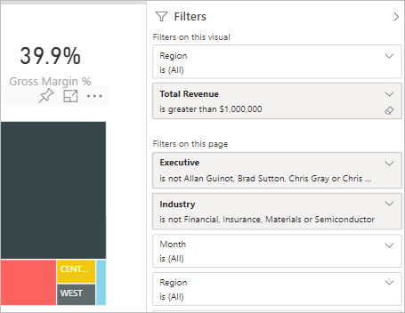
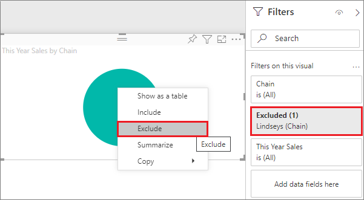
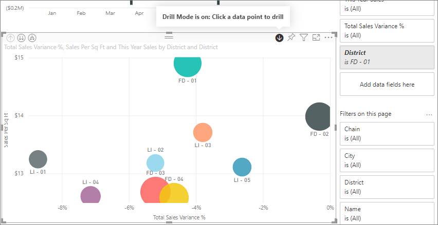
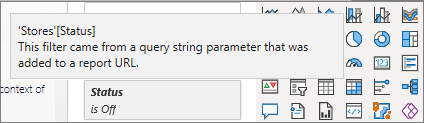
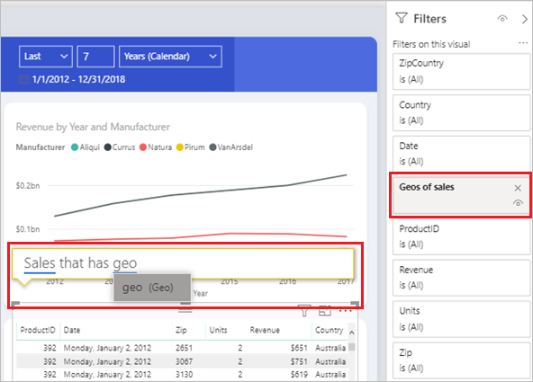

# Types of filters in Power BI reports

Filters don't all behave the same way because they're not created the same way. How you create them influences how they behave in the filter pane in editing mode. This article describes the different kinds of filters, the different ways you create them, and the different things they're good for. For more information, see [add filters to reports](power-bi-report-add-filter.md).

## Compare filter types

This table compares what authors can do with the different types of filters. Select a link to read more about each type.

| Filter type | Edit | Clear | Delete | Hide | Lock | Sort | Rename |
|----|----|----|----|----|----|----|----|
| [Automatic filters](#automatic-filters) | Y | Y | N | Y | Y | Y | Y |
| [Manual filters](#manual-filters) | Y | Y | Y | Y | Y | Y | Y |
| [Include/Exclude](#include-and-exclude-filters) filters | N | N | Y | Y | Y | Y | N |
| [Drill-down](#drill-down-filters) filters | Y | Y | N | N | N | N | N |
| [Cross-drill](#cross-drill-filters) filters | N | N | N | N | N | N | N |
| [Drillthrough](#drillthrough-filters) filters (Invokes drillthrough) | Y | Y | Y | Y | Y | N | N |
| Drillthrough filters (Transient) | Y | Y | Y | N | N | N | N |
| [URL](#url-filters) filters - transient | Y | Y | Y | N | N | N | N |
| [Pass-through](#pass-through-filters) filters | N | N | Y | Y | N | Y | N |

Start with the two most common filter types: automatic and manual.

## Automatic filters

Automatic filters are automatically added to the visual level of the filter pane when you build a visual. These filters are based on the fields that make up your visual. Users with edit permission to the report can edit, clear, hide, lock, rename, or sort this filter in the pane. They can't delete automatic filters because the visual refers to those fields.

## Manual filters

Manual filters are the filters that you drag and drop in any section of the filter pane when you're editing a report. If you have edit permission to the report, you can edit, delete, clear, hide, lock, rename, or sort these filters in the pane.

## More advanced filters

These next filter types are less common, but you still want to understand them if they're displayed in your report. You might find them useful in creating the ideal filter for your report.

## Include and exclude filters

Include and exclude filters are automatically added to the filter pane when you use the include or exclude functionality for a visual. If you can edit a report, you can delete, lock, hide, or sort this filter in the pane. You can't edit, clear, or rename an include or exclude filter because it's associated with the include and exclude functionality of visuals.

## Drill-down filters

Drill-down filters are automatically added to the filter pane when you use the drill-down functionality for a visual in your report. If you can edit a report, you can edit or clear the filter in the pane. You can't delete, hide, lock, rename, or sort this filter because it's associated with the drill-down functionality of visuals. To remove the drill-down filter, select the drill-up button for the visual.

## Cross-drill filters

Cross-drill filters are automatically added to the pane when a drill-down filter is passed to another visual on the report page via the cross-filter or cross-highlight feature. Even if you can edit a report, you can't delete, clear, hide, lock, rename, or sort this filter because it's associated with the drill-down functionality of visuals. You also can't edit this filter because it comes from drilling down in another visual. To remove the drill-down filter, select the drill-up button for the visual that's passing the filter.

## Drillthrough filters

Drillthrough filters get passed from one page to another via the drillthrough feature. They show in the Drillthrough pane. There are two types of drillthrough filters. The first type invokes the drillthrough. If you can edit a report, you can edit, delete, clear, hide, or lock this type of filter. The second type gets passed to the target, based on the page-level filters of the source page. You can edit, delete, or clear this transient type of drillthrough filter. You can't lock or hide this filter for end users.

Read about [creating drillthrough filters](desktop-drillthrough.md).

## URL filters

URL filters get added to the pane by adding a URL query parameter. If you can edit a report, you can edit, delete, or clear the filter in the pane. You can't hide, lock, rename, or sort this filter because it's associated with the URL parameter. To remove the filter, you remove the parameter from the URL. Here's an example URL with a parameter:

app.powerbi.com/groups/me/apps/*app-id*/reports/*report-id*/ReportSection?filter=Stores~2FStatus%20eq%20'Off'

For more information, see [setting up URL filters](../collaborate-share/service-url-filters.md).

## Pass-through filters

Pass-through filters are visual-level filters created through Q&A. If you can edit a report, you can delete, hide, or sort these filters in the pane. However, you can't rename, edit, clear, or lock these filters.

## Related content

- [Add filters to reports](power-bi-report-add-filter.md)

- [Take a tour of the report Filters pane](../consumer/end-user-report-filter.md)

- [Filters and highlighting in reports](power-bi-reports-filters-and-highlighting.md)

For more information, see [the Power BI Community](https://community.powerbi.com/)
