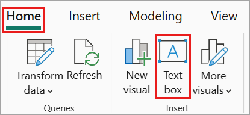
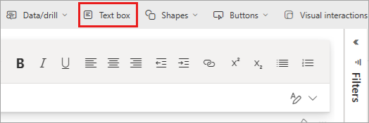
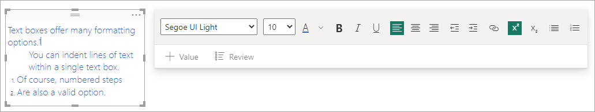
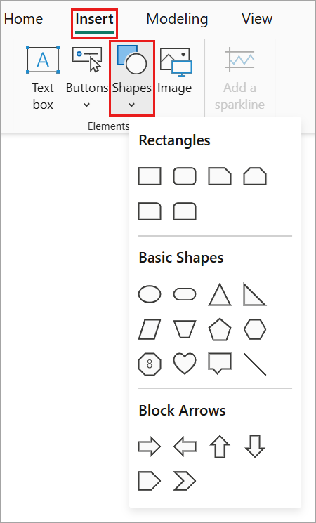
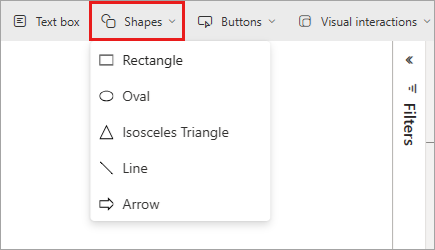

# Add text boxes, shapes, and smart narrative visuals to Power BI reports

[!INCLUDE [applies-yes-desktop-yes-service](../includes/applies-yes-desktop-yes-service.md)]

You can add text boxes, shapes, and *smart narrative visuals* to reports in Power BI Desktop or the Power BI service. The [smart narrative visual](#add-a-smart-narrative) uses artificial intelligence to provide a text summary of your visuals and reports.

In either Power BI Desktop or the Power BI service, you must have editing permissions for the report. If a report is shared with you in the Power BI service, you don't have editing permissions.

## Add a text box to a report

This procedure uses the [Retail Analysis sample](sample-retail-analysis.md) available in the Power BI service.

# [Power BI Desktop](#tab/powerbi-desktop)

1. In Power BI Desktop, go to the **Home** tab. In the **Insert** section, select **Text box**.

   

   The **Text box** option is also available on the **Insert** tab.

# [Power BI service](#tab/powerbi-service)

1. In the Power BI service, open a report in Editing view, and select **Text box** from the top menu.

   

---

2. Power BI places an empty text box on the canvas. To position the text box, select the grey area at the top and drag to your desired location. To resize the text box, select and drag any of the sizing handles.

   

3. Type your text into the text box. You can then set the format font style. Font styles include color, size, and subscript or superscript, and text alignment, including indents and bulleted lists.

4. With the text box still selected, add other formatting in the **Format text box** pane. In this example, the text has a theme color, and added bullets and superscript. You can also specify an exact size and position for a text box.  

   

5. When you finish editing the text box, select any blank space on the report canvas.

6. In the Power BI service, you can also pin a text box to a dashboard. Select the pin icon, then select the dashboard where you want to pin it.

   

## Add a shape to a report

You can add shapes to Power BI reports with various formatting options and styling. You can also upgrade old shapes in your reports.

# [Power BI Desktop](#tab/powerbi-desktop)

1. In Power BI Desktop, go to the **Insert** tab. In the **Elements** section, select **Shapes**.

   

# [Power BI service](#tab/powerbi-service)

1. In the Power BI service, open a report in Editing view, and select **Shapes** from the top menu.

   

---

2. From the dropdown menu, select a shape to add it to your report canvas. Then, in the **Format** pane, you can customize the shape to suit your needs. For this example, the arrow is rotated 45 degrees and formatted to include text and a shadow.

   :::image type="content" source="media/power-bi-reports-add-text-and-shapes/power-bi-arrow.png" alt-text="Screenshot of an arrow shape that is formatted by adding text, shadow, and rotation.":::

3. To position the shape, select the grey area at the top and drag to the desired location. To resize the shape, select and drag any of the sizing handles. As with the text box, you can also create an exact size and position for a shape.

   > [!NOTE]
   > Shapes cannot be pinned to a dashboard, except as one of the visuals when you [pin a live page](service-dashboard-pin-live-tile-from-report.md).
   >  

## Add a smart narrative

You can also add a *smart narrative* to your report. The smart narrative visualization uses artificial intelligence to provide a text summary of your visuals and reports. It provides relevant insights that you can customize.

1. In the **Visualizations** pane, select the **Smart narrative** icon. If you don't see it, you may need to turn on the preview.

    

2. Power BI creates a text box with autogenerated text describing interesting features of the data in your report.

    

3. You can format it as you would any other text box. The smart narrative underlines values found in the data.

Read more about [smart narratives](../visuals/power-bi-visualization-smart-narrative.md).

## Related content

For more information, see:

* [Add a hyperlink to a text box](service-add-hyperlink-to-text-box.md)
* [Basic concepts for designers in the Power BI service](../fundamentals/service-basic-concepts.md)
* More questions? [Try the Power BI Community](https://community.powerbi.com/)
