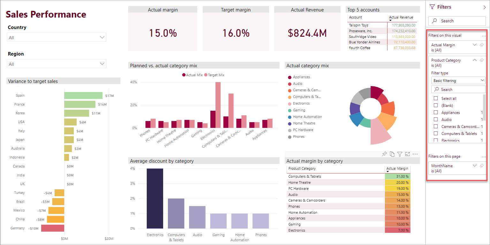
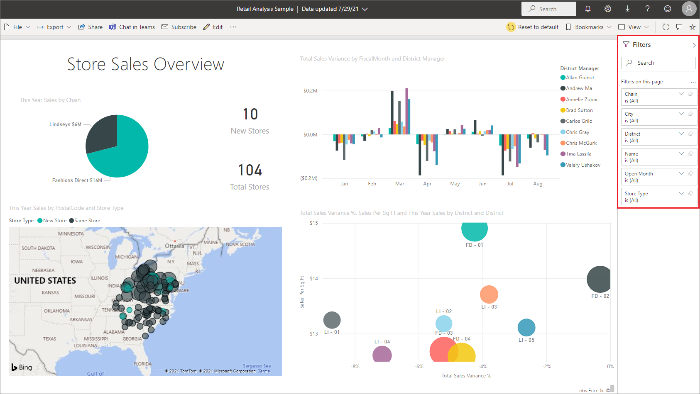
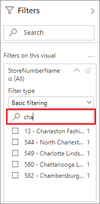
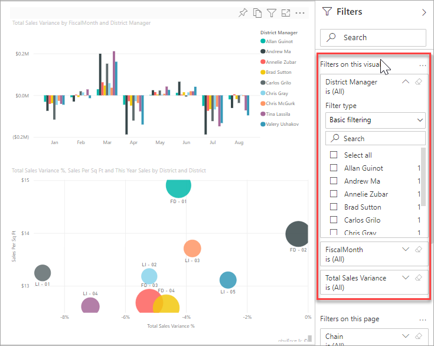
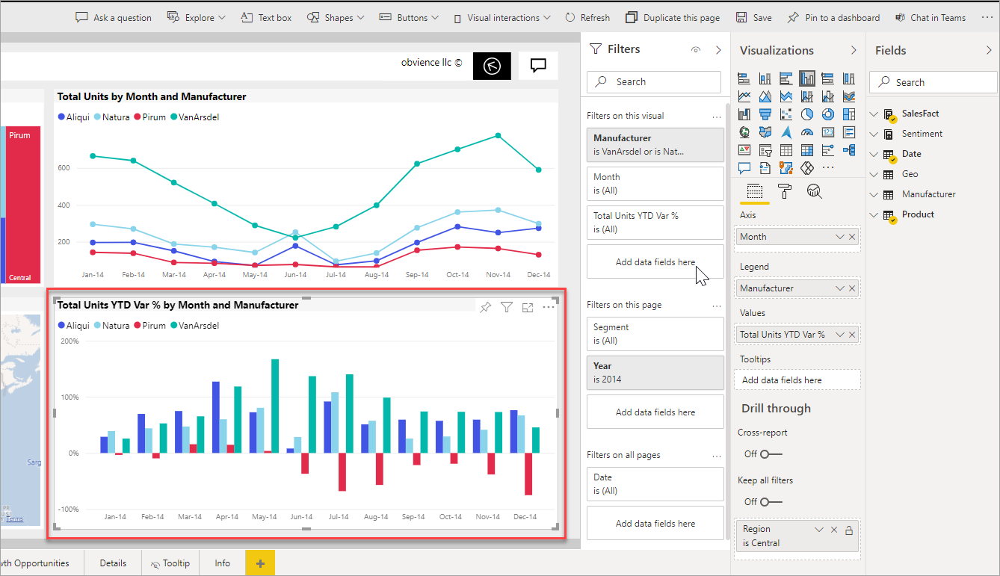

# Filters and highlighting in Power BI reports

 This article introduces you to filtering and highlighting in the Power BI service. The experience is almost exactly the same in Power BI Desktop. *Filters* remove all but the data you want to focus on. In general, *highlighting* isn't filtering. In most visuals, highlighting doesn't remove the unrelated data. Instead it highlights the related data. The rest of the data remains visible but dimmed. See [Cross-filter and cross-highlight](#cross-filter-and-cross-highlight-visuals) later in this article for details.

There are many ways to filter and highlight reports in Power BI. Putting all of that information in one article would be a lot, so we've broken it into these sections:

* Introduction to filters and highlighting, the article you're reading now.
* How [filters and highlighting work in Reading view](../consumer/end-user-interactions.md) in the Power BI service. What you can do is more limited than Editing view, but you still have a wide range of filtering and highlighting options.
* How to [create filters in the Filters pane](power-bi-report-add-filter.md) in Power BI Desktop and the Power BI service. When you have editing permissions for a report, you can create, modify, and delete filters in reports.
* After you add filters, you can [format the filters](power-bi-report-filter.md) to act the way you want and to look like the rest of the report.
* You've learned how filters and highlighting work by default. Now learn how to [change the way visualizations on a page filter and highlight each other](service-reports-visual-interactions.md).
* Read about other [types of filters in Power BI reports](power-bi-report-filter-types.md).

## Intro to the Filters pane

You can apply filters in the **Filters** pane, or [make selections in slicers](../visuals/power-bi-visualization-slicers.md) directly on the report page itself. The Filters pane shows the fields in individual visuals and any other filters the report designer adds.

There are four standard types of filters that you create in the Filters pane.

- **Visual filter** applies to a single visual on a report page. You see visual-level filters when you select a visual on the report canvas. Even if you can't edit a report, you can select a visual and filter it.
- **Page filter** applies to all the visuals on the report page.
- **Report filter** applies to all pages in the report.
- **Drillthrough filter** With drillthrough in the Power BI service and Power BI Desktop, you create a *destination* report page that focuses on a specific entity, such as a supplier. From the other report pages, users can right-click a data point for that entity and drill through to the focused page.

To create the visual, page, and report filters, see [Add a filter to a report in Power BI](power-bi-report-add-filter.md).

To create drillthrough filters, see [Set up drillthrough in Power BI reports](desktop-drillthrough.md).

### Basic and advanced filtering

By default, report readers can switch from **Basic** to **Advanced** filtering.

**Basic filters** show a list of all the values in the field. You can search in page, visual, and report filters, in Reading or Editing view, to find and select the value you want.

A filter with the word **All** next to it is unfiltered, showing all the values in the field. For example, **Chain is (All)** means the report page includes data about all the store chains. In contrast, the report-level filter **FiscalYear is 2013 or 2014** means the report is only showing data for the fiscal years of 2013 and 2014.

**Advanced filters** let you use more complicated filters. For example, you could search for values that contain or don't contain, start with or don't start with, a specific value.

:::image type="content" source="media/power-bi-reports-filters-and-highlighting/power-bi-advanced-filter.png" alt-text="Screenshot of the Filters pane, showing Advanced filters filtering options.":::

When you create a report, you can turn off switching and [not allow report readers to change filter types](power-bi-report-filter.md#restrict-changes-to-filter-type). You can also turn off searches in the filter pane.

## Filters in Reading or Editing view

There are two modes for interacting with reports in the Power BI service: Reading view and Editing view. The filtering capabilities available to you depend on which mode you're in.

* In [Reading view](#filters-in-reading-view), you can interact with any filters that already exist in the report and save the selections you make. You can't add new filters.
* In [Editing view](#filters-in-editing-view), you can add all kinds of filters. When you save the report, the filters are saved with the report even if report readers open it in a mobile app. People looking at the report in Reading view interact with the filters you added, but they can't add new filters.

### Filters in Reading view

In the Power BI service, if you select a visual in Reading view, the Filters pane looks similar to this example:

Each visual has filters for all of the fields in the visual. When you create a report, you can add more. In this Filters pane, the visual has three filters.

In Reading view, you explore the data by modifying the existing filters. You're only filtering your view of the report. When you exit the report, the changes you make are saved with your view of the report even if you open the report in a mobile app. To undo your filtering and return to the defaults set by the report author, select **Reset to default** from the top menu bar.

:::image type="content" source="../media/power-bi-reset-icon.png" alt-text="Screenshot of the Reset to default icon.":::

Learn more about Reading view: [Take a tour of the report Filters pane](../consumer/end-user-report-filter.md).

### Filters in Editing view

When you open a report in Power BI Desktop, you see that **Filters** is just one of several editing panes available. You see the same panes if you open a report in Editing view in the Power BI service.

This page of the report has four page-level filters. By selecting the column chart, we see it also has three visual-level filters.

#### Work with filters in Editing view

- Learn how to [Add filters to a report](power-bi-report-add-filter.md) in Power BI Desktop and in Editing view in the Power BI service.

- After you add filters, you have lots of formatting options for them. For example, you can hide, lock, or reorder filters, or format them to match the rest of the report. Learn how to [format filters in a report](power-bi-report-filter.md).

- You can also change the way the visuals interact. To fine-tune cross-highlighting and cross-filtering, see [Change how visuals interact in reports](service-reports-visual-interactions.md).

## Cross-filter and cross-highlight visuals

You can explore the relationships between the visuals in your report without using filters or slicers. Select a value or axis label in one visual to *cross-filter* or *cross-highlight* the related values in other visuals on the page. They don't all behave the same.

- **Cross-highlighting** Selecting a value in one visual highlights the related data in visuals such as column and bar charts. Cross-highlighting doesn't remove the unrelated data from those visuals. The unrelated data is still visible but dimmed.
- **Cross-filtering** Selecting a value in one visual acts more like a filter in other visuals, such as line charts, scatter charts, and maps. In those visuals, only the related data remains visible. The unrelated data isn't visible, just as you'd see with a filter.

To remove the highlighting, select the value again, or select any empty space in the same visual. For more examples, see the [Cross-filtering and cross-highlighting](../consumer/end-user-interactions.md#cross-filter-and-cross-highlight) section of "How visuals cross-filter each other in a Power BI report."

:::image type="content" source="media/power-bi-reports-filters-and-highlighting/power-bi-adhoc-filter.gif" alt-text="Animation showing cross-filtering and cross-highlighting.":::

## Related content

- [Add a filter to a report in Editing view](power-bi-report-add-filter.md)
- [Format filters in Power BI reports](power-bi-report-filter.md)
- [Take a tour of report filters](../consumer/end-user-report-filter.md)
- [How report visuals cross-filter and cross-highlight each other in a report](../consumer/end-user-interactions.md)

More questions? [Try the Power BI Community](https://community.powerbi.com/)
