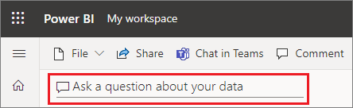
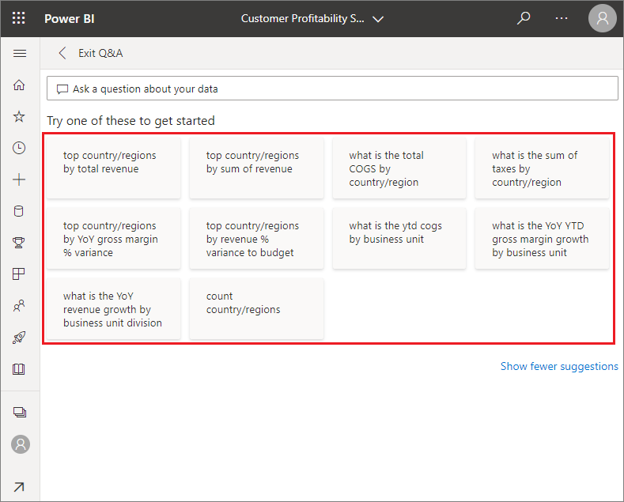
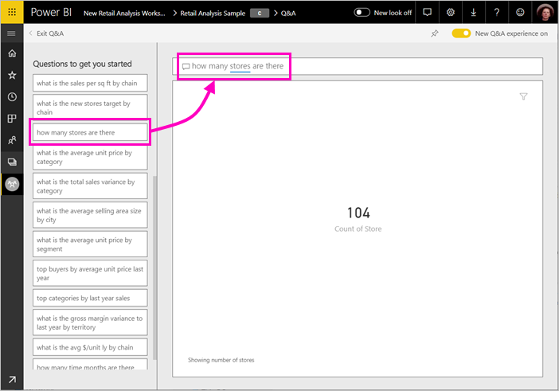
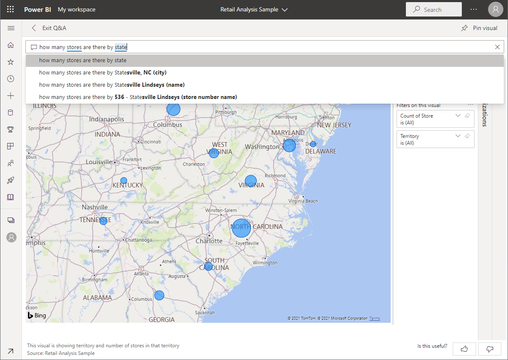
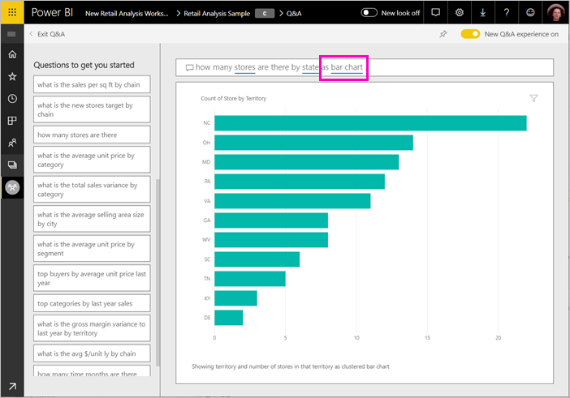
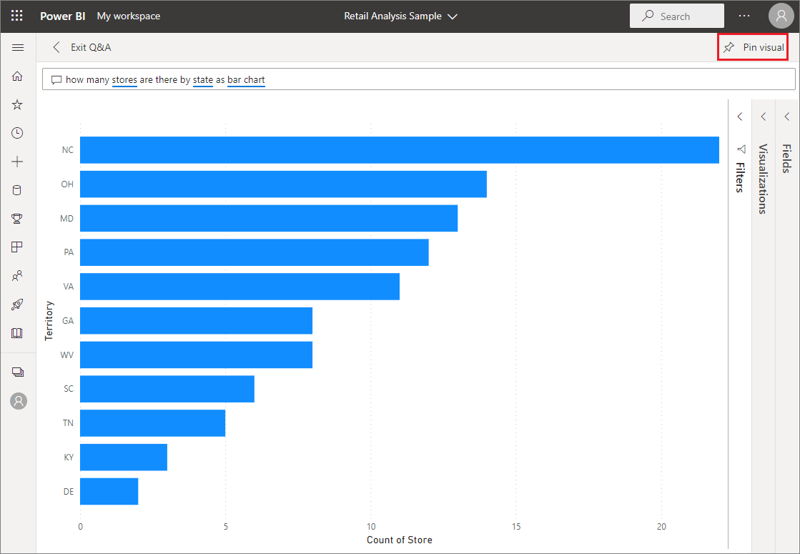
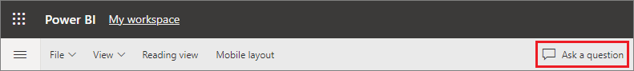
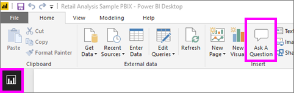
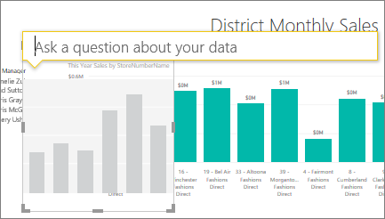
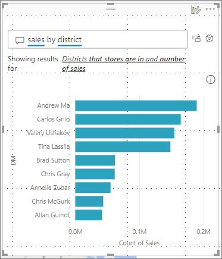

# Use Power BI Q&A to explore your data and create visuals

Sometimes the fastest way to get an answer from your data is to ask a question using natural language. The Q&A feature in Power BI lets you explore your data in your own words.  The first part of this article shows how you use Q&A in dashboards in the Power BI service. The second part shows what you can do with Q&A when creating reports in either the Power BI service or Power BI Desktop. For more background, see the [Q&A for consumers](../consumer/end-user-q-and-a.md) article. 

[Q&A in the Power BI mobile apps](../consumer/mobile/mobile-apps-ios-qna.md) and [Q&A with Power BI Embedded](../developer/embedded/qanda.md) are covered in separate articles. 

Q&A is interactive, even fun. Often, one question leads to others as the visualizations reveal interesting paths to pursue. Watch Amanda demonstrate using Q&A to create visualizations, dig into those visuals, and pin them to dashboards.

<iframe width="560" height="315" src="https://www.youtube.com/embed/qMf7OLJfCz8?list=PL1N57mwBHtN0JFoKSR0n-tBkUJHeMP2cP" frameborder="0" allowfullscreen></iframe>

## Part 1: Use Q&A on a dashboard in the Power BI service

In the Power BI service (app.powerbi.com), a dashboard contains tiles pinned from one or more datasets, so you can ask questions about any of the data contained in any of those datasets. To see what reports and datasets were used to create the dashboard, select the **More options** ellipsis from the menu bar, and then select **See related content**.

The Q&A question box is located in the upper-left corner of your dashboard, where you type your question using natural language. Don't see the Q&A box? See [Considerations and troubleshooting](../consumer/end-user-q-and-a.md#considerations-and-troubleshooting) in the **Q&A for consumers** article.  Q&A recognizes the words you type and figures out where (in which dataset) to find the answer. Q&A also helps you form your question with auto-completion, restatement, and other textual and visual aids.

The answer to your question is displayed as an interactive visualization and updates as you modify the question.

1. Open a dashboard and place your cursor in the question box. Even before you start typing, Q&A displays a new screen with suggestions to help you form your question. You see phrases and complete questions containing the names of the tables in the underlying datasets and may even see complete questions listed if the dataset owner has created [featured questions](service-q-and-a-create-featured-questions.md),

   

   You can choose one of these questions as a starting point and continue to refine the question to find a specific answer. Or use a table name to help you word a new question.

2. Select from the list of questions, or begin typing your own question and select from the dropdown suggestions.

   

3. As you type a question, Q&A picks the best visualization to display your answer.

   

4. The visualization changes dynamically as you modify the question.

   

1. When you type a question, Power BI looks for the best answer using any dataset that has a tile on that dashboard.  If all the tiles are from *datasetA*, then your answer will come from *datasetA*.  If there are tiles from *datasetA* and *datasetB*, then Q&A searches for the best answer from those 2 datasets.

   > [!TIP]
   > So be careful, if you only have one tile from *datasetA* and you remove it from your dashboard, Q&A will no longer have access to *datasetA*.
   >

5. When you're happy with the result, pin the visualization to a dashboard by selecting the pin icon in the top right corner. If the dashboard has been shared with you, or is part of an app, you won't be able to pin.

   

## Part 2: Use Q&A in a report in Power BI service or Power BI Desktop

Use Q&A to explore your dataset and to add visualizations to the report and to dashboards. A report is based on a single dataset and may be completely blank or contain pages full of visualizations. But just because a report is blank, doesn't mean there isn't any data for you to explore -- the dataset is linked to the report and is waiting for you to explore and create visualizations.  To see which dataset is being used to create a report, open the report in Power BI service Reading view and select **...** > **See related content** from the menu bar.

To use Q&A in reports, you must have edit permissions for the report and underlying dataset. In the [Q&A for consumers](../consumer/end-user-q-and-a.md) article, we refer to this as a *creator* scenario. If instead you're *consuming* a report that has been shared with you, Q&A isn't available.

1. In Power BI service, open a report in Editing view and select **Ask a question** from the menu bar. In Power BI Desktop Report view, select **Q&A** from the **Insert** tab.

    **Service**    
    

    **Power BI Desktop**    
    

2. A Q&A question box displays on your report canvas. In the example below, the question box displays on top of another visualization. This is fine, but it might be better to add a blank page to the report before asking a question.

    

3. Place your cursor in the question box. As you type, Q&A displays suggestions to help you form your question.

   

4. As you type a question, Q&A picks the best [visualization ](../visuals/power-bi-visualization-types-for-reports-and-q-and-a.md)to display your answer; and the visualization changes dynamically as you modify the question.

   

5. When you have the visualization you like, select ENTER. To save the visualization with the report, select **File > Save**.

6. Interact with the new visualization. It doesn't matter how you created the visualization -- all the same interactivity, formatting, and features are available.

   

   If you've created the visualization in Power BI service, you can even [pin it to a dashboard](service-dashboard-pin-tile-from-q-and-a.md).

## Tell Q&A which visualization to use
With Q&A, not only can you ask your data to speak for itself, you can tell Power BI how to display the answer. Just add "as a \<visualization type>" to the end of your question.  For example, "show inventory volume by plant as a map" and "show total inventory as a card".  Try it for yourself.

## Considerations and troubleshooting
- If you've connected to a dataset using a live connection or gateway, Q&A needs to be [enabled for that dataset](service-q-and-a-direct-query.md).

- You've opened a report and don't see the Q&A option. If you're using Power BI service, make sure the report is open in Editing view. If you can't open Editing view it means you don't have edit permissions for that report and you can use Q&A with that specific report.

## Next steps

- [Q&A for consumers](../consumer/end-user-q-and-a.md)   
- [Tips for asking questions in Q&A](../consumer/end-user-q-and-a-tips.md)   
- [Prepare a workbook for Q&A](service-prepare-data-for-q-and-a.md)  
- [Prepare an on-premises dataset for Q&A](service-q-and-a-direct-query.md)   
- [Pin a tile to the dashboard from Q&A](service-dashboard-pin-tile-from-q-and-a.md)
