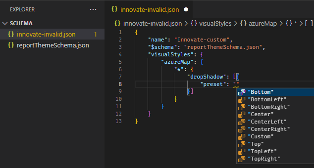

# Create custom report themes in Power BI Desktop

[!INCLUDE [applies-yes-desktop-no-service](../includes/applies-yes-desktop-no-service.md)]

This article describes how to create a custom report theme JSON file to fully customize the look and feel of your Power BI reports. For information about applying and using themes, see [Use report themes in Power BI Desktop](desktop-report-themes.md).

## Create a custom theme file

At its most basic level, the theme JSON file has only one required line: `name`.

```json
{
    "name": "Custom Theme"
}
```

Other than `name`, everything else is optional. Add only the properties you want to format to the theme file. You can continue to use Power BI's defaults in the base theme for the rest.

For example, you can set a default font size for all charts, specify font families for certain visuals, or turn off data labels for specific chart types. This approach makes it easy to standardize the look of your organization's reports.

When you import your theme file, Power BI validates it to make sure it can successfully read its full contents. If Power BI finds fields it doesn't understand, it displays an error message and prompts you to reimport a corrected theme file. Power BI publishes the validation schema in a public location and updates it automatically whenever Power BI changes. You can use this published schema to ensure your theme files stay current.

Power BI validates custom themes based on a *JSON schema*. You can [download this JSON schema](https://github.com/microsoft/powerbi-desktop-samples/tree/main/Report%20Theme%20JSON%20Schema) and use it with an IDE that supports JSON validation. The schema helps you identify available formatting options and highlights invalid formatting. For more information, see the [Report Theme JSON Schema repository](https://github.com/microsoft/powerbi-desktop-samples/tree/main/Report%20Theme%20JSON%20Schema).

> [!NOTE]
> Modifying a custom JSON report theme in the **Customize theme** dialog box is safe. The dialog doesn't modify theme settings that it can't control and updates the changes made to the report theme that's in place.

A theme file has four main components:

- [Theme colors](#set-theme-colors)
- [Structural colors](#set-structural-colors)
- [Text classes](#set-formatted-text-defaults)
- [Visual styles](#set-properties-for-visual-types)

The following sections describe each component in detail.

## Set theme colors

Under `name`, add the following basic data color-related properties:

- `dataColors`: These hexadecimal codes determine the color of shapes that represent data in Power BI Desktop visuals. This list can have as many colors as you want. When all colors are used, Power BI automatically generates additional unique colors by adjusting saturation and hue.
- `good`, `neutral`, `bad`: These properties set the status colors used by the waterfall chart and the KPI visual.
- `maximum`, `center`, `minimum`, `null`: These colors set the various gradient colors in the conditional formatting dialog box.

A basic theme that defines these colors might appear as follows:

```json
{
    "name": "Custom Theme",
    "dataColors": [
        "#118DFF",
        "#12239E",
        "#E66C37",
        "#6B007B",
        "#E044A7",
        "#744EC2",
        "#D9B300",
        "#D64550",
        "#197278",
        "#1AAB40"
    ],
    "good": "#1AAB40",
    "neutral": "#D9B300",
    "bad": "#D64554",
    "maximum": "#118DFF",
    "center": "#D9B300",
    "minimum": "#DEEFFF",
    "null": "#FF7F48"
}
```

## Set structural colors

Next, add various color classes, such as `background` and `firstLevelElements`. These color classes set the structural colors for elements in the report, such as axis gridlines, highlight colors, and background colors for visual elements.

The following table shows the six color classes you can format. The **Color class** names correspond to the names in the "Advanced" subsection of the "Name and Colors" section in the **Customize theme** dialog box.

| Color class preferred name | Also called | What it formats |
|---|---|---|
| **firstLevelElements** | **foreground** | Label background color (when outside data points) |
| | | Trend line color |
| | | Textbox default color |
| | | Table and matrix values and totals font colors |
| | | Data bars axis color |
| | | Card data labels |
| | | Gauge callout value color |
| | | KPI goal color |
| | | KPI text color |
| | | Slicer item color (when in focus mode) |
| | | Slicer dropdown item font color |
| | | Slicer numeric input font color |
| | | Slicer header font color |
| | | Scatter chart ratio line color |
| | | Line chart forecast line color |
| | | Map leader line color |
| | | Filter pane and card text color |
| | | Modern visual tooltips text and icon color |
| **secondLevelElements** |**foregroundNeutralSecondary**| Light [secondary text classes](#set-formatted-text-defaults) |
| | | Label colors |
| | | Legend label color |
| | | Axis label color |
| | | Table and matrix header font color |
| | | Gauge target and target leader line color |
| | | KPI trend axis color |
| | | Slicer slider color |
| | | Slicer item font color |
| | | Slicer outline color |
| | | Line chart hover color |
| | | Multi-row card title color |
| | | Ribbon chart stroke color |
| | | Shape map border color |
| | | Button text font color |
| | | Button icon line color |
| | | Button outline color |
| **thirdLevelElements** | **backgroundLight** | Axis gridline color |
| | | Table and matrix grid color |
| | | Slicer header background color (when in focus mode) |
| | | Multi-row card outline color |
| | | Shape fill color |
| | | Gauge arc background color |
| | | Applied filter card background color |
| | | Disabled button fill color (when the background is `FFFFFF`) |
| | | Disabled button outline color (when the background is `FFFFFF`) |
| **fourthLevelElements** | **foregroundNeutralTertiary** | Legend dimmed color |
| | | Card category label color |
| | | Multi-row card category labels color |
| | | Multi-row card bar color |
| | | Funnel chart conversion rate stroke color |
| | | Disabled button text font color |
| | | Disabled button icon line color |
| **background** | | Label background color (when inside data points) |
| | | Slicer dropdown items background color |
| | | Donut chart stroke color |
| | | Treemap stroke color |
| | | Combo chart background color |
| | | Button fill color |
| | | Filter pane and available filter card background color |
| | | Modern visual tooltips background color|
| **secondaryBackground** | **backgroundNeutral** | Table and matrix grid outline color |
| | | Shape map default color |
| | | Ribbon chart ribbon fill color (when match series option is turned off) |
| | | Disabled button fill color (when the background color isn't `FFFFFF`) |
| | | Disabled button outline color (when the background color isn't `FFFFFF`) |
| | | Modern visual tooltips separator line and hover color|
| **tableAccent** | | Table and matrix grid outline color (when present) |

Here's a sample theme that sets the color classes:

```json
{
    "name": "Custom Theme",
    "firstLevelElements": "#252423",
    "secondLevelElements": "#605E5C",
    "thirdLevelElements": "#F3F2F1",
    "fourthLevelElements": "#B3B0AD",
    "background": "#FFFFFF",
    "secondaryBackground": "#C8C6C4",
    "tableAccent": "#118DFF"
}
```
 
> [!TIP]
> If you use a dark theme or other colorful theme that diverges from the typical black `firstLevelElements` on white `background` style, set the values for other structural colors and the [primary text class colors](#set-formatted-text-defaults). This configuration ensures that data labels on charts with a label background match the anticipated style, are readable, and have visible axis gridlines.

## Set formatted text defaults

Next, add text classes to your JSON file. Text classes are similar to color classes, but they allow you to update the font size, color, and family for groups of text across your report.

Set four of the 12 classes, called *primary classes*, to change all of the text formatting in your report. Set these four primary classes in the **Customize theme** dialog box under the **Text** section: **General** corresponds to **label**, **Title** to **title**, **Cards and KPIs** to **callout**, and **Tab headers** to **header**.

*Secondary classes* automatically derive their properties from their associated primary classes. Often, a secondary class selects a lighter shade of text color or a percentage larger or smaller text size compared to the primary class.

Take the **label** class as an example. The default formatting for the **label** class is Segoe UI, #252423 (a dark grey color), with a 12-point font. This class formats the values in the table and matrix. Typically, the totals in a table or matrix have similar formatting but are made bold with the **bold label** class so that they stand out. However, you don't need to specify that class in the theme JSON. Power BI does so automatically. If you decide to specify labels that have a 14-point font in your theme, you don't need to also update the **bold label** class because it inherits text formatting from the **label** class.

The following table shows:

- Each of the four primary text classes, what it formats, and its default settings.
- Each secondary class, what it formats, and its default setting that's unique compared to the primary class.

|Primary class  |Secondary classes  |JSON class name  | Default settings  |Associated visual objects  |
|---------|---------|---------|---------|---------|
| Callout | N/A | callout | DIN #252423 45 pt |Card data labels KPI indicators|
|Header|N/A|header|Segoe UI Semibold #252423 12 pt |Key influencers headers |
| Title || title |DIN #252423 12 pt |Category axis title Value axis title  Multi-row card title *Slicer header|
|-| Large title | largeTitle |14 pt |Visual title |
|Label ||label |Segoe UI #252423 10 pt |Table and matrix column headers Matrix row headers Table and matrix grid Table and matrix values |
|-|Semibold |semiboldLabel| Segoe UI Semibold | Key influencers profile text|
|-|Large |largeLabel |12 pt | Multi-row card data labels |
|-|Small |smallLabel |9 pt |Reference line labels *Slicer date range labels Slicer numeric input text style Slicer search box Key influencers influencer text|
|-|Light |lightLabel |#605E5C |Legend text Button text Category Axis labels Funnel chart data labels Funnel chart conversion rate labels Gauge target Scatter chart category label Slicer items|
|-|Bold |boldLabel |Segoe UI Bold |Matrix subtotals Matrix grand totals Table totals |
|-|Large and Light |largeLightLabel |#605E5C 12 pt |Card category labels Gauge labels Multi-row card category labels |
|-|Small and Light |smallLightLabel |#605E5C 9 pt |Data labels Value axis labels|

*\* Starred items are based on the first data color of the report theme.*

Use the `bold` Boolean setting to adjust the format. To make the text bold, use the following settings:

- `bold`: true
- `titleBold`: true

> [!TIP]
> The *light* variations of text classes take their light color from the [structural colors](#set-structural-colors) defined earlier.  If you're authoring a `dark theme`, set the color's `firstLevelElements` (matching the primary text color), `secondLevelElements` (matching the anticipated light color for text), and `background` (with sufficient contrast to both first- and second-level elements colors).

See the following example theme that sets only the primary text classes:

```json
{
    "name": "Custom Theme",
    "textClasses": {
        "callout": {
            "fontSize": 45,
            "fontFace": "DIN",
            "color": "#252423"
        },
        "title": {
            "fontSize": 12,
            "fontFace": "DIN",
            "color": "#252423"
        },
        "header": {
            "fontSize": 12,
            "fontFace": "Segoe UI Semibold",
            "color": "#252423"
        },
        "label": {
            "fontSize": 10,
            "fontFace": "Segoe UI",
            "color": "#252423"
        }
    }
}
```

Because secondary classes inherit from the primary classes, you don't need to set them in your theme file. However, if you don't like the inheritance rules (for example, if you don't want bolded totals), you can explicitly format the secondary classes in the theme file, just like you can format the primary classes.

## Find visual properties

### Use the JSON schema

[The report theme schema](https://github.com/microsoft/powerbi-desktop-samples/tree/main/Report%20Theme%20JSON%20Schema) helps you identify what properties are available to style with a report theme. By using the schema as a local reference in your theme file, you can use the autocomplete functionality of your IDE to identify available formatting options.

For example, by using [Visual Studio Code's](https://code.visualstudio.com/download) [support for JSON schema](https://code.visualstudio.com/docs/languages/json#_json-schemas-and-settings), you can define a theme as follows with "reportThemeSchema.json" downloaded from the [schema repository](https://github.com/microsoft/powerbi-desktop-samples/tree/main/Report%20Theme%20JSON%20Schema) and placed in the same folder:

```json
{
    "name": "My custom theme",
    "$schema": "reportThemeSchema.json"
}
```

With this defined, you can use autocomplete in [Visual Studio Code](https://code.visualstudio.com/download) to understand the structure and available formatting options. Trigger autocomplete explicitly by using the key combination *Ctrl* + *Space*. The description pop-up shows the formatting item's display name and description as they show in the Formatting pane, if available:



### Use the formatting pane and PBIR files

If you already manually formatted a visual to a specific style and now want to create a style preset or make it the default look for that visual type, these steps are for you. 

1. Save your report as a [PBIP](/power-bi/developer/projects/projects-overview) by going to **File** > **Save as** then choosing *PBIP* from the file type.
1. Enable **Report objects** / **Copy object names when right clicking on report visuals.** in **File** > **Options and settings** > **Options** > **GLOBAL** > **Report settings**.
1. In the context menu of the visual you want to find the properties you set, choose **Copy object name**.
1. In File Explorer, navigate to the folder containing your PBIP project.
1. Right-click the folder and choose **Open in Code** to open it in [Visual Studio Code](https://code.visualstudio.com/download).
1. Use the search box at the top to search all files for the object name you copied earlier.
1. Open the file containing that visual object.
1. The **objects** node contains the property names and values for the formatting options you configured. You can't copy and paste these values directly because the theme file requires a different structure.

For example, here is an input slicer's *corner radius* option set to *4px* in the format pane. In the [PBIR file format](/power-bi/developer/projects/projects-report#pbir-format), this option looks like this:

```json
    "objects": {
      "inputText": [
        {
          "properties": {
            "pillCornerRadius": {
              "expr": {
                "Literal": {
                  "Value": "4L"
                }
              }
            }
          }
        }
      ],
```

In the theme `JSON` file, it would be added like this:

```json
"visualStyles": {
        "textSlicer": {
            "*":{
                "inputText": [{
                    "pillCornerRadius": 4
                }]
            }
        }
    }
```

In this example *inputText* and *pillCornerRadius* are what you need to translate this formatting pane option to a theme file property.

## Set properties for visual types

Visual styles let you specify the default and presets for each visual type. A visual type can be line chart, area chart, clustered bar chart, etc. 

To use, add a `visualStyles` section to the JSON file. See the following example of the `visualStyles` section:

```json
    "visualStyles": {
        "<visualName>": {
            "<stylePresetName>": {
                "<cardName>": [{
                    "<propertyName>": <propertyValue>
                }]
            }
        }
    }
```

- **visualName** is the name of the visual type. 
- **stylePresetName** can be an asterisk ("*") for the default visual style, or a name in quotes ("My new preset") to create a named preset that appears in a dropdown menu. Named style presets inherit settings from the default visual style, so define common settings in the default style only.
- **cardName** is the name of the formatting section you want to target. This can be an asterisk ("*") if you want to target properties in many formatting sections, such as font sizes. What the formatting pane displays in Power BI may not map to the theme file card name, so be sure to utilize the theme schema file or [PBIR file](/power-bi/developer/projects/projects-report#pbir-format).
- **propertyName** is the name of the property you want to set.
- **propertyValue** is the value you want to set to that property.

The following example sets a few properties through the visual styles:

```json
{
   "name":"Custom Theme",
   "visualStyles":{
      "*": {
         "*": {
            "*": [{
                "wordWrap": true
            }],
            "categoryAxis": [{
                "gridlineStyle": "dotted"
            }],
            "filterCard": [
              {
                "$id": "Applied",
                "foregroundColor": {"solid": {"color": "#252423" } }
              },
              {
                "$id":"Available",
                "border": true
              }
            ]
         }
      },
      "scatterChart": {
         "*": {
            "bubbles": [{
                  "bubbleSize": -10
            }]
         }
      }
   }
}
```

This example makes the following settings:

- Turns on word wrap everywhere.
- Sets the gridline style to be dotted for all visuals with a category axis.
- Sets some formatting for the available and applied filter cards (note the format using "$id" to set the different versions of the filter cards).
- Sets the bubble size for scatter charts to -10.

> [!NOTE]
> You only need to specify the formatting elements you want to adjust. Any formatting elements that aren't included in the JSON file revert to their default values and settings.

## Create style presets in custom themes

**Style presets** are predefined formatting options that you can apply to visual elements in a theme file. Each style preset is specific to the visual it's defined on. These presets let you change multiple formatting options at once without adjusting each one manually. This feature enhances the customization capabilities of Power BI reports by enabling you to quickly apply consistent styles across different visuals.

When you create and import a custom JSON theme file that includes your desired style presets, the new **Style presets** menu option becomes visible within the **Format Visual** section of the **Visualizations pane**.

By using the **Style** dropdown, you can select any of your predefined style presets from the newly imported theme file. The formatting options are automatically applied to visual elements in your report, such as positioning elements or altering colors.

   :::image type="content" source="media/desktop-report-themes/style-presets-example-00.png" alt-text="Screenshot displaying a Style presets menu on the Visuals tab of the Format visuals section in the Visualizations pane.":::

### Define style presets

To define style presets, create a custom theme by using a JSON file. The JSON file contains the formatting options for different visual elements. As explained in this article, you can import this file to apply the custom theme that includes your style presets.

   :::image type="content" source="media/desktop-report-themes/style-presets-json-01.png" alt-text="Screenshot of a JSON file displaying default Style preset, plus three defined Style presets customized according to the user's needs.":::

When crafting a custom theme, you can specify which style preset is the default after importing, as shown. If you don't select or define a preset, Power BI's default settings are applied. The default settings ensure there are always fallback formatting options for visual elements.

The example theme depicted in the previous screenshot is displayed in the following code block:

```json
{
    "$schema": "./reportThemeSchema.json",
    "name": "Style Preset Demo Test",
    "visualStyles": {
        "columnChart": {
            "*": {
                "stylePreset": [{
                    "name": "Demo Preset 1"
                }]
            },
            "Demo Preset 1": {
                "legend": [{
                    "position": "BottomCenter"
                }],
                "valueAxis": [{
                    "gridlineColor": { "solid": { "color": "#950" } }
                }]
            },
            "Demo Preset 2": {
                "legend": [{
                    "position": "Right"
                }],
                "valueAxis": [{
                    "gridlineColor": { "solid": { "color": "#00f" } },
                    "labelColor": { "solid": { "color": { "expr": { "ThemeDataColor": { "ColorId": 2, "Percent": 0.6 } } } } }
                }]
            },
            "Demo Preset 3": {
                "legend": [{
                    "italic": true,
                    "position": "Left"
                }]
            }
        }
    }
}
```

### Apply style presets

The following example shows how to define and use custom style presets on a visualization. Style presets are specific to the visual type they're defined on.

The following steps outline the process to define and import a custom theme JSON file that includes style presets:

1. Copy the preceding code block to create the JSON file by using any text editor. Then save the **Style Preset Demo Test.json** file on your computer.
1. In Power BI Desktop, go to the **View** ribbon and select the **Themes** dropdown button.
1. Select **Browse for themes** and import the JSON file.
1. The newly defined style presets are available in the **Format Visual** section of the **Visualizations** pane.

After importing the custom theme, select 'Demo Preset 1' to set the legend position to the bottom center and change the gridline color of the value axis, as shown here:

   :::image type="content" source="media/desktop-report-themes/style-presets-example-01.png" alt-text="Screenshot of the Style presets menu displaying Demo Preset 1.":::

In this next example, 'Demo Preset 2' moves the legend to the right side and changes the gridline color and the label color of the value axis.

   :::image type="content" source="media/desktop-report-themes/style-presets-example-02.png" alt-text="Screenshot of the Style presets menu displaying Demo Preset 2.":::

An error message appears when the definition of a style preset isn't found for the specific visual. This author-only error message indicates the report lost reference to your custom style preset definitions and your custom style preset can't be found.

   :::image type="content" source="media/desktop-report-themes/style-presets-example-error.png" alt-text="Screenshot of the Style presets menu displaying an error message indicating that the custom style preset can't be found.":::

## Tips for setting values in the JSON theme file

Here are some helpful tips about setting values.

- Booleans are either true or false.
- Strings must be in double quotes, as in "this is a string."
- Numbers are just the value itself without quotes.
- When you use `dateTime`, the date must be an ISO date in single quotes, with "datetime" at the beginning. See the following example:

    "datetime'2022-10-05T14:48:00.000Z'"

- Colors that use a custom hexadecimal code to replace `FFFFFF` use the following format.  Either 3-digit or 6-digit hexadecimal values are acceptable:

    ```json
    { "solid": { "color": "#FFFFFF" } }
    ```

You can use an enumeration to format dropdown menus by setting menu options to any of the options in the pane, for example, `RightCenter` for legend position or `Data value, percent of total` for pie data label.  The enumerations are usually formatted as strings.

## Example report theme JSON file

Here's the *St Patricks Day.json* file in its entirety:

 ```json
    {
        "name": "St Patrick's Day",
        "dataColors": ["#568410", "#3A6108", "#70A322", "#915203", "#D79A12", "#bb7711", "#114400", "#aacc66"],
        "background":"#FFFFFF",
        "foreground": "#3A6108",
        "tableAccent": "#568410"
    }
```

This report theme JSON file has the following lines:

- `name`: The report theme name. This field is the only required field.
- `dataColors`: The list of color hexadecimal codes to use for data in Power BI Desktop visuals. This list can have as many or as few colors as you want.
- `background`, `foreground`, and `tableAccent`: Color classes. Color classes enable you to set many structural colors in your report at once.

You can copy this JSON and use it as a basis to create your own custom report theme file to import. If you want to adjust only the basic colors of your report, change the name and hex codes in the file.

## Extract and apply themes programmatically

You can also extract and apply report themes programmatically using Microsoft Fabric notebooks and [Semantic Link Labs](https://semantic-link-labs.readthedocs.io/en/stable/sempy_labs.report.html). This approach is useful for:

- Extracting themes from existing reports for reuse
- Applying themes to multiple reports at scale
- Automating theme management as part of your deployment pipeline

The Semantic Link Labs library provides functions to work with report themes through the Power BI REST APIs, allowing you to manage themes without manual file operations.

## Considerations and limitations

- You can't add conditional formatting rules to a custom theme. Conditional formatting must be applied separately to individual visuals after the theme is applied.

## Related content

- [Use report themes in Power BI Desktop](desktop-report-themes.md)
- [Apply report themes with the JavaScript API](/javascript/api/overview/powerbi/apply-report-themes)
- [Design Power BI reports for accessibility](desktop-accessibility-creating-reports.md)
- [Conditional formatting in Power BI](../visuals/power-bi-visualization-conditional-formatting.md)
- [Use custom format strings in Power BI Desktop](desktop-custom-format-strings.md)
- [Power BI project files overview](/power-bi/developer/projects/projects-overview)
