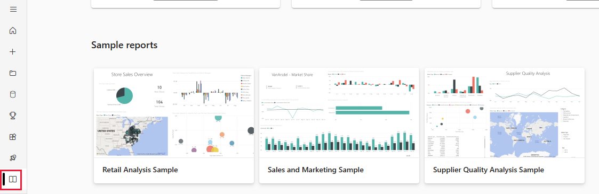
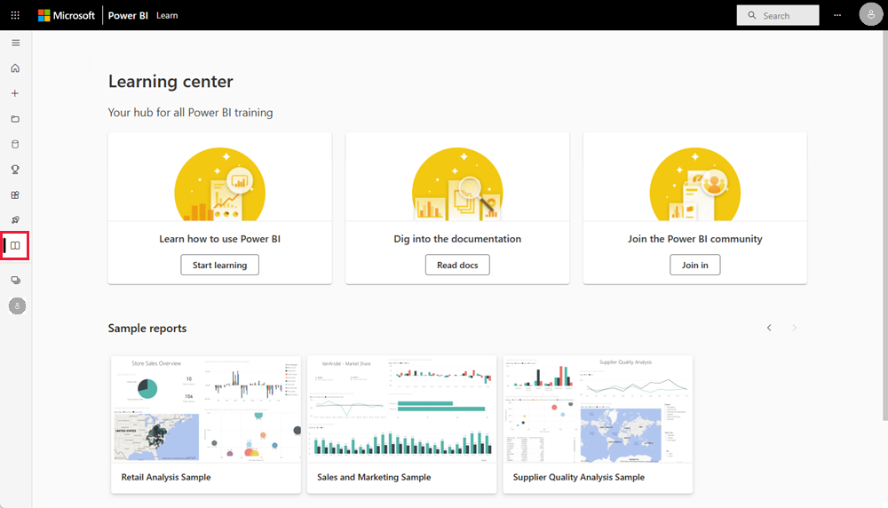
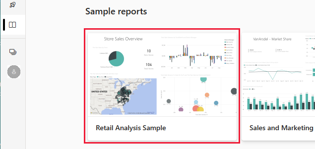
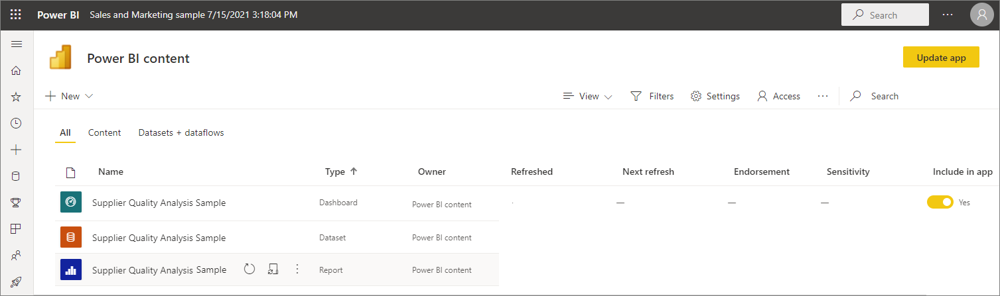
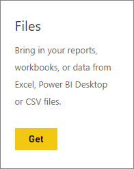
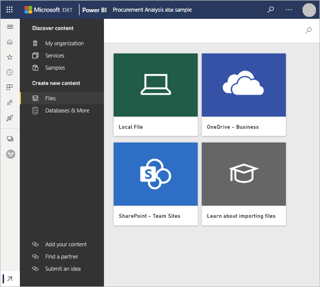
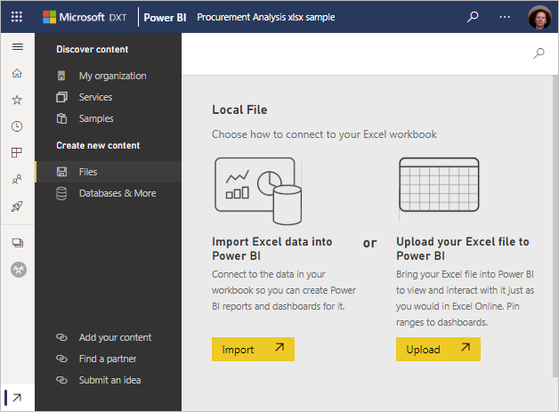
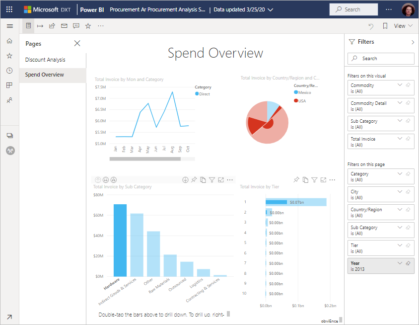

# Get samples for Power BI
Say you're new to Power BI and want to try it out but don't have any data.  Or maybe you'd like to see reports that illustrate some of the capabilities of Power BI. We've got you covered.

Power BI offers different kinds of samples, for different purposes: 
- A **[Power BI report](#sales--returns-sample-pbix-file) (.pbix file)** that you can view in the Data Stories Gallery, open and explore in Power BI Desktop, or upload to the Power BI service.
- A **[sample app](#sample-app-from-appsource)** that you download from AppSource, also right in the Power BI service. Apps include dashboards, reports, and datasets. You can modify them, then distribute them to your colleagues.
- **[Eight original built-in samples](#eight-original-samples)** in the Power BI service, with dashboards, reports, and datasets. You install them right in the Power BI service. The built-in samples are also available as Power BI reports (.pbix) and Excel workbooks (.xlsx).
- **[Excel workbook](#download-sample-excel-files)** versions of the built-in samples, containing the data model and Power View sheets. You can explore or edit the data model in Excel, use the Excel workbook as a data source for a Power BI report. You can also upload the workbook as an Excel file and display the Excel visuals and PivotTables in Power BI reports. 
- Also a **[Financial data sample workbook](sample-financial-download.md)**, a simple flat table in an Excel file available for download. It contains anonymized data with fictitious products, with sales divided by segments and countries/regions. It makes a useful basic data source for a Power BI report.

Our online documentation uses these same samples in tutorials and examples, so you can follow along.

## Sales & Returns sample .pbix file

:::image type="content" source="media/sample-datasets/sales-returns-sample-pbix.png" alt-text="Sales & Returns sample .pbix file":::

*The Sales & Returns sample report*

Power BI report designers Miguel Myers and Chris Hamill created the Sales & Returns .pbix file to demonstrate many new features in Power BI, including buttons, drillthrough, conditional formatting, what-if, and customized tooltips. 

The scenario for this report is a company that sells Microsoft-themed skateboards. They want to see the state of their sales and returns, and analyze how they should modify their operations. 

You can explore it these ways:

- View and interact with it in the Power BI Community [Data Stories Gallery](https://community.powerbi.com/t5/Data-Stories-Gallery/Sales-amp-Returns-Sample-Report/m-p/876607).
- Download the .pbix file and explore it in depth. Look "behind the curtain" to see how Miguel made it. Selecting this link downloads the file automatically: [Sales & Returns sample report](https://github.com/microsoft/powerbi-desktop-samples/blob/main/Sample%20Reports/Sales%20%26%20Returns%20Sample%20v201912.pbix).
- Read about the report in the Power BI blog post, [Take a tour of the new Sales & Returns sample report](https://powerbi.microsoft.com/blog/take_a_tour_of_the_new_sales_returns_sample_report/).

## Sample app from AppSource

The Marketing and Sales *app* is available from Microsoft AppSource. An app is a Power BI content type that combines related dashboards and reports. An app can have one or more dashboards and one or more reports, all bundled together. You can download the Marketing and Sales app from **Apps** in the Power BI service, or by going to AppSource in your browser.

- The article [Install and use apps](../consumer/end-user-app-view.md) explains how to download an app from within the Power BI service.
- This link takes you to the [Sales & Marketing app](https://appsource.microsoft.com/product/power-bi/microsoft-retail-analysis-sample.salesandmarketingsample?tab=Overview) in AppSource.

After you install it, you see it in your collection of apps.

:::image type="content" source="media/sample-datasets/power-bi-sales-marketing-app.png" alt-text="Sales & Marketing app tile":::

When you open it, select **Explore with sample data**. 

:::image type="content" source="media/sample-datasets/power-bi-explore-app.png" alt-text="Explore the app":::

You see the app view, with the dashboard and individual report pages in the navigation pane. 

:::image type="content" source="media/sample-datasets/power-bi-sales-marketing-app-navigation.png" alt-text="App navigation pane":::

Because you installed it, you can also open the *workspace* and edit the elements of the app. Select the **Edit** pencil icon to open the workspace.

:::image type="content" source="media/sample-datasets/power-bi-app-edit-pencil.png" alt-text="Edit the app":::

Now you see the dashboard, report, and dataset from the app in the list view of the workspace. Here in the workspace, you can edit each of them.

:::image type="content" source="media/sample-datasets/power-bi-sales-marketing-workspace.png" alt-text="Sales & Marketing workspace":::

If you want to, you can distribute this app to anyone in your organization. Select **Update app**.

:::image type="content" source="media/sample-datasets/power-bi-update-app.png" alt-text="Update app button":::

Complete the **Setup** tab, including choosing an **App theme color**. 

:::image type="content" source="media/sample-datasets/power-bi-app-setup.png" alt-text="Select app setup":::

Complete the **Navigation** and **Permission** tabs, then select **Update app**.

:::image type="content" source="media/sample-datasets/power-bi-select-update-app.png" alt-text="Select Update app to publish it":::

Read more about [publishing apps in Power BI](../collaborate-share/service-create-distribute-apps.md).

## Eight original samples
Eight original samples are available for you to use. Each sample represents a different industry. You can engage with each in different formats:

- Install the [built-in samples](#install-built-in-samples) in the Power BI service.
- Download the [Power BI report files](#download-original-sample-power-bi-files) (.pbix).
- Download the [Excel workbook files](#download-sample-excel-files) (.xlsx), then upload them to the Power BI service.
- Explore the [Excel files in Excel](#explore-excel-samples-inside-excel) itself.

The company obviEnce ([www.obvience.com](http://www.obvience.com/)) and Microsoft teamed up to create samples for you to use with Power BI.  The data is anonymized and represents different industries: finance, HR, sales, and more. 

Each of these samples is available in several formats: as a built-in sample, as an Excel workbook, and as a Power BI .pbix file. If you don't know what these things are, or how to get your hands on them -- don't worry. This article explains it all. For each of these samples, we've created a *tour*. Tours are articles that tell the story behind the sample and walk you through different scenarios. One scenario might be answering questions for your manager, another might be looking for competitive insights, or creating reports and dashboards to share, or explaining a business shift.

Before we get started, here are the legal guidelines for using these samples. After that, we introduce the samples and show how to use them.

### Usage guidelines for the sample Excel workbooks

&copy;2015 Microsoft Corporation. All rights reserved. The documents and workbooks are provided "as-is." Information and views expressed in the workbooks, including URL and other Internet Web site references, may change without notice. You bear the risk of using it. Some examples are for illustration only and are fictitious. No real association is intended or inferred. Microsoft makes no warranties, express or implied, with respect to the information provided here.

The workbooks do not provide you with any legal rights to any intellectual property in any Microsoft product. You may copy and use this workbook for your internal, reference purposes.

The workbooks and related data are provided by obviEnce. [www.obvience.com](http://www.obvience.com)

ObviEnce is an ISV and an Intellectual Property (IP) Incubator focused on Microsoft Business Intelligence. ObviEnce works closely with Microsoft to develop best practices and thought leadership for jump-starting and deploying Microsoft Business Intelligence solutions.

The workbooks and data are property of obviEnce, LLC, and have been shared solely for the purpose of demonstrating Power BI functionality with industry sample data.

Any uses of the workbooks and/or data must include the above attribution (that is also on the Info worksheet included with each workbook). The workbook and any visualizations must be accompanied by the following copyright notice: obviEnce &copy;.

By clicking any of the following links to download the Excel workbook files or .pbix files, you are agreeing to the terms above.

### Customer Profitability sample  
[Take a tour of the Customer Profitability sample](sample-customer-profitability.md)

This industry sample analyzes a CFO's key metrics for the company's executives, products, and customers. You can investigate what factors impact the company's profitability.

### Human Resources sample 
[Take a tour of the HR sample](sample-human-resources.md)

This industry sample focuses on the hiring strategy for a company by analyzing new hires, active employees, and employees who have left.  By exploring the data, you can find trends in voluntary separations and biases in the hiring strategy.

### IT Spend Analysis sample 
[Take a tour of the IT Spend Analysis sample](sample-it-spend.md)

In this industry sample, we analyze the planned vs. actual costs of the IT department of a company. This comparison helps us understand how well the company planned for the year and investigate areas with huge deviations from the plan. The company in this example goes through a yearly planning cycle, and then quarterly it produces a new Latest Estimate (LE) to help analyze changes in IT spend over the fiscal year.

### Opportunity Analysis sample 
[Take a tour of the Opportunity Analysis sample](sample-opportunity-analysis.md)

This industry sample explores a software company's sales channel. Sales managers monitor their direct and partner sales channels by tracking opportunities and revenue by region, deal size, and channel.

### Procurement Analysis sample  
[Take a tour of the Procurement Analysis sample](sample-procurement.md)

This industry sample analyzes a CFO's key metrics for the company's executives, products, and customers. You can investigate what factors impact the company's profitability.

### Retail Analysis sample  
[Take a tour of the Retail Analysis sample](sample-retail-analysis.md)

This industry sample analyzes retail sales data of items sold across multiple stores and districts. The metrics compare this year's performance to last year's in these areas: sales, units, gross margin, and variance, as well as new store analysis.

### Sales and Marketing sample  
[Take a tour of the Sales and Marketing sample](sample-sales-and-marketing.md)

This industry sample analyzes a manufacturing company, VanArsdel Ltd. It allows the Chief Marketing Officer to watch the industry and the market share for VanArsdel.  By exploring the sample, you can find the company's market share, product volume, sales, and sentiment.

### Supplier Quality sample  
[Take a tour of the Supplier Quality sample](sample-supplier-quality.md)

This industry sample focuses on one of the typical supply chain challenges — supplier quality analysis. Two primary metrics are at play in this analysis: total number of defects and the total downtime that these defects caused. This sample has two main objectives: understand who the best and worst suppliers are, with respect to quality, and identify which plants do a better job finding and rejecting defects, to minimize downtime.

### Install built-in samples

Let's start with the *built-in samples*. The built-in samples are available in the Power BI service; you don't have to leave Power BI to find them. These samples are each a bundle of one or more dashboards, datasets, and reports that someone creates and that can be used with the Power BI service. These built-in samples are still available, but are being deprecated. They aren't available for Power BI Desktop.

1. Open the Power BI service (app.powerbi.com) and sign in.
2. Navigate to your My Workspace, or another workspace where you want to install the sample. 
2. In the bottom-left corner, select **Get data**.

    
3. On the **Get Data** page that appears, select **Samples**.

   
4. Select one of the samples to open a description of that sample, and choose **Connect**.  

   
5. Power BI imports the built-in sample and adds a new dashboard, report, and dataset to your current workspace. Use the samples to take Power BI for a test run.  

   

Now that you have data, you're on your way.  Try out some of our tutorials using the built-in samples or just open the Power BI service and explore.

### Download original sample Power BI files
Each of the built-in samples is also available as Power BI .pbix file. The .pbix files are designed to be used with Power BI Desktop.  

1. Download the files individually using the links below. Selecting these links saves the file automatically to your Downloads folder. 

   - [Customer Profitability Sample PBIX](https://download.microsoft.com/download/6/A/9/6A93FD6E-CBA5-40BD-B42E-4DCAE8CDD059/Customer%20Profitability%20Sample%20PBIX.pbix)
   - [Human Resources Sample PBIX](https://download.microsoft.com/download/6/9/5/69503155-05A5-483E-829A-F7B5F3DD5D27/Human%20Resources%20Sample%20PBIX.pbix)
   - [Procurement Analysis Sample PBIX](https://download.microsoft.com/download/D/5/3/D5390069-F723-413B-8D27-5888500516EB/Procurement%20Analysis%20Sample%20PBIX.pbix)
   - [Retail Analysis Sample PBIX](https://download.microsoft.com/download/9/6/D/96DDC2FF-2568-491D-AAFA-AFDD6F763AE3/Retail%20Analysis%20Sample%20PBIX.pbix)
   - [Sales and Marketing Sample PBIX](https://download.microsoft.com/download/9/7/6/9767913A-29DB-40CF-8944-9AC2BC940C53/Sales%20and%20Marketing%20Sample%20PBIX.pbix)
   - [Supplier Quality Analysis Sample PBIX](https://download.microsoft.com/download/8/C/6/8C661638-C102-4C04-992E-9EA56A5D319B/Supplier-Quality-Analysis-Sample-PBIX.pbix)

1. In Power BI Desktop, select **File > Open** and navigate to the location where you saved the sample .pbix file.

4. Select the .pbix file to open it in Power BI Desktop.

### Download sample Excel files
Each of the built-in samples is also available as an Excel workbook. The Excel workbooks are designed to be used with the Power BI service.  

1. Download the files individually using the links below, or [download a zip file of all the sample files](https://go.microsoft.com/fwlink/?LinkId=535020). If you're an advanced user, you might want to download the Excel workbooks to explore or edit the data models.

   - [Customer Profitability Sample](https://go.microsoft.com/fwlink/?LinkId=529781)
   - [Human Resources Sample](https://go.microsoft.com/fwlink/?LinkId=529780)
   - [Opportunity Tracking Sample](https://go.microsoft.com/fwlink/?LinkId=529782)
   - [Procurement Analysis Sample](https://go.microsoft.com/fwlink/?LinkId=529784)
   - [Retail Analysis Sample](https://go.microsoft.com/fwlink/?LinkId=529778)
   - [Sales and Marketing Sample](https://go.microsoft.com/fwlink/?LinkId=529785)
   - [Supplier Quality Analysis Sample](https://go.microsoft.com/fwlink/?LinkId=529779)

2. Save the downloaded file. Where you save the file makes a difference.

      **Local** - If you save your file to a local drive on your computer or another location in your organization, from Power BI, you can import your file into Power BI. Your file remains on your local drive, so the whole file isn't imported into Power BI. What happens is a new dataset is created in your Power BI site and data, and in some cases the data model, are loaded into the dataset. If your file has any reports, those reports appear in your Power BI site under Reports.
    
     **OneDrive - Business** – If you have OneDrive for Business and you sign into it with the same account you sign into Power BI with, OneDrive for Business is by far the best place to keep your work in Excel, Power BI, or a .CSV file in-sync with your dataset, reports, and dashboards in Power BI. Because both Power BI and OneDrive are in the cloud, Power BI connects to your file on OneDrive about every hour. If any changes are found, your dataset, reports, and dashboards are automatically updated in Power BI.
    
     **SharePoint Team-Sites**    Saving your Power BI files to SharePoint – Team Sites is much the same as saving to OneDrive for Business. The biggest difference is how you connect to the file from Power BI. You can specify a URL or connect to the root folder.
1. Open the Power BI service (app.powerbi.com) and sign in.

1. Navigate to your My Workspace or to another workspace, or create a workspace just for the sample.

4. In the bottom-left corner of the navigation pane, select **Get data**.

    
5. On the **Get Data** page that appears, select **Files** > **Get**.

    
6. Select the location where you downloaded and saved the sample.

    
7. Select the file. Depending on where you saved the file, select **Connect** or **Open**.

8. Choose whether to import the data or to bring the workbook into Power BI and see it exactly as it is in Excel online.

    
9. If you select **Import**, Power BI imports the sample workbook and adds it as a new dashboard, report, and dataset, in this case each named **Procurement Analysis Sample**.

    - Because the workbook has Power View sheets, Power BI creates a report with a page for each Power BI sheet. 
    - Power BI creates a new dashboard with a new blank tile.  Selecting that tile takes you to the report you just added.

10. Open the report. Select different elements of the report to explore their interactions. 

    

### Explore Excel samples inside Excel

(Optional) Want to understand how the data in an Excel workbook gets converted to Power BI datasets and reports? Opening the Excel samples *in Excel* and exploring the worksheets provides some of the answers.

- When you first open a sample workbook in Excel, you may see two warnings. The first warning says the workbook is in Protected View. Select **Enable Editing**. The second warning may say that the workbook has external data connections. Select **Enable Content**.
- Each workbook contains several Power View sheets. If you want to see the Power View sheets in Excel, You need to [enable the Power View add-in](https://support.office.com/article/flash-silverlight-and-shockwave-controls-blocked-in-microsoft-office-55738f12-a01d-420e-a533-7cef1ff6aeb1) by downloading a package of registry keys.
- So where's the actual data? It's in the Power Pivot data model. You don't need the Power View sheets to see the data. On the **PowerPivot** tab, select **Manage**.

    Don't see the **Power Pivot** tab? [Enable the Power Pivot add-in](https://support.office.com/article/Start-Power-Pivot-in-Microsoft-Excel-2013-add-in-A891A66D-36E3-43FC-81E8-FC4798F39EA8).

    In Power Pivot, you can see the data in all the underlying tables, plus all the DAX formulas. 

- The Info tab provides information about obviEnce, the company that created the sample.

## Next steps
[Basic concepts for designers in the Power BI service](../fundamentals/service-basic-concepts.md)

[Tutorial: Connect to the Power BI samples](sample-tutorial-connect-to-the-samples.md)

[Data sources for Power BI](../connect-data/service-get-data.md)

More questions? [Try the Power BI Community](https://community.powerbi.com/)
