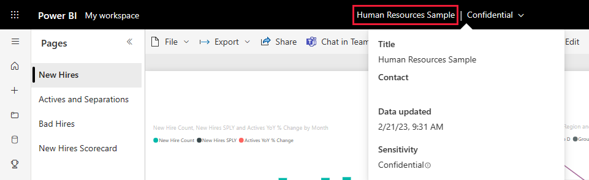

# Human Resources sample for Power BI: Take a tour

The Human Resources sample content pack contains a dashboard, report, and dataset for a human resources department. In this sample, the human resources department has the same reporting model across different companies, even when they differ by industry or size. This sample looks at new hires, active employees, and employees who have left. It strives to uncover any trends in the hiring strategy. Our main objectives are to understand:

* Who we hire
* Biases in our hiring strategy
* Trends in voluntary separations

This sample is part of a series that shows how you can use Power BI with business-oriented data, reports, and dashboards. It was created by [obviEnce](http://www.obvience.com/) with real data, which has been anonymized. The data is available in several formats: content pack, .pbix Power BI Desktop file, or Excel workbook. See [Samples for Power BI](sample-datasets.md). 

This tutorial explores the Human Resources sample content pack in the Power BI service. Because the report experience is similar in Power BI Desktop and in the service, you can also follow along by using the sample .pbix file in Power BI Desktop. 

You don't need a Power BI license to explore the samples in Power BI Desktop. If you don't have a Power BI Pro or Premium Per User (PPU) license, you can save the sample to your My Workspace in the Power BI service. 

## Get the sample

Before you can use the sample, you must first download it as a [content pack](#get-the-content-pack-for-this-sample), [.pbix file](#get-the-pbix-file-for-this-sample), or [Excel workbook](#get-the-excel-workbook-for-this-sample).

### Get the content pack for this sample

1. Open the Power BI service (app.powerbi.com), sign in, and open the workspace where you want to save the sample.

   If you don't have a Power BI Pro or Premium Per User (PPU) license, you can save the sample to your My Workspace.

2. In the bottom-left corner, select **Get data**.
   
   
3. On the **Get Data** page that appears, select **Samples**.
   
4. Select **Human Resources Sample**, then choose **Connect**.  
   
   

5. Power BI imports the content pack and then adds a new dashboard, report, and dataset to your current workspace.
   
   
  
### Get the .pbix file for this sample

Alternatively, you can download the Human Resources sample as a [.pbix file](https://download.microsoft.com/download/6/9/5/69503155-05A5-483E-829A-F7B5F3DD5D27/Human%20Resources%20Sample%20PBIX.pbix), which is designed for use with Power BI Desktop.

### Get the Excel workbook for this sample

If you want to view the data source for this sample, it's also available as an [Excel workbook](https://go.microsoft.com/fwlink/?LinkId=529780). The workbook contains Power View sheets that you can view and modify. To see the raw data, enable the Data Analysis add-ins, and then select **Power Pivot > Manage**. To enable the Power View and Power Pivot add-ins, see [Explore the Excel samples in Excel](sample-datasets.md#explore-excel-samples-inside-excel) for details.

## New hires
Let's explore new hires first.

1. In your workspace, select the **Dashboards** tab, and open the **Human Resources Sample** dashboard.
2. On the dashboard, select the **New Hire Count, New Hires Same Period Last Year, Actives YoY % Change By Month** tile.  

     

   The Human Resources Sample report opens to the **New Hires** page.  

   

3. Look at these items of interest:

    * The **New Hire Count, New Hires SPLY and Actives YoY % Change by Month** combo chart shows we hired more people every month this year compared to last year. Significantly more people in some months.
    * In the combo chart **New Hire Count and Active Employee Count by Region and Ethnicity**, notice we're hiring fewer people in the **East** region.
    * The **New Hires YoY Var by Age Group** waterfall chart shows we're hiring mainly younger people. This trend may be due to the mostly part-time nature of the jobs.
    * The **New Hire Count by Gender** pie chart shows a roughly even split.

    Can you find more insights? For example, a region where the gender split is not even. 

4. Select different age groups and genders in the charts to explore the relationships between age, gender, region, and ethnicity group.

5. Select **Human Resources Sample** from the top nav bar to see detailed information about the dashboard.

   

## Compare currently active and former employees
Let's explore data for currently active employees and employees who no longer work for the company.

1. On the dashboard, select the **Active Employee Count by Age Group** tile.

   

   The Human Resources Sample report opens to the **Active Employees vs. Separations** page.  

   

 2. Look at these items of interest:

    * The two combo charts on the left show the year-over-year change for active employees and employee separations. We have more active employees this year due to rapid hiring, but also more separations than last year.
    * In August, we had more separations compared to other months. Select the different age groups, genders, or regions to see if you can find any outliers.
    * Looking at the pie charts, we notice we have an even split in our active employees by gender and age groups. Select different age groups to see how the gender split differs by age. Do we have an even split by gender in every age group?

## Reasons for separation
Let's look at the report in Editing View. You can change the pie charts to show employee separations data instead of active employee data.

1. Select **Edit report** in the upper-left corner.

2. Select the **Active Employee Count by Age Group** pie chart.

3. In **Fields**, select **Employees** to expand the **Employees** table. Clear **Active Employee Count** to remove that field.

4. Select **Separation Count** in the **Employees** table to add it to the **Values** box in the **Fields** area.

5. On the report canvas, select the **Voluntary** bar in the **Separation Count by Separation Reason** bar chart. 

   This bar highlights those employees who left voluntarily in the other visuals in the report.

6. Select the 50+ slice of the **Separation Count by Age Group** pie chart.

7. Look at the line chart in the lower-right corner. This chart is filtered to show voluntary separations.  

   

   Notice the trend in the 50+ age group. During the latter part of the year, more employees over age 50 left voluntarily. This trend is an area to investigate further with more data.

8. You can also follow the same steps for the **Active Employee Count by Gender** pie chart, changing it to separations instead of active employees. Look at the voluntary separation data by gender to see if you find any other insights.

9. Select **Human Resource Sample** from the top nav pane to return to the dashboard. You can choose to save the changes you've made to the report.

## Bad hires
The last area to explore is bad hires. Bad hires are defined as employees who didn't last for more than 60 days. We're hiring rapidly, but are we hiring good candidates?

1. Select the **Bad Hires as % of Actives by Age Group** dashboard tile. The report opens to tab three, **Bad Hires**.

     
2. Select **Northwest** in the **Region** slicer on the left and select **Male** in the **Bad Hire Count by Gender** donut chart. Look at the other charts on the **Bad Hires** page. Notice there are more male bad hires than females and many Group A bad hires.

     

3. If you look at the **Bad Hire Count by Gender** donut chart and select different regions in the **Region** slicer, you'll notice that the East region is the only region with more female than male bad hires.  

4. Select the name of the dashboard from the top nav pane to return to the dashboard.

## Ask a question in the dashboard Q&A box
In the [Q&A question box](power-bi-tutorial-q-and-a.md) in the dashboard, you can ask a question about your data by using natural language. Q&A recognizes the words you type and figures out where in your dataset to find the answer.

1. Select the Q&A question box. Notice that even before you start typing, Q&A displays suggestions to help you form your question.

   

2. You can pick one of those suggestions, or enter: *show age group, gender, and bad hires SPLY where region is East*.  

   

   Notice most of the female bad hires are under 30.

## Next steps: Connect to your data
This environment is a safe one to play in, because you can choose not to save your changes. But if you do save them, you can always select **Get Data** for a new copy of this sample.

We hope this tour has shown how Power BI dashboards, Q&A, and reports can provide insights into sample data. Now it's your turn; connect to your own data. With Power BI, you can connect to a wide variety of data sources. To learn more, see [Get started with the Power BI service](../fundamentals/service-get-started.md).
