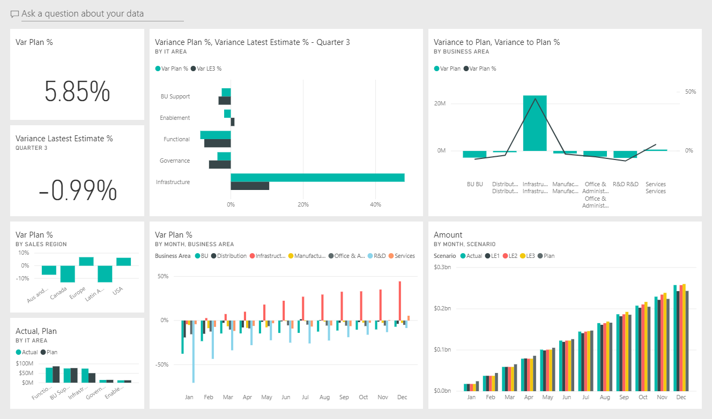
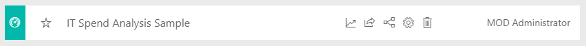
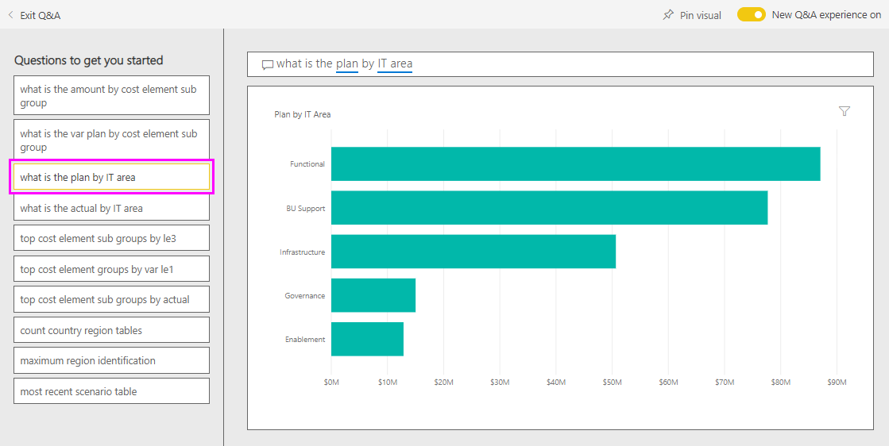
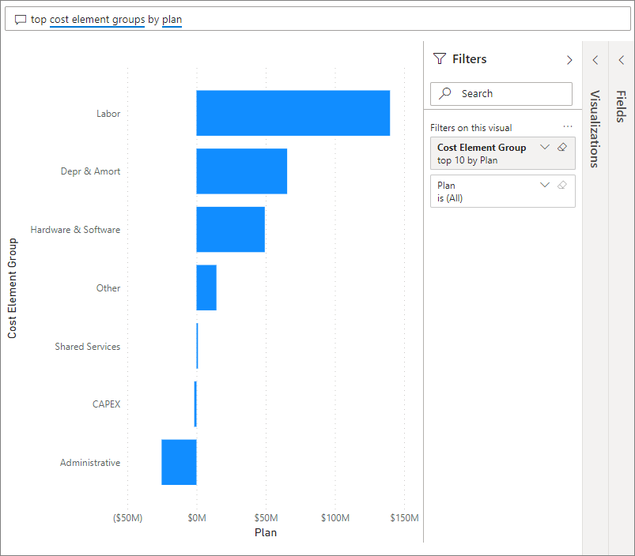
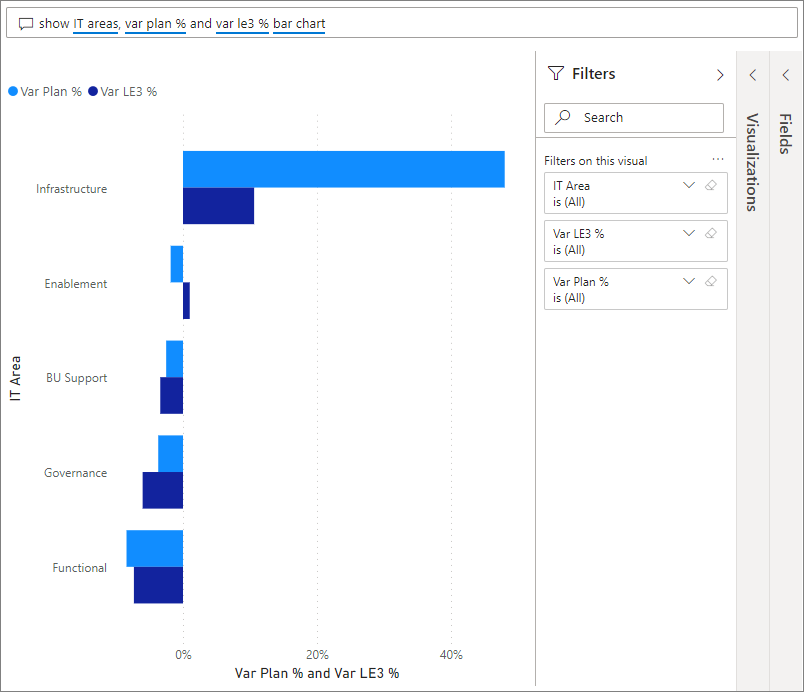
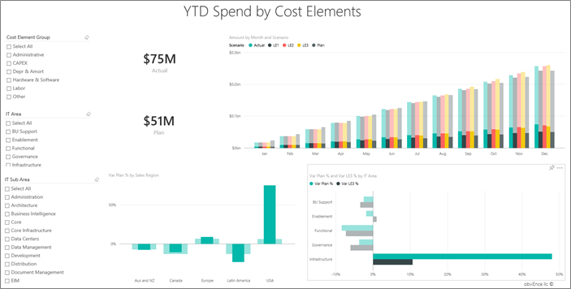

# IT Spend Analysis sample for Power BI: Take a tour

The IT Spend Analysis sample content pack contains a dashboard, report, and dataset that analyzes the planned vs. actual costs of an IT department. This comparison helps us understand how well the company planned for the year and investigate areas with huge deviations from the plan. The company in this example goes through a yearly planning cycle, and then quarterly it produces a new latest estimate (LE) to help analyze changes in IT spend over the fiscal year.

This sample is part of a series that shows how you can use Power BI with business-oriented data, reports, and dashboards. It was created by [obviEnce](http://www.obvience.com/) with real data, which has been anonymized. The data is available in several formats: content pack, .pbix Power BI Desktop file, or Excel workbook. See [Samples for Power BI](sample-datasets.md). 

This tutorial explores the IT Spend Analysis sample content pack in the Power BI service. Because the report experience is similar in Power BI Desktop and in the service, you can also follow along by using the sample .pbix file in Power BI Desktop. 

You don't need a Power BI license to explore the samples in Power BI Desktop. If you don't have a Power BI Pro or Premium Per User (PPU) license, you can save the sample to your My Workspace in the Power BI service. 

## Get the sample

 Before you can use the sample, you must first download it as a [content pack](#get-the-content-pack-for-this-sample), [.pbix file](#get-the-pbix-file-for-this-sample), or [Excel workbook](#get-the-excel-workbook-for-this-sample).

### Get the content pack for this sample

1. Open the Power BI service (app.powerbi.com), sign in, and open the workspace where you want to save the sample.

   If you don't have a Power BI Pro or Premium Per User (PPU) license, you can save the sample to your My Workspace.

2. In the bottom-left corner, select **Get data**.
   
   
3. On the **Get data** page that appears, select **Samples**.
   
4. Select **IT Spend Analysis Sample**, then choose **Connect**.  
  
   
   
5. Power BI imports the content pack and then adds a new dashboard, report, and dataset to your current workspace.
   
   
  
### Get the .pbix file for this sample

Alternatively, you can download the IT Spend Analysis sample as a [.pbix file](https://download.microsoft.com/download/E/9/8/E98CEB6D-CEBB-41CF-BA2B-1A1D61B27D87/IT%20Spend%20Analysis%20Sample%20PBIX.pbix), which is designed for use with Power BI Desktop.

### Get the Excel workbook for this sample

If you want to view the data source for this sample, it's also available as an [Excel workbook](https://go.microsoft.com/fwlink/?LinkId=529783). The workbook contains Power View sheets that you can view and modify. To see the raw data, enable the Data Analysis add-ins, and then select **Power Pivot > Manage**. To enable the Power View and Power Pivot add-ins, see [Explore the Excel samples in Excel](sample-datasets.md#explore-excel-samples-inside-excel) for details.

## IT Spend Analysis Sample dashboard
The two numbers tiles on the left of the dashboard, **Var Plan %** and **Variance Latest Estimate % Quarter 3**, give us an overview of how well we're doing against the plan and against the latest quarterly estimate (LE3 = latest estimate quarter 3). Overall, we're about 6% off the plan. Let's explore the cause of this variance: when, where, and in which category.

## YTD IT Spend Trend Analysis page
When you select the **Var Plan % by Sales Region** dashboard tile, it displays the **YTD IT Spend Trend Analysis** page of the IT Spend Analysis Sample report. At a glance, we see that we have positive variance in the United States and Europe and negative variance in Canada, Latin America, and Australia. The United States has about 6% +LE variance and Australia has about 7% -LE variance.

However, just looking at this chart and drawing conclusions can be misleading. We need to look at actual dollar amounts to put things in perspective.

1. Select **Aus and NZ** in the **Var Plan % by Sales Region** chart, and then observe the **Var Plan by IT Area** chart.

   
2. Now select **USA**. Notice that Australia and New Zealand are a very small part of our overall spending as compared to the United States.

    Next, let's explore which category in the USA is causing the variance.

## Ask questions of the data
2. In the dashboard, select **Ask a question about your data**.
3. From the **Try one of these to get started** list on the left side, select **top cost element groups by plan**.

   
   
   

4. In the Q&A box, clear the previous entry and enter *show IT areas, var plan % and var le3 % bar chart*.

   

   In the first IT area, **Infrastructure**, notice that the percentage has changed drastically between the initial variance plan and the variance plan latest estimate.

## YTD Spend by Cost Elements page

1. Return to the dashboard and look at the **Variance Plan %, Variance Latest Estimate % - Quarter 3** dashboard tile.

   

   Notice that the Infrastructure area stands out with a large positive variance to the plan.

1. Select this tile to open the report and view the **YTD Spend by Cost Elements** page.
2. Select the **Infrastructure** bar in the **Var Plan % and Var LE3 % by IT Area** chart on the lower right, and observe the variance-to-plan values in the **Var Plan % by Sales Region** chart on the lower left.

    
3. Select each name in turn in the **Cost Element Group** slicer to find the cost element with the largest variance.
4. With **Other** selected, select **Infrastructure** in the **IT Area** slicer and select subareas in the **IT Sub Area** slicer to find the subarea with the largest variance.  

   Notice the large variance for **Networking**. Apparently the company decided to give its employees phone services as a benefit, even though this move was not planned for.

## Plan Variance Analysis page

1. Select the **Plan Variance Analysis** page.

2. In the **Var Plan and Var Plan % by Business Area** chart on the left, select the **Infrastructure** column to highlight infrastructure business area values in the rest of the page.

    

   Notice in the **Var plan % by Month and Business Area** chart that the infrastructure business area started a positive variance in February. Also, notice how the variance-to-plan value for that business area varies by country, as compared to all other business areas. 

3. Use the **IT Area** and **IT Sub Area** slicers on the right to filter the values in the rest of the page and to explore the data. 

## Edit the report
Select **Edit** in the top menu bar to explore in Editing view:

* See how the pages are made, the fields in each chart, and the filters on the pages.
* Add pages and charts, based on the same data.
* Change the visualization type for each chart.
* Pin charts of interest to your dashboard.

## Next steps: Connect to your data
This environment is a safe one to play in, because you can choose not to save your changes. But if you do save them, you can always select **Get data** for a new copy of this sample.

We hope this tour has shown how Power BI dashboards, Q&A, and reports can provide insights into sample data. Now it's your turn; connect to your own data. With Power BI, you can connect to a wide variety of data sources. To learn more, see [Get started with the Power BI service](../fundamentals/service-get-started.md).
