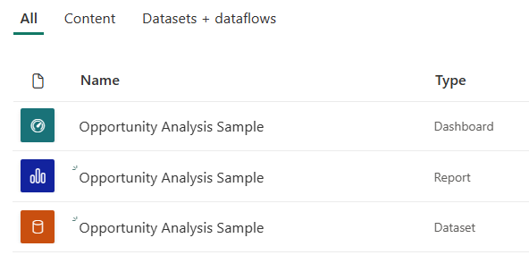

# Opportunity Analysis sample for Power BI: Take a tour

The Opportunity Analysis downloadable sample contains a dashboard, report, and dataset for a software company that has two sales channels: *direct* and *partner*. The sales manager created this dashboard to track opportunities and revenue by region, deal size, and channel.

This sample relies on two measures of revenue:

* Revenue: A salesperson's estimate of what the revenue will be.
* Factored revenue: Calculated as revenue X probability% and is accepted as being a more-accurate predictor of actual sales revenue. Probability is determined by the deal's current *sales stage*:
  * Lead: 10%  
  * Qualify: 20%  
  * Solution: 40%  
  * Proposal: 60%  
  * Finalize: 80%

This sample is part of a series that shows how you can use Power BI with business-oriented data, reports, and dashboards. It was created by [obviEnce](http://www.obvience.com/) with real data, which has been anonymized. The data is available in several formats: downloadable sample, .pbix Power BI Desktop file, or Excel workbook. See [Samples for Power BI](sample-datasets.md). 

This tutorial explores the Opportunity Analysis downloadable sample in the Power BI service. Because the report experience is similar in Power BI Desktop and in the service, you can also follow along by using the sample .pbix file in Power BI Desktop. 

You don't need a Power BI license to explore the samples in Power BI Desktop. If you don't have a Power BI Pro or Premium Per User (PPU) license, you can save the sample to your My Workspace in the Power BI service. 

## Get the sample

Before you can use the sample, you must first [download it in the service](#get-the-content-pack-for-this-sample), or get the [.pbix file](#get-the-pbix-file-for-this-sample) or [Excel workbook](#get-the-excel-workbook-for-this-sample).

### Get the downloadable sample

1. Open the Power BI service (app.powerbi.com), sign in, and open the workspace where you want to save the sample. 

    If you don't have a Power BI Pro or Premium Per User (PPU) license, you can save the sample to your My Workspace.

2. In the bottom-left corner, select **Get Data**.

    
3. On the **Get Data** page that appears, select **Samples**.

4. Select **Opportunity Analysis Sample**, and then choose **Connect**.  

   
5. Power BI imports the downloadable sample, adding a new dashboard, report, and dataset to your current workspace.

   

### Get the .pbix file for this sample

Alternatively, you can download the Opportunity Analysis sample as a [.pbix file](https://download.microsoft.com/download/9/1/5/915ABCFA-7125-4D85-A7BD-05645BD95BD8/Opportunity%20Analysis%20Sample%20PBIX.pbix), which is designed for use with Power BI Desktop.

### Get the Excel workbook for this sample

If you want to view the data source for this sample, it's also available as an [Excel workbook](https://go.microsoft.com/fwlink/?LinkId=529782). The workbook contains Power View sheets that you can view and modify. To see the raw data, enable the Data Analysis add-ins, and then select **Power Pivot > Manage**. To enable the Power View and Power Pivot add-ins, see [Explore the Excel samples in Excel](sample-datasets.md#explore-excel-samples-inside-excel) for details.

## What is our dashboard telling us?
Our sales manager has created a dashboard to track those metrics most important to them. When they see something interesting, they can select a tile to look into the data:

- Company revenue is $2 billion and factored revenue is $461 million.
- Opportunity count and revenue follow a familiar funnel pattern, with totals decreasing with each subsequent stage.
- Most of our opportunities are in the East region.
- Large opportunities generate more revenue than medium or small opportunities.
- Large partner deals generate more revenue: $8 million on average versus $6 million for direct sales.

Because the effort to land a deal is the same whether the deal is classified as large, medium, or small, our company should analyze the data to learn more about large opportunities.

1. In the workspace where you saved the sample, open the **Dashboards** tab, then find the **Opportunity Analysis Sample** dashboard and select it.

2. Select the **Opportunity Count by Partner Driven, Sales Stage** tile to open the first page of the Opportunity Analysis Sample report. 

    

## Explore the pages in the report

View each page in the report by selecting the page tabs at the bottom.

### Opportunity Count Overview page

Note the following details:
* East is our biggest region in terms of opportunity counts.  
* On the **Opportunity Count by Region** pie chart, select each region in turn to filter the page by region. For each region, notice that partners are pursuing significantly more large opportunities.   
* The **Opportunity Count by Partner Driven and Opportunity Size** column chart shows that most of the large opportunities are partner driven, while most of the small and medium opportunities are not.
* In the **Opportunity Count by Sales Stage** bar chart, select each **Sales Stage** in turn to see the difference in regional count. Notice that although the East region has the largest opportunity count, all three regions in the Solution, Proposal, and Finalize sales stages have comparable counts. This result means we close a higher percent of deals in the Central and West regions.

### Revenue Analysis page
This page takes a similar look at the data, but uses a revenue perspective instead of count.  

Note the following details:
* East is our biggest region, not only in opportunity count but also in revenue.  
* If you filter the **Revenue by Sales Stage and Partner Driven** chart by selecting **Yes** for **Partner Driven**, you see a revenue of $1.5 billion and a factored revenue of $294 million. Compare these amounts to $644 million and $166 million for non-partner driven revenue. 
* Average revenue for large accounts is larger at 8 million if the opportunity is partner driven, compared to 6 million for non-partner driven business.  
* For partner driven businesses, average revenue for large-sized opportunities is almost double that of medium-sized opportunities.  
* Average revenue for small and medium businesses is comparable for both partner driven and non-partner driven business.   

Clearly our partners are doing a better job than non-partners selling to customers. It might make sense to funnel more deals through our partners.

### Opportunity Count by Region and Stage
This page of the report looks at data similar to the data on the previous page but breaks it down by region and stage. 

Note the following details:
* If you select **East** in the **Opportunity Count by Region** pie chart to filter by the East region, you see that the opportunities in this region are split almost equally between partner driven and non-partner driven.
* Large opportunities are most common in the Central region, small opportunities are most common in the East region, and medium opportunities are most common in the West region.

### Upcoming Opportunities by Month page
For this page we're looking at similar factors, but from a date and time perspective. 
 

Our CFO uses this page to manage workload. By looking at the revenue opportunities by sales stage and month, they can plan accordingly.

Note the following details:
* Average revenue for the Finalize sales stage is the highest. Closing these deals is a top priority.
* If you filter by month (by selecting a month in the **Month** slicer), you see that January has a high proportion of large deals in the Finalize sales stage with a factored revenue of $75 million. February, on the other hand, has mostly medium deals in the Solution and Proposal sales stages.
* In general, the factored revenue numbers fluctuate based on sales stage, number of opportunities, and deal size. Add filters for these factors by using the **Filter** pane on the right to discover further insights.

## Next steps: Connect to your data
This environment is a safe one to play in, because you can choose not to save your changes. But if you do save them, you can always select **Get Data** for a new copy of this sample.

We hope this tour has shown how Power BI dashboards, Q&A, and reports can provide insights into sample data. Now it's your turn; connect to your own data. With Power BI, you can connect to a wide variety of data sources. To learn more, see [Get started with the Power BI service](../fundamentals/service-get-started.md).
