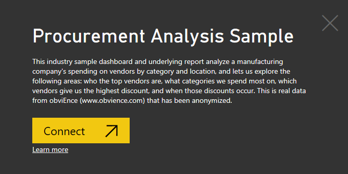
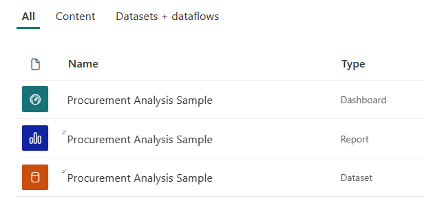
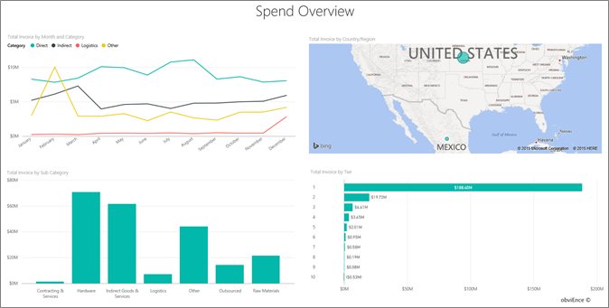
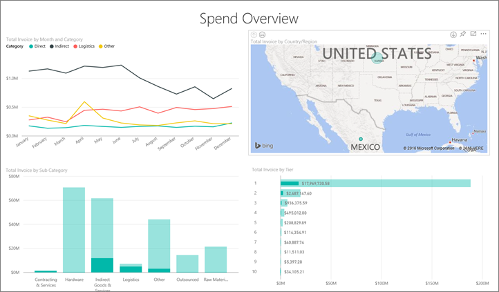
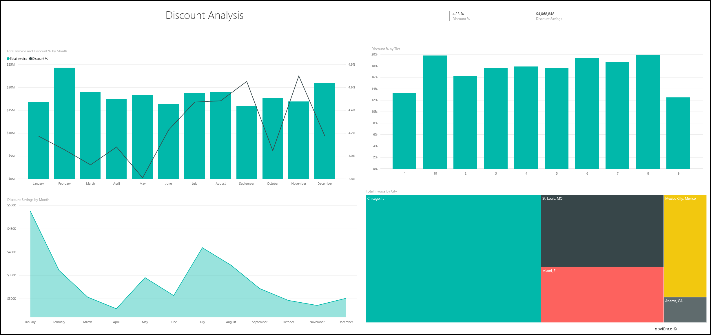
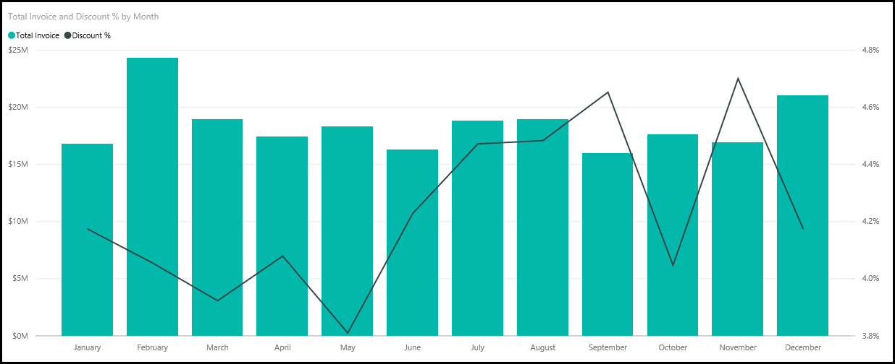
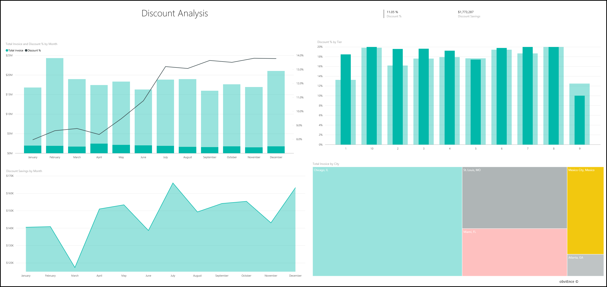

# Procurement Analysis sample for Power BI: Take a tour

The Procurement Analysis built-in sample contains a dashboard, report, and dataset that analyzes a manufacturing company's spending on vendors by category and location. In the sample, we explore these areas:

* Who the top vendors are
* What categories we spend the most on
* Which vendors give us the highest discount and when

This sample is part of a series that shows how you can use Power BI with business-oriented data, reports, and dashboards. It was created by [obviEnce](http://www.obvience.com/) with real data, which has been anonymized. The data is available in several formats: built-in sample in the Power BI service, .pbix Power BI Desktop file, or Excel workbook. See [Samples for Power BI](sample-datasets.md). 

This tutorial explores the Procurement Analysis built-in sample in the Power BI service. Because the report experience is similar in Power BI Desktop and in the service, you can also follow along by using the sample .pbix file in Power BI Desktop. 

You don't need a Power BI license to explore the samples in Power BI Desktop. If you don't have a Power BI Pro or Premium Per User (PPU) license, you can save the sample to your My Workspace in the Power BI service. 

## Get the sample

Before you can use the sample, you must first [download it in the Power BI service](#get-the-built-in-sample), or get the [.pbix file](#get-the-pbix-file-for-this-sample) or [Excel workbook](#get-the-excel-workbook-for-this-sample).

### Get the built-in sample

1. Open the Power BI service (app.powerbi.com), sign in, and open the workspace where you want to save the sample. 

    If you don't have a Power BI Pro or Premium Per User (PPU) license, you can save the sample to your My Workspace.

2. In the bottom-left corner, select **Get Data**.

    
3. On the **Get Data** page that appears, select **Samples**.

4. Select **Procurement Analysis Sample**, and then choose **Connect**.  
  
   
   
5. Power BI imports the built-in sample, and then adds a new dashboard, report, and dataset to your current workspace.
   
   
  
### Get the .pbix file for this sample

Alternatively, you can download the Procurement Analysis sample as a [.pbix file](https://download.microsoft.com/download/D/5/3/D5390069-F723-413B-8D27-5888500516EB/Procurement%20Analysis%20Sample%20PBIX.pbix), which is designed for use with Power BI Desktop. 

### Get the Excel workbook for this sample

If you want to view the data source for this sample, it's also available as an [Excel workbook](https://go.microsoft.com/fwlink/?LinkId=529784). The workbook contains Power View sheets that you can view and modify. To see the raw data, enable the Data Analysis add-ins, and then select **Power Pivot > Manage**. To enable the Power View and Power Pivot add-ins, see [Explore the Excel samples in Excel](sample-datasets.md#explore-excel-samples-inside-excel) for details.

## Spending trends
First, let's look for trends in spending by category and location.  

1. In the workspace where you saved the sample, open the **Dashboards** tab, then find the **Procurement Analysis Sample** dashboard and select it. 
2. Select the dashboard tile, **Total Invoice by Country/Region**, which opens to the **Spend Overview** page of the **Procurement Analysis Sample** report.

    

Note the following details:

* In the **Total Invoice by Month and Category** line chart, the **Direct** category has consistent spending, **Logistics** has a peak in December, and **Other** has a spike in February.
* In the **Total Invoice by Country/Region** map, most of our spending is in the United States.
* In the **Total Invoice by Sub Category** column chart, **Hardware** and **Indirect Goods & Services** are the biggest spend categories.
* In the **Total Invoice by Tier** bar chart, most of our business is done with our tier 1 (top 10) vendors. Doing so enables us to manage better vendor relationships.

## Spending in Mexico
Let's explore the spending areas in Mexico.

1. In the **Total Invoice by Country/Region** map, select the **Mexico** bubble. Notice that in the **Total Invoice by Sub Category** column chart, most spending is in the **Indirect Goods & Services** sub category.

   
2. Drill down into the **Indirect Goods & Services** column:

   * In the **Total Invoice by Sub Category** chart, select the drill-down arrow  in the upper-right corner of the chart.
   * Select the **Indirect Goods & Services** column.

      As you can see, the highest spending by far is for the **Sales & Marketing** subcategory.
   * Select **Mexico** in the map again.

      For Mexico, the biggest spending is in the **Maintenance & Repair** subcategory.

      
3. Select the up arrow on the upper-left corner of the chart to drill back up.
4. Select the drill-down arrow again to turn the drill-down feature off.  
5. In the top nav pane, select **Procurement Analysis Sample** to return to the dashboard.

## Evaluate different cities
We can use highlighting to evaluate different cities.

1. Select the dashboard tile, **Total Invoice, Discount % By Month**, which opens to the **Discount Analysis** page of the **Procurement Analysis Sample** report.
2. In the **Total Invoice by City** tree map, select each city in turn to see how they compare. Notice that almost all of Miami's invoices are from tier 1 vendors.

   

## Vendor discounts
Let's also explore the discounts available from vendors, and the time periods when we get the most discounts:
* Are the discounts different each month or do they remain the same?
* Do some cities get more discounts than others?

### Discount by month
If you look at the **Total Invoice and Discount % by Month** combo chart, we see that February is the busiest month, and September is the least busy month. 

Look at the discount percent during these months: when volume increases, the discount shrinks, and when volume is low, the discount increases. The more we need the discount, the worse of a deal we get.

### Discount by city
Another area to explore is the discount by city. Select each city in turn in the tree map and see how the other charts change:

* St. Louis had a large spike in total invoices in February and a large dip in discount savings in April.
* Mexico City has the highest discount percentage (11.05%) and Atlanta has the smallest (0.08%).

### Edit the report
Select **Edit report** in the upper-left corner and explore in Editing view:

* See how the pages are made.
* Add pages and charts based on the same data.
* Change the visualization type for a chart; for example, change the tree map to a donut chart.
* Pin charts to your dashboard.

## Next steps: Connect to your data
This environment is a safe one to play in, because you can choose not to save your changes. But if you do save them, you can always select **Get Data** for a new copy of this sample.

We hope this tour has shown how Power BI dashboards, Q&A, and reports can provide insights into sample data. Now it's your turn; connect to your own data. With Power BI, you can connect to a wide variety of data sources. To learn more, see [Get started with the Power BI service](../fundamentals/service-get-started.md).
