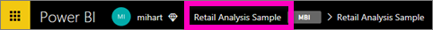
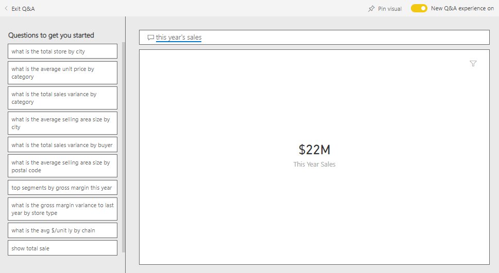
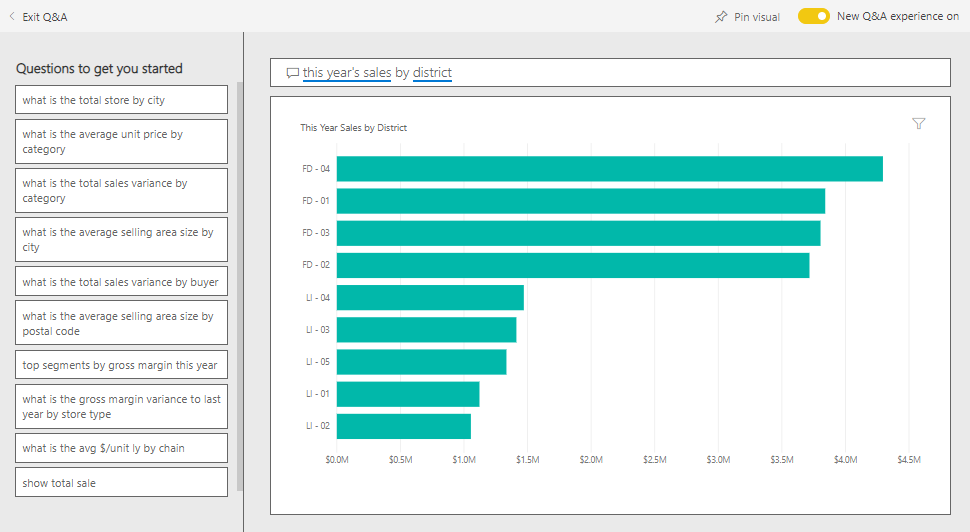
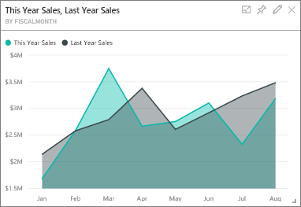
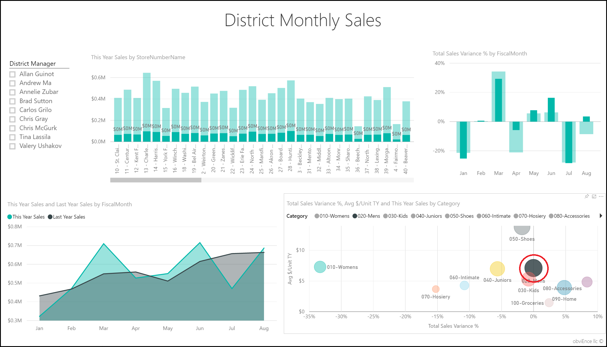
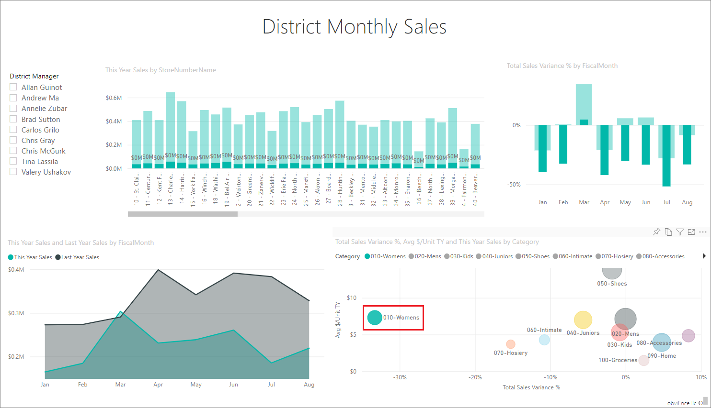
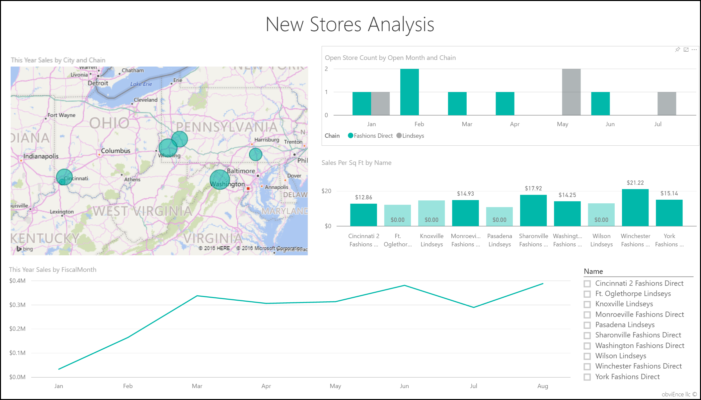
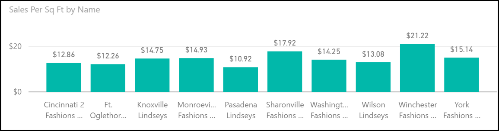

# Retail Analysis sample for Power BI: Take a tour

The Retail Analysis built-in sample contains a dashboard, report, and dataset that analyzes retail sales data of items sold across multiple stores and districts. The metrics compare this year's performance to last year's for sales, units, gross margin, and variance, as well as new-store analysis. 

This sample is part of a series that shows how you can use Power BI with business-oriented data, reports, and dashboards. It was created by [obviEnce](http://www.obvience.com/) with real data, which has been anonymized. The data is available in several formats: built-in sample in the Power BI service, .pbix Power BI Desktop file, or Excel workbook. See [Samples for Power BI](sample-datasets.md). 

This tutorial explores the Retail Analysis built-in sample in the Power BI service. Because the report experience is similar in Power BI Desktop and in the service, you can also follow along by using the sample .pbix file in Power BI Desktop. 

You don't need a Power BI license to explore the samples in Power BI Desktop. If you don't have a Power BI Pro or Premium Per User (PPU) license, you can save the sample to your My Workspace in the Power BI service. 

## Get the sample

 Before you can use the sample, you must first [download it in the Power BI service](#get-the-built-in-sample), or get the [.pbix file](#get-the-pbix-file-for-this-sample) or [Excel workbook](#get-the-excel-workbook-for-this-sample).

### Get the built-in sample

1. Open the Power BI service (app.powerbi.com), sign in, and open the workspace where you want to save the sample. 

    If you don't have a Power BI Pro or Premium Per User (PPU) license, you can save the sample to your My Workspace.

2. In the bottom-left corner, select **Get Data**.

   :::image type="content" source="../media/power-bi-get-data.png" alt-text="Select Get data.":::

3. On the **Get Data** page that appears, select **Samples**.
   
4. Select **Retail Analysis Sample**, and then choose **Connect**.  
  
   
   
5. Power BI imports the built-in sample, and then adds a new dashboard, report, and dataset to your current workspace.
   
   
  
### Get the .pbix file for this sample

Alternatively, you can download the Retail Analysis sample as a [.pbix file](https://download.microsoft.com/download/9/6/D/96DDC2FF-2568-491D-AAFA-AFDD6F763AE3/Retail%20Analysis%20Sample%20PBIX.pbix), which is designed for use with Power BI Desktop. 

### Get the Excel workbook for this sample

If you want to view the data source for this sample, it's also available as an [Excel workbook](https://go.microsoft.com/fwlink/?LinkId=529778). The workbook contains Power View sheets that you can view and modify. To see the raw data, enable the Data Analysis add-ins, and then select **Power Pivot > Manage**. To enable the Power View and Power Pivot add-ins, see [Explore the Excel samples in Excel](sample-datasets.md#explore-excel-samples-inside-excel) for details.

## Start on the dashboard and open the report

1. In the workspace where you saved the sample, open the **Dashboards** tab, then find the **Retail Analysis Sample** dashboard and select it. 
2. On the dashboard, select the **Total Stores New & Existing Stores** tile, which opens to the **Store Sales Overview** page in the Retail Analysis Sample report. 

     

   On this report page, you see we have a total of 104 stores, 10 of which are new. We have two chains, Fashions Direct and Lindseys. Fashions Direct stores are larger, on average.
3. In the **This Year Sales by Chain** pie chart, select **Fashions Direct**.

     

   Notice the result in the **Total Sales Variance %** bubble chart:

     

   The **FD-01** district has the highest average **Sales per Square Foot** and FD-02 has the lowest **Total Sales Variance** compared to last year. FD-03 and FD-04 are worst performers overall.
4. Select individual bubbles or other charts to see cross highlighting, revealing the impact of your selections.
5. To return to the dashboard, select  **Retail Analysis Sample** from the top nav pane.

   
6. On the dashboard, select the **This Year's Sales New & Existing Stores** tile, which is equivalent to typing *This year sales* in the Q&A question box.

   

   The Q&A results appear:

   

## Review a tile created with Power BI Q&A
Let's get more specific.

1. Change the question to _this year sales **by district**_. Observe the result: Q&A automatically places the answer in a bar chart and suggests other phrases:

   
2. Now change the question to _this year sales **by zip and chain**_.

   Notice how Power BI answers the question as you type and displays the appropriate chart.
3. Experiment with more questions and see what kind of results you get.
4. When you're ready, return to the dashboard.

## Dive deeper into the data
Now let's explore on a more detailed level, looking at the districts' performances.

1. On the dashboard, select the **This Year's Sales, Last Year's Sales** tile, which opens the **District Monthly Sales** page of the report.

   

   In the **Total Sales Variance % by Fiscal Month** chart, notice the large variability on variance % compared to last year, with January, April, and July being particularly bad months.

   

   Let's see if we can narrow down where the issues might be.
2. In the bubble chart, select the **020-Mens** bubble.

     

   Observe that although the men's category wasn't as severely affected in April as the overall business, January and July were still problematic months.
1. Select the **010-Womens** bubble.

   

   Notice the women's category performed much worse than the overall business across all months, and in almost every month compared to the previous year.
1. Select the bubble again to clear the filter.

## Try out the slicer
Let's look at how specific districts are doing.

1. Select **Allan Guinot** in the **District Manager** slicer on the top left.

   

   Note that Allan's district outperformed in March and June, compared to last year.
2. With **Allan Guinot** still selected, select the **Womens-10** bubble in the bubble chart.

   

   Notice that for the Womens-10 category, Allan's district didn't meet last year's volume.
3. Explore the other district managers and categories; what other insights can you find?
4. When you are ready, return to the dashboard.

## What the data says about sales growth this year
The last area we want to explore is our growth by examining the new stores opened this year.

1. Select the **Stores Opened This Year by Open Month, Chain** tile, which opens the **New Stores Analysis** page of the report.

   

   As evident from the tile, more Fashions Direct stores than Lindseys stores opened this year.
2. Observe the **Sales Per Sq Ft by Name** chart:

   

    Notice the difference in average sales/square foot across the new stores.
3. Select the **Fashions Direct** legend item in the **Open Store Count by Open Month and Chain** top-right chart. Notice, even for the same chain, the best store (Winchester Fashions Direct) significantly outperforms the worst store (Cincinnati 2 Fashions Direct) by $21.22 vs $12.86, respectively.

   
4. Select **Winchester Fashions Direct** in the **Name** slicer and observe the line chart. The first sales numbers were reported in February.
5. Select **Cincinnati 2 Fashions Direct** in the slicer and observe in the line chart that it was opened in June and appears to be the worst performing store.
6. Explore by selecting other bars, lines, and bubbles throughout the charts and see what insights you can discover.

## Next steps: Connect to your data
This environment is a safe one to play in, because you can choose not to save your changes. But if you do save them, you can always select **Get Data** for a new copy of this sample.

We hope this tour has shown how Power BI dashboards, Q&A, and reports can provide insights into sample data. Now it's your turn; connect to your own data. With Power BI, you can connect to a wide variety of data sources. To learn more, see [Get started with the Power BI service](../fundamentals/service-get-started.md).
