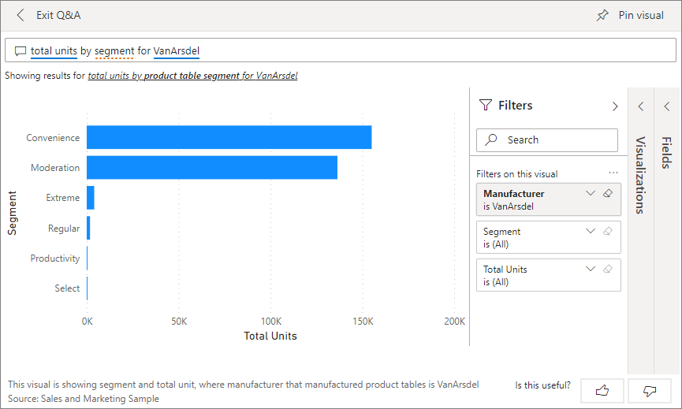
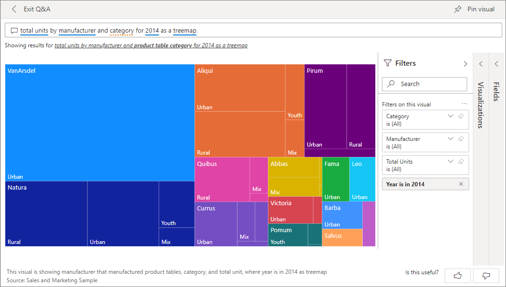
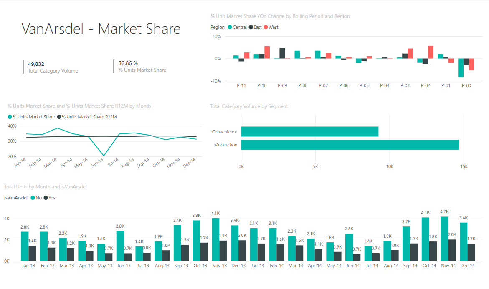
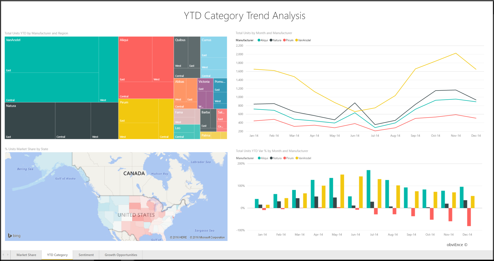
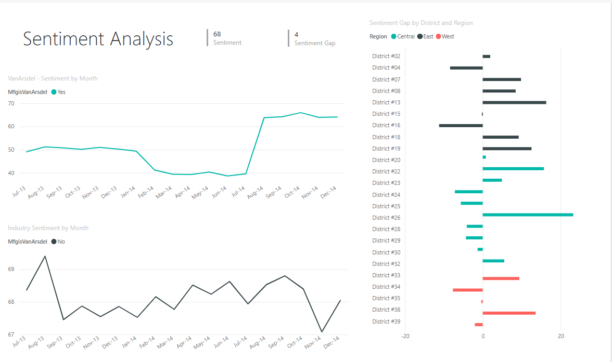
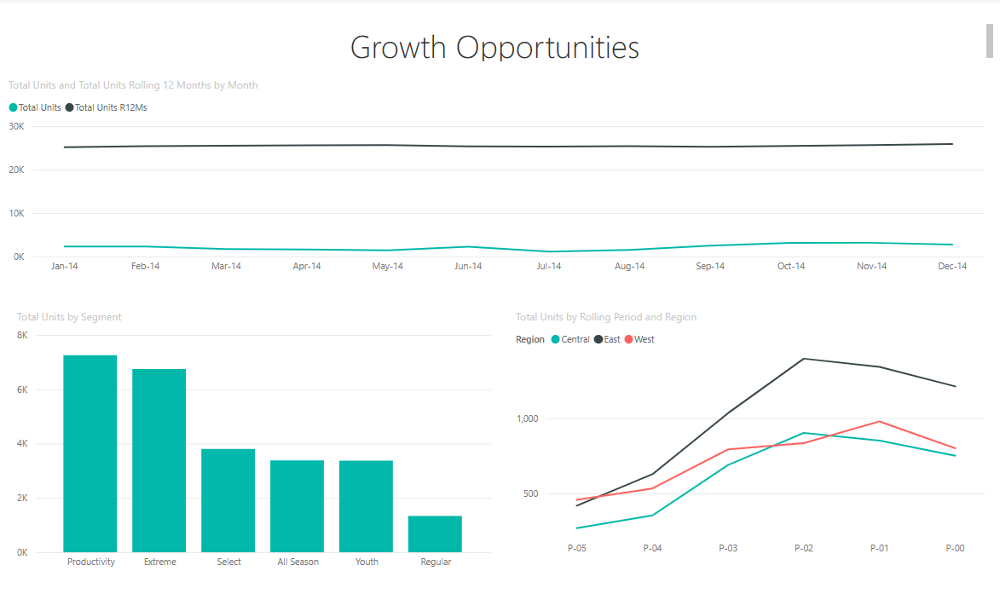

# Sales and Marketing sample for Power BI: Take a tour

The Sales and Marketing sample contains a dashboard and report for a fictitious manufacturing company named VanArsdel Ltd. The VanArsdel Chief Marketing Officer (CMO) created this dashboard to keep an eye on the industry and the company's market share, product volume, sales, and sentiment.

VanArsdel has many competitors, but is the market leader in its industry. The CMO wants to increase market share and discover growth opportunities. However, for unknown reasons, VanArsdel's market share has started to decline, with significant dips in June.

This sample is part of a series that shows how you can use Power BI with business-oriented data, reports, and dashboards. It was created by [obviEnce](http://www.obvience.com/) with real data, which has been anonymized. The data is available in several formats: in-product sample, .pbix Power BI Desktop file, or Excel workbook. See [Samples for Power BI](sample-datasets.md). 

This tutorial explores the Sales and Marketing sample in the Power BI service. Because the report experience is similar in Power BI Desktop and in the service, you can also follow along by using the sample .pbix file in Power BI Desktop. 

You don't need a Power BI license to explore the samples in Power BI Desktop. If you don't have a Power BI Pro or Premium Per User (PPU) license, you can save the sample to your My Workspace in the Power BI service. 

## Get the sample

Before you can use the sample, you must first download the [dashboard, report, and dataset](#get-the-sample-from-the-power-bi-service), [.pbix file](#get-the-pbix-file-for-this-sample), or [Excel workbook](#get-the-excel-workbook-for-this-sample).

### Get the sample from the Power BI service

1. Open the Power BI service (app.powerbi.com), sign in, and open the workspace where you want to save the sample.

   If you don't have a Power BI Pro or Premium Per User (PPU) license, you can save the sample to your My Workspace.

2. In the bottom-left corner, select **Get data**.
   
   :::image type="content" source="../media/power-bi-get-data.png" alt-text="Select Get data.":::

3. On the **Get Data** page that appears, select **Samples**.
   
4. Select **Sales and Marketing Sample**, then choose **Connect**.   
  
   
   
5. Power BI imports the sample and then adds a new dashboard, report, and dataset to your current workspace.
   
   
  
### Get the .pbix file for this sample

Alternatively, you can download the Sales and Marketing sample as a [.pbix file](https://download.microsoft.com/download/9/7/6/9767913A-29DB-40CF-8944-9AC2BC940C53/Sales%20and%20Marketing%20Sample%20PBIX.pbix), which is designed for use with Power BI Desktop.

### Get the Excel workbook for this sample

If you want to view the data source for this sample, it's also available as an [Excel workbook](https://go.microsoft.com/fwlink/?LinkId=529785). The workbook contains Power View sheets that you can view and modify. To see the raw data, enable the Data Analysis add-ins, and then select **Power Pivot > Manage**. To enable the Power View and Power Pivot add-ins, see [Explore the Excel samples in Excel](sample-datasets.md#explore-excel-samples-inside-excel) for details.

## What is our dashboard telling us?
Let's start our tour at the dashboard and look at the tiles the CMO has chosen to pin. We see information about our market share, sales, and sentiment. Data is broken down by region, time, and competition.

* The number tiles along the left column show industry sales volume for the past year (50,000), market share (32.86%), sales volume (16,000), sentiment score (68), sentiment gap (4), and total units sold (1 million).
* The top line chart (**% Units Market Share vs. % Units Market Share Rolling 12 Months**) shows how our market share fluctuates over time. Notice the large drop in June. Our rolling 12-month (R12M) share, which was increasing for a while, is now starting to stall.
* Our biggest competitor is Aliqui, as evident in the middle column chart tile (**Total Units YTD Variance %**).
* Most of our business is in the East and Central regions.
* The line chart at the bottom (**Total Units for 2014**) shows that our dip in June isn't seasonal; none of our competitors show the same trend.
* The **Total Units Overall** and **Total Units YTD** tiles on the right show units sold, by segment and by region/manufacturer. The largest market segments for our industry are **Productivity** and **Convenience**.

## Use Q&A to dig a little deeper

By using Q&A, you can discover additional details in the data.

### Which segments drive our sales? Do they match the industry trend?
1. Select the **Total Units Overall by Segment** tile, which opens Q&A and populates it with the query, *total units by segment*.
2. At the end of the existing query, add: *for VanArsdel*. Q&A interprets the question and displays an updated chart with the answer. Notice that our product volume is mostly from the **Convenience** and **Moderation** segments.

   
3. Our share in the **Moderation** and **Convenience** categories is high; these segments are the ones where we compete.
4. Return to the dashboard by selecting the **Sales and Marketing Sample** from the left navigation bar.

### What does total unit market share look like for category (versus region)?
1. Notice the **Total Units YTD by Manufacturer, Region** tile. What is the total unit market share by category?

   
2. Select the question field at the top of the dashboard and type the question, *total units by manufacturer and category for 2014 as a treemap*. Notice how the visualization updates as you type the question.

   
3. To compare the findings, pin the chart to your dashboard. Notice this interesting fact: In 2014, VanArsdel sold only products in the **Urban** category.
4. Return to the dashboard.

## Sales and Marketing Sample report

Dashboards are an entry point into reports. If a tile was created from an underlying report, selecting that tile opens the report.

On our dashboard, the **% Units Market Share R12M** line in the **% Units Market Share vs. % Units Market Share Rolling 12 Months** chart shows that our market share is no longer increasing over time. It's even declining a bit. And why do we have a large market share dip in June? 

The report for the Sales and Marketing sample has four pages.
 
### VanArsdel - Market Share page
Page one of the report focuses on VanArsdel's market share.

1. On the dashboard, select the **% Units Market Share vs. % Units Market Share Rolling 12 Months** chart to open the **VanArsdel - Market Share** page of the Sales and Marketing Sample report.

   

2. Look at the **Total Units by Month and isVanArsdel** column chart at the bottom of the report. The black column represents VanArsdel (our products) and the green column is our competition. The drop in June 2014 that VanArsdel experienced was not experienced by the competition.

3. The **Total Category Volume by Segment** bar chart on the right is filtered to show VanArsdel's top two segments. Take a look at how this filter was created:  

   a. Select the **Total Category Volume by Segment** chart.

   b. Select the **Filters** pane on the right to expand it.  

   c. Under **Visual level filters**, notice that **Segment** is filtered to include only the **Convenience** and **Moderation** segments.  

   d. Modify the filter by selecting **Segment** to expand it, and then check **Productivity** to add that segment.  

4. In the **Total Units by Month and isVanArsdel** chart, select **Yes** in the legend to cross-filter the page by VanArsdel. In the **Total Category Volume by Segment** chart, notice that we don't compete in the **Productivity** segment.

5. Select the **Yes** again in the legend to remove the filter.

6. Look at the **% Units Market Share and % Units Market Share R12M by Month** line chart. It shows our monthly market share and rolling 12-month market shares. Rolling-months data helps to smooth out monthly fluctuations and shows the long-term trends. In the **Total Category Volume by Segment** bar chart, select **Convenience**, and then **Moderation** to see the fluctuation in market share for each segment. Notice that the **Moderation** segment shows much more fluctuation in market share.

We're still looking to find out why our market share dipped so low in June. Next, let's check the **Sentiment Analysis** page of the report.

### YTD Category Trend Analysis page
Page two of the report focuses on the year-to-date category trend.

Notice the following details:
* VanArsdel is the largest company in this category and its biggest competitors are Natura, Aliqui, and Pirium. We'll keep our eyes on them.
* Aliqui is growing, but product volume compared to us is still low.
* The treemap shows VanArsdel in green. In the East region, customers prefer our competition, but in the Central region we're doing okay. Our share in the East region is our lowest.
* Geography has an impact on units sold. The East region is the dominant region for most manufacturers and VanArsdel has a strong presence in the Central region as well.
* On the **Total Units YTD Var % by Month and Manufacturer** chart in the bottom right, notice that we have positive variance, which is a good sign. We're doing better than last year, but so is our competitor, Aliqui.

### Sentiment Analysis page
Page three of the report focuses on consumer sentiment.

Tweets, Facebook, blogs, and articles all contribute to consumer sentiment, which is shown in the two line charts on left side of the page. The **VanArsdel - Sentiment by Month** chart in the top-left corner shows that sentiment for our products was mostly neutral up until February. Then, a large drop started in February and bottomed out in June. What happened to cause this drop in sentiment? 

Let's look at external sources. In February, several articles and blog posts rated VanArsdel's customer service as the worst in the industry. This bad press had a direct correlation to customer sentiment and sales. VanArsdel worked hard to improve customer service, and customers and the industry took note. In July, positive sentiment started to rise and then reached an all-time high in the 60s. This uptick in sentiment is reflected in the **Total Units by Month** charts on pages one and two of the report. Perhaps this partially explains our market share dips for June?

Sentiment gap might be another area to explore. Which districts have the highest sentiment gap, how can management capitalize on it, and how can they replicate it in other districts?

### Growth Opportunities page
Page four of the report focuses on competitive product analysis.

Notice the following details:
* The **Total Units by Segment** chart in the bottom-left shows all the category segments, except for VanArsdel's two strongest segments. Select each of the segments in turn to identify potential expansion areas for VanArsdel. 
* Notice that the **Extreme** and **Productivity** segments are growing faster than others. However, we don't compete in those segments; if we want to move into these segments, we can use our data to see which segments are popular in which regions. We can further investigate such questions as which regions are growing faster and who would be our biggest competitor in that segment.
* Remember our market share dip in June? June is a significant month for the **Productivity** segment, a segment we don't compete in at all. This detail could help explain our market share dip in June.

By filtering the visualizations by VanArsdel, by segment, by month, and by region, we can discover growth opportunities for VanArsdel.

## Next steps: Connect to your data
This environment is a safe one to play in, because you can choose not to save your changes. But if you do save them, you can always select **Get data** for a new copy of this sample.

We hope this tour has shown how Power BI dashboards, Q&A, and reports can provide insights into human resources data. Now it's your turn; connect to your own data. With Power BI, you can connect to a wide variety of data sources. To learn more, see [Get started with the Power BI service](../fundamentals/service-get-started.md).
