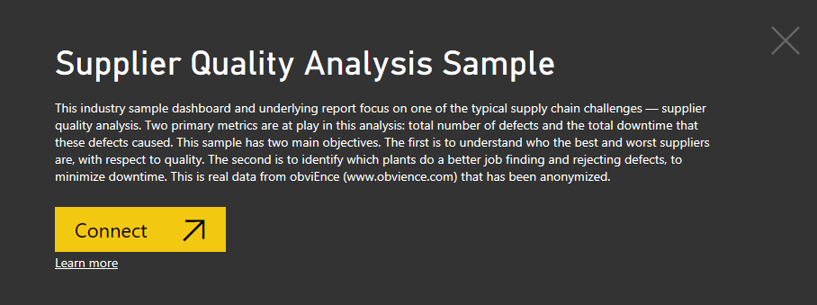
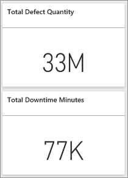
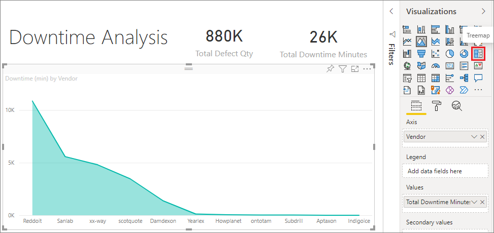
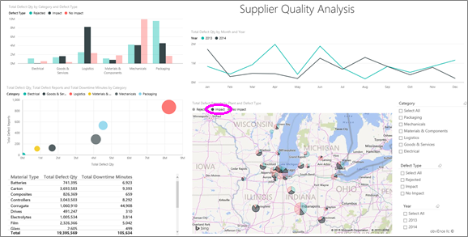
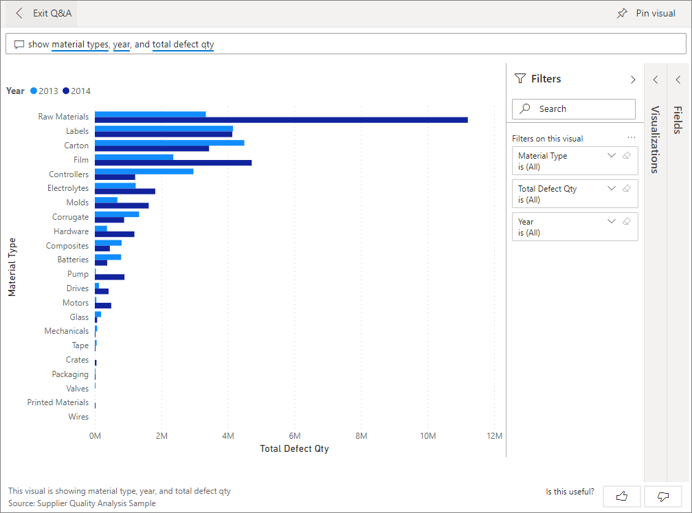
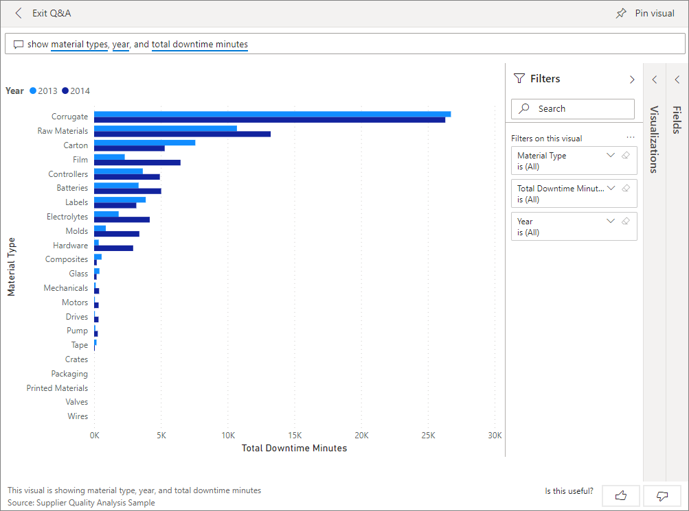
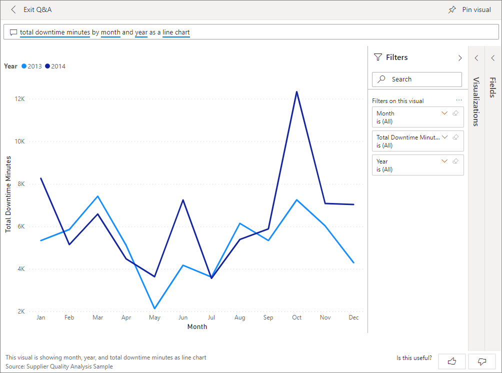

# Supplier Quality Analysis sample for Power BI: Take a tour

This industry sample dashboard and underlying report focus on one of the typical supply chain challenges: supplier quality analysis. Two primary metrics are at play in this analysis: total number of defects and the total downtime that these defects caused. 

This sample has two main objectives:

* Understand who the best and worst suppliers are, with respect to quality.
* Identify which plants do a better job finding and rejecting defects, to minimize downtime.

This sample is part of a series that shows how you can use Power BI with business-oriented data, reports, and dashboards. It was created by [obviEnce](http://www.obvience.com/) with real data, which has been anonymized. The data is available in several formats: content pack, .pbix Power BI Desktop file, or Excel workbook. See [Samples for Power BI](sample-datasets.md). 

This tutorial explores the Supplier Quality Analysis sample content pack in the Power BI service. Because the report experience is similar in Power BI Desktop and in the service, you can also follow along by using the sample .pbix file in Power BI Desktop. 

You don't need a Power BI license to explore the samples in Power BI Desktop. If you don't have a Power BI Pro or Premium Per User (PPU) license, you can save the sample to your My Workspace in the Power BI service. 

## Get the sample

Before you can use the sample, you must first download it as a [content pack](#get-the-content-pack-for-this-sample), [.pbix file](#get-the-pbix-file-for-this-sample), or [Excel workbook](#get-the-excel-workbook-for-this-sample).

### Get the content pack for this sample

1. Open the Power BI service (app.powerbi.com), sign in, and open the workspace where you want to save the sample.

   If you don't have a Power BI Pro or Premium Per User (PPU) license, you can save the sample to your My Workspace.

2. In the bottom-left corner, select **Get Data**.
   
   
3. On the **Get Data** page that appears, select **Samples**.
   
4. Select **Supplier Quality Analysis Sample**, then choose **Connect**.  
   
   

5. Power BI imports the content pack and then adds a new dashboard, report, and dataset to your current workspace.
   
   
  
### Get the .pbix file for this sample

Alternatively, you can download the Supplier Quality Analysis sample as a [.pbix file](https://download.microsoft.com/download/8/C/6/8C661638-C102-4C04-992E-9EA56A5D319B/Supplier-Quality-Analysis-Sample-PBIX.pbix), which is designed for use with Power BI Desktop.

### Get the Excel workbook for this sample

If you want to view the data source for this sample, it's also available as an [Excel workbook](https://go.microsoft.com/fwlink/?LinkId=529779). The workbook contains Power View sheets that you can view and modify. To see the raw data, enable the Data Analysis add-ins, and then select **Power Pivot > Manage**. To enable the Power View and Power Pivot add-ins, see [Explore the Excel samples in Excel](sample-datasets.md#explore-excel-samples-inside-excel) for details.

## Downtime caused by defective materials
Let's analyze the downtime caused by defective materials and see which vendors are responsible.  

1. On the dashboard, select the **Total Defect Quantity** or the **Total Downtime Minutes** tile.

     

   The Supplier Quality Analysis Sample report opens to the **Downtime Analysis** page.

   Notice we have 33 million defective pieces, causing a total downtime of 77,000 minutes. Although some materials have fewer defective pieces, they can cause delays, which result in more downtime. Let's explore them on the report page.  
2. If we look at the **Total Downtime Minutes** line in the **Defects and Downtime (min) by Material Type** combo chart, we can see that corrugate materials cause the most downtime.  
3. Select the **Corrugate** column to see which plants are affected most by this defect and which vendor is responsible.  

     
4. In the **Downtime (min) by Plant** map, select individual plants in turn to see which vendor or material is responsible for the downtime at that plant.

### Which are the worst suppliers?
 We want to find the worst eight suppliers and determine what percentage of the downtime they're responsible for creating. We can do so by changing the **Downtime (min) by Vendor** area chart to a treemap.  

1. On the **Downtime Analysis** page of the report, select **Edit report** in the upper-left corner.  
2. Select the **Downtime (min) by Vendor** area chart, and in the **Visualizations** pane, select the **Treemap** icon.  

     

    The treemap automatically sets the **Vendor** field as the **Group**.  

      

   From this treemap, we can see the top eight vendors are the eight blocks on the left of the treemap. We can also see they account for about 50% of all downtime minutes.  
3. Select **Supplier Quality Analysis Sample** in the top nav pane to return to the dashboard.

### Comparing plants
Now let's explore which plant does a better job managing defective material, resulting in less downtime.  

1. On the dashboard, select the **Total Defect Reports by Plant, Defect Type** map tile.      

     

   The report opens to the **Supplier Quality Analysis** page.  

2. In the legend of the **Total Defect Reports by Plant and Defect Type**, select the **Impact** circle.  

      

    Notice in the bubble chart that **Logistics** is the most troublesome category. It's the largest in terms of total defect quantity, defect reports, and downtime minutes. Let's explore this category more.  
3. Select the **Logistics** bubble in the bubble chart and observe the plants in Springfield and Naperville, IL. Naperville seems to be doing a much better job of managing defective supplies as it has a high number of rejects and few impacts, compared to Springfield's large number for impacts.  

     
4. Select **Supplier Quality Analysis Sample** in the top nav pane to return to the dashboard.

## Which material type is best managed?
The best managed material type is the one with lowest downtime or no impact, regardless of defect quantity.

1. In the dashboard, look at the **Total Defect Quantity by Material Type, Defect Type** tile.

   

   Notice that although **Raw Materials** material type has many total defects, most of those defects are either rejected or have no impact.

   Let's verify that this material type doesn't cause much downtime, despite high defect quantity.

2. In the dashboard, look at the **Total Defect Qty, Total Downtime Minutes by Material Type** tile.

   

   Raw materials appear to be well managed; although they have more defects, they have lower total downtime minutes.

### Compare defects to downtime by year
1. Select the **Total Defect Reports by Plant, Defect Type** map tile to open the report to the **Supplier Quality Analysis** page.
2. In the **Total Defect Qty by Month and Year** chart, notice that defect quantity is higher in 2014 than in 2013.  

      
3. Do more defects translate into more downtime? Ask questions in the Q&A box to find out.  
4. Select **Supplier Quality Analysis Sample** in the top nav pane to return to the dashboard.  
5. Because we know that raw materials have the highest number of defects, type in the question box: *show material types, year, and total defect qty*.  

    There were many more raw materials defects in 2014 than in 2013.  

      
6. Next, change the question to: _show material types, year, and total **downtime minutes**_.  

   

   Notice that downtime for raw materials was about the same in 2013 and 2014, even though there were many more raw materials defects in 2014. It appears that more defects for raw materials in 2014 didn't lead to much more downtime for raw materials in 2014.

### Compare defects to downtime month to month
Let's look at another dashboard tile related to total defective quantity.  

1. Select **Exit Q&A** in the upper-left corner to return to the dashboard.  

    Look more closely at the **Total Defect Quantity by Month, Year** tile. It shows that the first half of 2014 had a similar number of defects as 2013, but in the second half of 2014, the number of defects increased significantly.  

      

    Let's see if this increase in defect quantity led to an equal increase in downtime minutes.  
2. In the question box, type *total downtime minutes by month and year as a line chart*.  

   

   Other than a jump in downtime minutes during June and October, the number of defects didn't result in significantly more downtime. This result shows we're managing defects well.  
3. To pin this chart to your dashboard, select the pin icon  above the question box.  
4. To explore the outlier months, check out the downtime minutes during October by material type, plant location, category, and so on, by asking questions such as *total downtime minutes in October by plant*. 
5. Select **Exit Q&A** in the upper-left corner to return to the dashboard.

## Next steps: Connect to your data
This environment is a safe one to play in, because you can choose not to save your changes. But if you do save them, you can always select **Get Data** for a new copy of this sample.

We hope this tour has shown how Power BI dashboards, Q&A, and reports can provide insights into sample data. Now it's your turn; connect to your own data. With Power BI, you can connect to a wide variety of data sources. To learn more, see [Get started with the Power BI service](../fundamentals/service-get-started.md).
