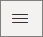
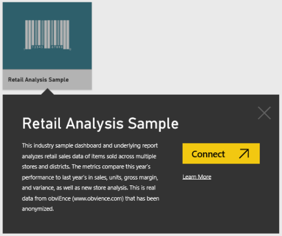
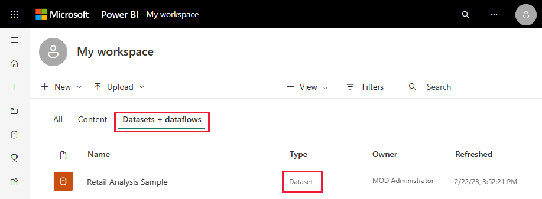
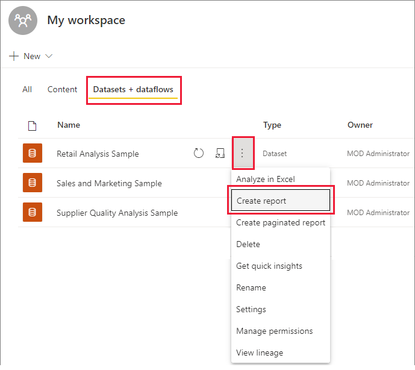
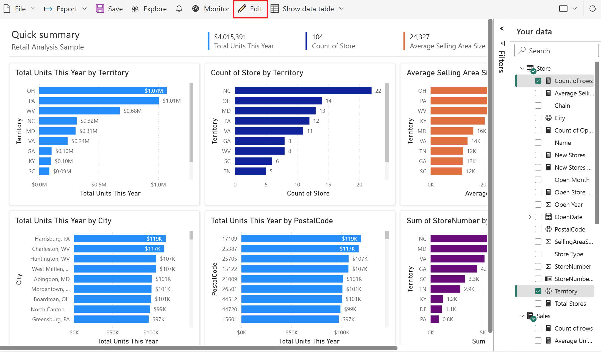

# Tutorial: Create a decomposition tree with a Power BI sample

[!INCLUDE [applies-yes-desktop-yes-service](../includes/applies-yes-desktop-yes-service.md)]

In this tutorial, you start with a built-in Power BI sample dataset and create a report with a decomposition tree. 

:::image type="content" source="media/sample-tutorial-connect-to-the-samples/retail-report-overview.png" alt-text="Retail Analysis Sample, Overview page.":::

This tutorial shows you how to: 

> [!div class="checklist"]
> * Sign up for a Power BI license, if you don't have one.
> * Import the Retail Analysis sample and add it to the Power BI service.
> * Create a decomposition tree.
> * Do ad hoc exploration of your data in the decomp tree in Edit mode.
> * Save the report and do ad hoc exploration in reading view.

If you want to familiarize yourself with the built-in sample in this tutorial and its scenario, see [Retail Analysis sample for Power BI: Take a tour](sample-retail-analysis.md) before you begin.

## Prerequisites

- To download a sample in the Power BI service, you can sign up for a [free or trial license](../fundamentals/service-self-service-signup-purchase-for-power-bi.md).

## Import the sample in the Power BI service

1. Open the Power BI service (app.powerbi.com), sign in, and open the workspace where you want to save the sample. 

    If you don't have a Power BI Pro or Premium Per User (PPU) license, you can save the sample to your My Workspace.

2. Select **Get data** at the bottom of the nav pane. 

   :::image type="content" source="../media/power-bi-get-data.png" alt-text="Select Get data.":::

   If you don't see **Get Data**, expand the nav pane by selecting the following icon at the top of the pane.

    

1. On the **Get Data** page that appears, select **Samples**.

1. Select **Retail Analysis Sample** > **Connect**.

   

### Create a report from the dataset

When someone shares an app with colleagues, they typically want to share only the insights, rather than provide direct access to the data. On the **Datasets** tab, you have several options for exploring your dataset.

   
1. One way of exploring the dataset is by creating your own reports from scratch. Select **More options (...)** > **Create report**.
   
   
   
   The dataset opens in report editing mode.
   
   

## Create a decomp tree

Let's add a decomposition tree, or decomp tree, for ad hoc analysis.

1. In the **Visualizations** pane, select the **Decomposition tree** icon.

    :::image type="content" source="media/sample-tutorial-decomp-tree/retail-visualizations-decomp-tree.png" alt-text="Screenshot of the Visualizations pane, Decomposition tree.":::

1. Drag the edge so it fills most of the page. Decomposition trees can get wide.

    :::image type="content" source="media/sample-tutorial-decomp-tree/retail-decomp-resize.png" alt-text="Resize the decomposition tree.":::

1. Decomp trees analyze one value by many categories. Expand **Sales** > **This Year Sales** and select **Value**. Power BI adds **Value** to the **Analyze** box.

    :::image type="content" source="media/sample-tutorial-decomp-tree/retail-decomp-analyze-sales.png" alt-text="Analyze Sales Value in the decomp tree.":::

1. Next, select category fields and add them to the **Explain by** box. Add as many as you want, in any order. You can use them or not in the decomp tree.

     :::image type="content" source="media/sample-tutorial-decomp-tree/retail-decomp-explain-by.png" alt-text="Explain sales by these categories.":::

## Analyze in the decomp tree

Now comes the ad hoc analysis part. 

1. Select the plus sign (+) next to **This Year Sales** and select **High value**. That means you want Power BI to analyze all the different categories in the **Explain by** box, and pick the one to drill into to get the highest value of the measure being analyzed. 

    :::image type="content" source="media/sample-tutorial-decomp-tree/retail-decomp-select-high-value.png" alt-text="Let Power BI select the highest value.":::

    Power BI selects **Store type**.

    :::image type="content" source="media/sample-tutorial-decomp-tree/retail-decomp-store-type.png" alt-text="Power BI selects Store Type.":::

1. Keep selecting **High value** until you have a decomp tree that looks like this one.

    :::image type="content" source="media/sample-tutorial-decomp-tree/retail-decomp-complete.png" alt-text="Power BI selected all the highest values.":::

    Or select other values yourself, and see what you end up with.

1. Save your report. Now anyone who views your report can interact with the decomp tree, starting from the first **This Year Sales** and choosing their own path to follow.

    :::image type="content" source="media/sample-tutorial-decomp-tree/retail-decomp-reading-view.png" alt-text="The decomp tree in Reading view.":::

## Next steps

> [!div class="nextstepaction"]
> [Tutorial: Explore a Power BI sample](sample-tutorial-connect-to-the-samples.md)
> [Create and view decomposition tree visuals in Power BI](../visuals/power-bi-visualization-decomposition-tree.md)

More questions? [Try the Power BI Community](https://community.powerbi.com/)
