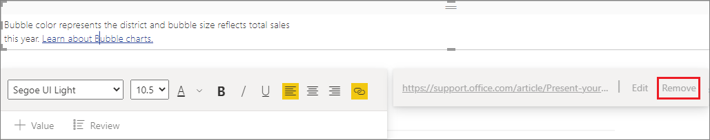

# Add a hyperlink to a text box in a report

[!INCLUDE [applies-yes-desktop-yes-service](../includes/applies-yes-desktop-yes-service.md)]

You can add a text box to a report in Power BI Desktop or the Power BI service. You can pin a text box from a report to a dashboard or add one directly to a dashboard. Wherever the text box is, you can always add a hyperlink to it. This article shows how to add a hyperlink to a text box in a report.

Watch Will Thompson create a text box and add a hyperlink to it.

> [!NOTE]
> This video might use earlier versions of Power BI Desktop or the Power BI service.

> [!VIDEO https://www.youtube.com/embed/_3q6VEBhGew#t=0m55s]

For information on hyperlinks in Power BI tables and matrixes, see [Add hyperlinks to a table](power-bi-hyperlinks-in-tables.md). For information on adding text boxes to your dashboard, see [Add images, videos, and more to your dashboard](service-dashboard-add-widget.md).

## Add a hyperlink to a text box

1. Open a report, [create a text box](power-bi-reports-add-text-and-shapes.md#add-a-text-box-to-a-report), and add some text.

1. Select existing text or add new text to use as a hyperlink.

   The text box menu appears.

   :::image type="content" source="media/service-add-hyperlink-to-text-box/power-bi-hyperlink-new.png" alt-text="Screenshot of a text box with sample text.":::

1. Select the hyperlink icon :::image type="icon" source="media/service-add-hyperlink-to-text-box/power-bi-hyperlink-icon.png"::: on the text box menu.

   The hyperlink field appears on the text box menu.

1. Type or paste the URL in the hyperlink field, and then select **Done**.

   :::image type="content" source="media/service-add-hyperlink-to-text-box/power-bi-add-link.png" alt-text="Screenshot of a text box, highlighting the hyperlink field.":::

1. Test the link:

   1. To display the URL in the hyperlink field, place your cursor anywhere in the new hyperlink in the text box.

      :::image type="content" source="media/service-add-hyperlink-to-text-box/power-bi-test-link.png" alt-text="Screenshot showing a hyperlink in the text box.":::

      :::image type="content" source="media/service-add-hyperlink-to-text-box/power-bi-hyperlink-edit.png" alt-text="Screenshot of a textbox, highlighting a URL in hyperlink field.":::

   1. To open the page in a new browser window, select the URL in the hyperlink field.

## Remove the hyperlink

1. In the text box, place your cursor anywhere in the hyperlink.

     
1. Select **Remove** from the hyperlink menu.

   Power BI Desktop removes the hyperlink but leaves the text.

## Related content

- [Add text boxes, shapes, and smart narrative visuals to Power BI reports](power-bi-reports-add-text-and-shapes.md)

More questions? Ask the [Power BI Community](https://community.powerbi.com/).
