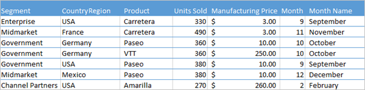
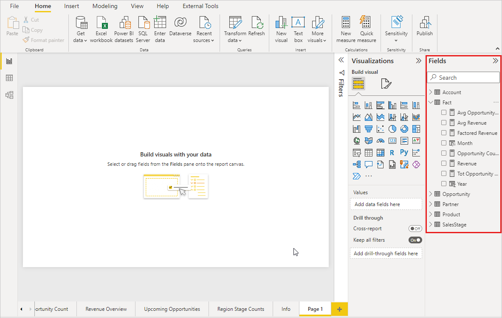
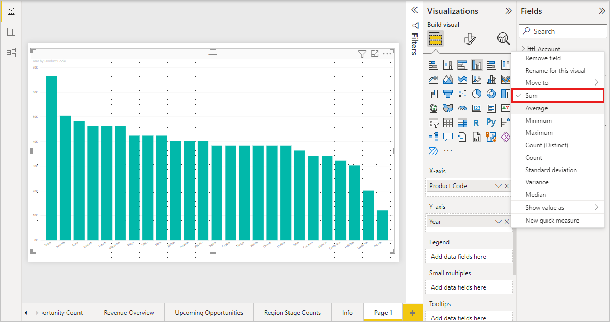
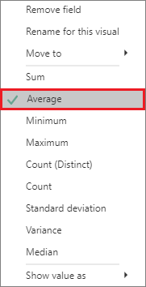
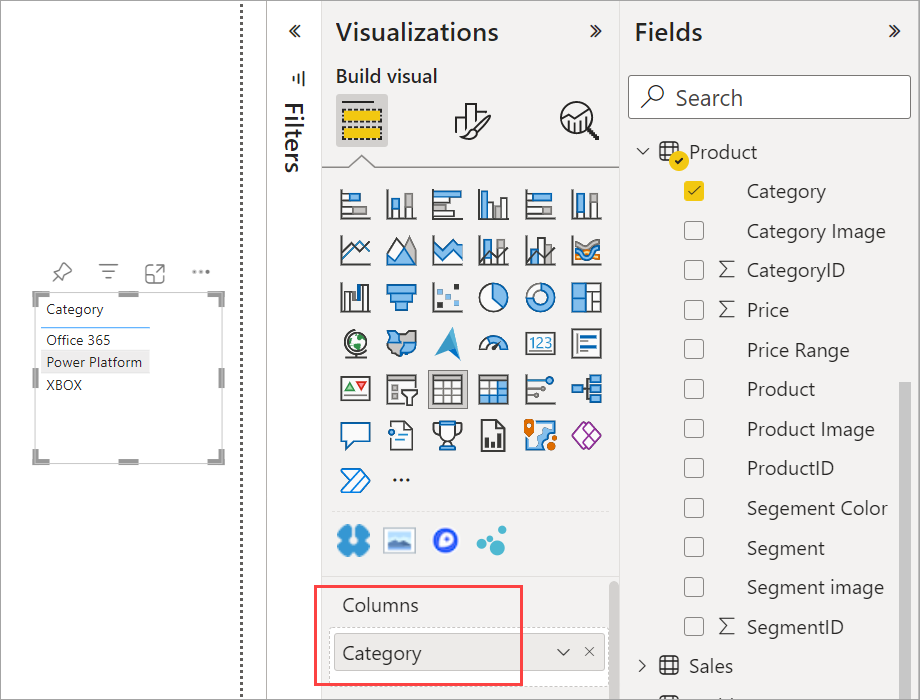
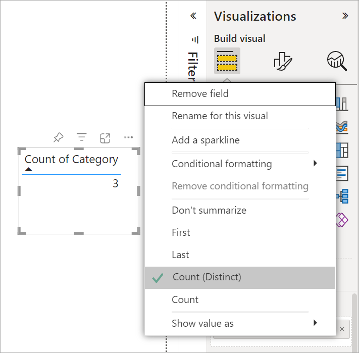
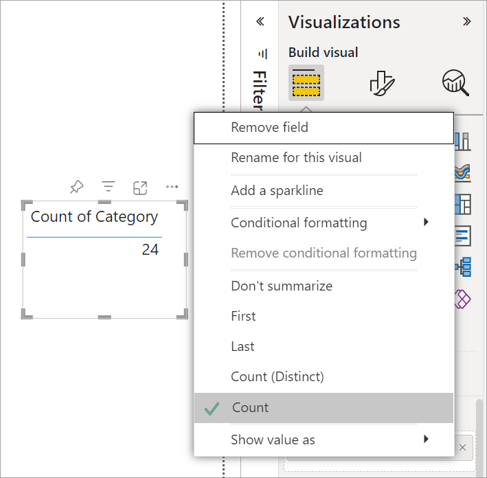
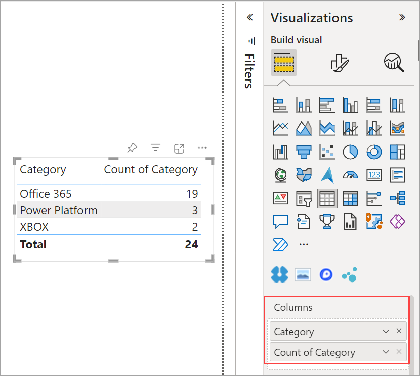

# Work with aggregates (sum, average, and so on) in Power BI

[!INCLUDE [applies-yes-desktop-yes-service](../includes/applies-yes-desktop-yes-service.md)]

## What is an aggregate?

Sometimes you want to mathematically combine values in your data. The mathematical operation could be sum, average, maximum, count, and so on. When you combine values in your data, it's called *aggregating*. The result of that mathematical operation is an *aggregate*.

When you create visualizations in Power BI Desktop and the Power BI service, they may aggregate your data. Often the aggregate is just what you need, but other times you may want to aggregate the values in a different way.  For example, a sum versus an average. There are several different ways to manage and change the aggregate Power BI uses in a visualization.

First, let's take a look at data *types* because the type of data determines how, and whether, Power BI can aggregate it.

## Types of data

Most semantic models have more than one type of data. At the most basic level, the data is either numeric or it isn't. Power BI can aggregate numeric data using a sum, average, count, minimum, variance, and much more. Power BI can even aggregate textual data, often called *categorical* data. If you try to aggregate a categorical field by placing it in a numeric-only bucket like **Values** or **Tooltips**, Power BI will count the occurrences of each category or count the distinct occurrences of each category. Special types of data, like dates, have a few of their own aggregate options: earliest, latest, first, and last.

In the example below:

- **Units Sold** and **Manufacturing Price** are columns that contain numeric data.

- **Segment**, **CountryRegion**, **Product**, **Month**, and **Month Name** contain categorical data.

   

When you create a visualization, Power BI aggregates numeric fields (the default is *sum*) over some categorical field.  For example, "Units Sold *by Product*", "Units Sold *by Month*" and "Manufacturing Price *by Segment*". Power BI refers to some numeric fields as **measures**. It's easy to identify measures in the Power BI report editor -- The **Fields** list shows measures with the ∑ symbol next to them. See [The report editor... take a tour](service-the-report-editor-take-a-tour.md) for more info.

## Why don't aggregates work the way I want them to?

Working with aggregates in Power BI can be confusing. Maybe you have a numeric field and Power BI won't let you change the aggregation. Or maybe you have a field, like a year, and you don't want to aggregate it, you just want to count the number of occurrences.

Typically, the underlying issue is the field definition in the semantic model. Maybe the semantic model owner defined the field as text and that explains why Power BI can't sum or average it. Unfortunately, [only the semantic model owner can change the way a field is categorized](../transform-model/desktop-measures.md). So if you have owner permissions to the semantic model, either in Desktop or the program used to create the semantic model (for example, Excel), you can fix this problem. Otherwise, you'll need to contact the semantic model owner for help.  

There is a special section at the end of this article called [**Considerations and troubleshooting**](#considerations-and-troubleshooting). It provides tips and guidance. If you don't find your answer there, post your question on the [Power BI Community forum](https://community.powerbi.com). You'll get a quick response directly from the Power BI team.

## Change how a numeric field is aggregated

Say you have a chart that sums the units sold for different products, but you'd rather have the average.

1. Create a **Clustered column chart** that uses a measure and a category. In this example, we're using Units Sold by Product.  By default, Power BI creates a chart that sums the units sold (drag the measure into the **Value** well) for each product (drag the category into the **Axis** well).

    

1. In the **Visualizations** pane, right-click the measure, and select the aggregate type you need. In this case, we're selecting **Average**. If you don't see the aggregation you need, see the [**Considerations and troubleshooting**](#considerations-and-troubleshooting) section.

   

   > [!NOTE]
   > The options available in the drop-down list will vary depending on 1) the field selected and 2) the way the semantic model owner categorized that field.

1. Your visualization is now using aggregated by average.

   

## Ways to aggregate your data

Some of the options that may be available for aggregating a field:

- **Do Not Summarize**. With this option chosen, Power BI treats each value in that field  separately and doesn't summarize them. Use this option if you have a numeric ID column that Power BI shouldn't sum.
- **Sum**. Adds all the values in that field up.
- **Average**. Takes an arithmetic mean of the values.
- **Minimum**. Shows the smallest value.
- **Maximum**. Shows the largest value.
- **Count (Not Blanks).** Counts the number of values in that field that aren't blank.
- **Count (Distinct).** Counts the number of different values in that field.
- **Standard deviation.**
- **Variance**.
- **Median**.  Shows the median (middle) value. This value has the same number of items above and below.  If there are two medians, Power BI averages them.

For example, this data:

| CountryRegion | Amount |
|:--- |:--- |
| USA |100 |
| UK |150 |
| Canada |100 |
| Germany |125 |
| France | |
| Japan |125 |
| Australia |150 |

Would give the following results:

- **Do Not Summarize**: Each value is shown separately
- **Sum**: 750
- **Average**: 125
- **Maximum**:  150
- **Minimum**: 100
- **Count (Not Blanks):** 6
- **Count (Distinct):** 4
- **Standard deviation:** 20.4124145...
- **Variance:** 416.666...
- **Median:** 125

## Create an aggregate using a category (text) field

You can also aggregate a non-numeric field. For example, if you have a Category name field, you can add it as a value and then set it to **Count**, **Distinct count**, **First**, or **Last**.

1. Drag the **Category** field onto the report canvas. The **Values** well is typically used for numeric fields. Power BI recognizes that this field is a text field, so it creates a table with a single column.

   

1. Select the arrow next to **Category**, and change the aggregation from the default **Don't summarize** to **Count (Distinct)**, Power BI counts the number of different categories. In this case, there are three.
  
   

1. And if you change the aggregation to **Count**, Power BI counts the total number. In this case, there are 24 entries for **Category**.

   

1. Drag the same field (in this case **Category**) into the **Columns** well again. Keep the default aggregation **Don't summarize**. Power BI breaks down the count by Category.

   

## Considerations and Troubleshooting

Q:  Why don't I have a **Do not summarize** option?

A:  The field you've selected is likely a calculated measure in a multidimensional model, or a measure created in Excel or [Power BI Desktop](../transform-model/desktop-measures.md). Each measure has its own hard-coded formula. You can’t change the aggregation Power BI uses. For example, if it’s a sum, it can only be a sum. The **Fields** list shows *measures* with the calculator symbol.

Q:  My field **is** numeric, why are my only choices **Count** and **Distinct count**?

A1:  The likely explanation is that the semantic model owner has *not* classified the field as a number. For example, if a semantic model has a **year** field, the semantic model owner may categorize the value as text. It's more likely that Power BI will count the **year** field (for example, number of people born in 1974). It's less likely that Power BI will sum or average it. If you're the owner, you can open the semantic model in Power BI Desktop and use the **Modeling** tab to change the data type.

A2: If the field has a calculator icon, then it's a *measure*. Each measure has its own formula that only the semantic model owner can change. The calculation Power BI uses may be a simple aggregation like an average or sum. It may also be something more complicated like a "percent of contribution to parent category" or "running total since start of the year". Power BI isn't going to sum or average the results. Instead, it will just recalculate (using the hard-coded formula) for each data point.

A3:  Another possibility is that you've dropped the field into a *bucket* that only allows categorical values.  In that case, your only options will be count and distinct count.

A4:  And a fourth possibility is that you're using the field for an axis. On a bar chart axis, for example, Power BI shows one bar for each distinct value -- it doesn't aggregate the field values at all.

>[!NOTE]
>The exception to this rule is scatter charts, which *require* aggregated values for the X and Y axes.

Q:  Why can't I aggregate text fields for SQL Server Analysis Services (SSAS) data sources?

A:  Live connections to SSAS multidimensional models don't allow any client-side aggregations, including first, last, avg, min, max, and sum.

Q:  I have a scatter chart and I want my field to *not* aggregate.  How?

A:  Add the field to the **Details** bucket and not to the X or Y axes buckets.

Q:  When I add a numeric field to a visualization, most of them default to sum but some default to average or count or some other aggregation.  Why isn't the default aggregation always the same?

A:  Semantic model owners can set the default summarization for each field. If you're a semantic model owner, change the default summarization in the **Modeling** tab of Power BI Desktop.

Q:  I'm a semantic model owner and I want to ensure that a field is never aggregated.

A:  In Power BI Desktop, in the **Modeling** tab, set **Data type** to **Text**.

Q:  I don't see **Do not summarize** as an option in my drop-down list.

A:  Try removing the field and adding it back in.

More questions? [Try the Power BI Community](https://community.powerbi.com/)
