# Add images, videos, and more to your dashboard

[!INCLUDE [applies-no-desktop-yes-service](../includes/applies-no-desktop-yes-service.md)]

By adding a tile to your dashboard, you can place an image, text box, video, streaming data, or web code on your dashboard.

## Add an image, video, or other tile

You can add an image, text box, video, streaming data, or web code directly to your dashboard.

1. Select the arrow next to **Edit** on the top menu, and then select **Add a tile**.

    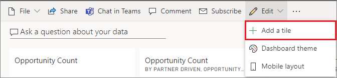
2. Select which type of tile to add: 

    **[Web content](#add-web-content)**

    **[Image](#add-an-image)**

    **[Text box](#add-a-text-box-or-dashboard-heading)**

    **[Video](#add-a-video)**

    **[Custom streaming data](#add-streaming-data)**

    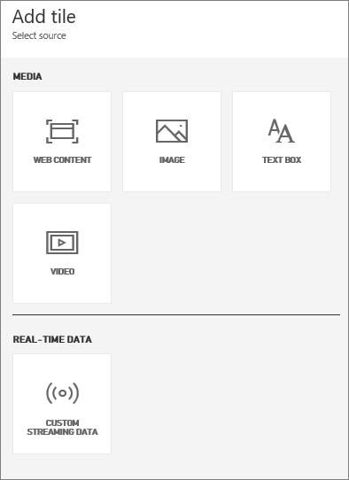

## Add an image

If you want to add your company logo or some other image to your dashboard, you save the image file online and link to it. Make sure security credentials aren't required to access the image file. For example, because OneDrive and SharePoint require authentication, images stored there can't be added to a dashboard this way. Also, images can't be in .svg format.  

1. From the **Add tile** window, select **Image** > **Next**.

2. From the **Add image tile** window, add the image information:

   a. To display a title above the image, select **Display title and subtitle** and enter a **Title** and an optional **Subtitle**.

   b. Enter the image **URL**.

   c. To make the tile a hyperlink, select **Set custom link** and enter the **URL**.

      When colleagues click the image or title, they'll be taken to this URL.

   d. Select **Apply**.

      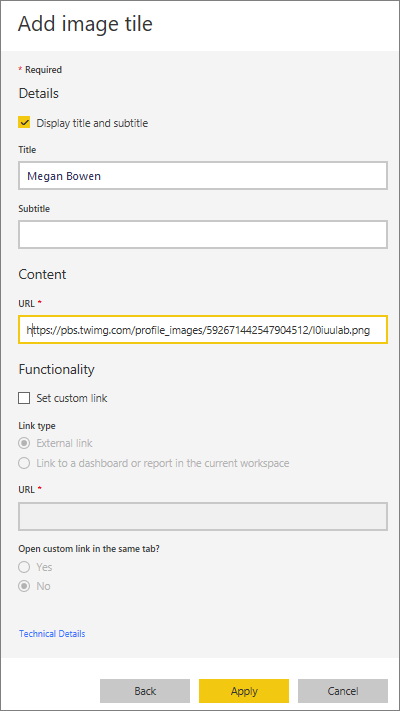

3. On the dashboard, resize and move the image as needed.

     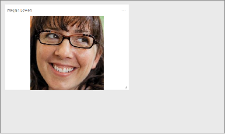

## Add a text box or dashboard heading

To add a dashboard heading, type your heading in the text box and increase the font.

1. From the **Add tile** window, select **Text box** > **Next**.

2. Format the text box:

   a. To display a title above the text box, select **Display title and subtitle** and enter a **Title** and an optional **Subtitle**.

   b. Enter and format **Content** for the text box.  

   c. Optionally, set a custom link for the title. A custom link can be an external site or a dashboard or report in your workspace. However, in this example we've added hyperlinks within the text box itself, so we'll leave **Set custom link** unchecked.

   d. Select **Apply**.

     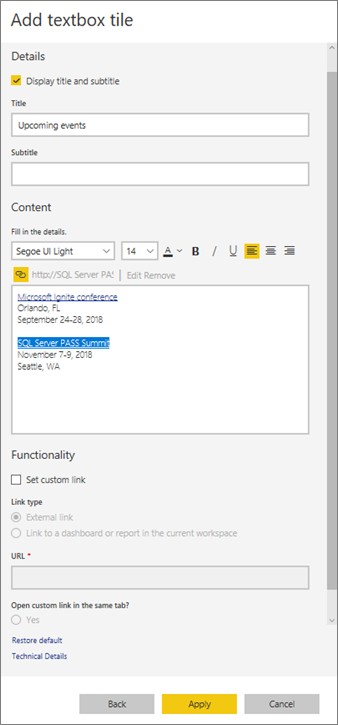

3. On the dashboard, resize and move the text box as needed.

   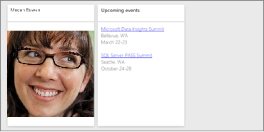

## Add a video

When you add a YouTube or Vimeo video tile to your dashboard, the video plays right on your dashboard.

1. From the **Add tile** window, select **Video** > **Next**.
2. Add video information in the **Add video tile** window:

   a. To display a title and subtitle at the top of the video tile, select **Display title and subtitle** and enter a **Title** and an optional **Subtitle**. In this example, we'll add a **Subtitle**, and then convert it to a hyperlink to the entire YouTube playlist.

   b. Enter the **Video URL** for the video.

   c. Add a hyperlink for the **Title** and **Subtitle**, so that your colleagues can view the entire playlist on YouTube after they watch the embedded video. To do so, under **Functionality**, select **Set custom link**, and then enter the **URL** for the playlist.

   d. Select **Apply**.  

   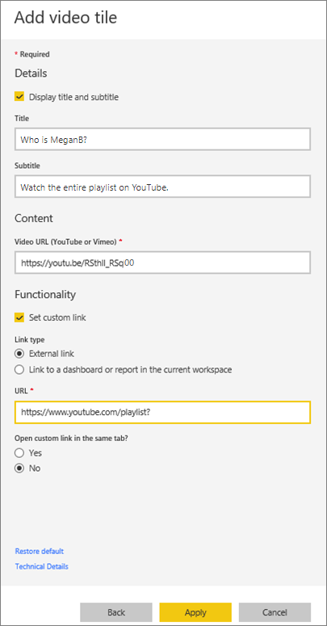

3. On the dashboard, resize and move the video tile as needed.

   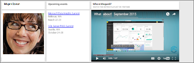
4. Select the video tile to play the video.
5. Select the subtitle to visit the playlist on YouTube.

## Add streaming data

You can use PubNub to add streaming data, such as Twitter feeds or sensor data, to a tile in your dashboard. Power BI has created an integration to get the data from PubNub.

1. From the **Add tile** window, select **Custom Streaming Data** > **Next**.
2. Select **Add streaming dataset**.
3. Create a **New streaming dataset** using the Power BI API or PubNub.
4. Fill in the fields for **Dataset name**, **Subscription key**, and **Channel name**. If it's a secure connection, it also has an authorization key. You can use the sample values from PubNub to try it out.
5. Select **Next**.
    You see the fields that are available in the dataset, with their data types and JSON format.
6. Select **Connect**.
    You have created a streaming dataset.
7. Go back to the dashboard and again select **Add tile** > **Custom Streaming Data** > **Next**.
8. Select the sensor data dataset you created > **Next**.
9. Select the visual type you want. Often a line chart works well for this data.
10. Select the **Axis**, **Legend**, and **Values**.
11. Decide the amount of time you want to display, either in seconds, minutes, or hours.
12. Select **Next**.
13. Give it a **Title** and **Subtitle**, if you want.
14. Pin it to your dashboard.

1. From the **Add tile** window, select **Custom Streaming Data** > **Next**.

2. Select **Add streaming dataset**.

3. Create a **New streaming dataset** using the Power BI API or PubNub.

4. Fill in the fields for **Dataset name**, **Subscription key**, and **Channel name**. If it's a secure connection, it also has an authorization key. You can use the sample values from PubNub to try it out.

5. Select **Next**.

   You see the fields that are available in the dataset, with their data types and JSON format.

6. Select **Connect**.

   You've created a streaming dataset.

7. Go back to the dashboard and again select **Add tile** > **Custom Streaming Data** > **Next**.

8. Select the sensor data dataset you created > **Next**.

9. Select the visual type you want. Often a line chart works well for this data.

10. Select the **Axis**, **Legend**, and **Values**.

11. Decide the amount of time you want to display, either in seconds, minutes, or hours.

12. Select **Next**.

13. Optionally, give it a **Title** and **Subtitle**.

14. Pin it to your dashboard.

## Add web content

You can paste or type in any HTML content, as a tile, to your report or dashboard. Enter the embed code manually or copy/paste from sites such as Twitter, YouTube, embed.ly, and so on.

1. From the **Add tile** window, select **Web content** > **Next**.

2. Add information to the **Add web content tile** window:

   a. To display a title above the tile, select **Display title and subtitle** and enter a **Title** and an optional **Subtitle**.

   b. Enter the embed code. In this example, we're copying and pasting a Twitter feed.

   c. Select **Apply**.

   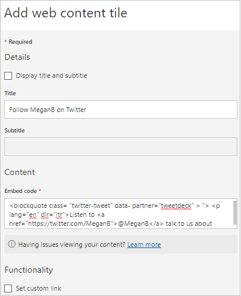

3. On the dashboard, resize and move the web content tile as needed.

   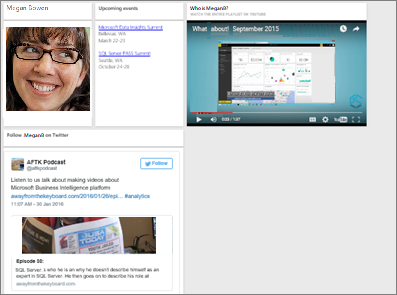

### Tips for embedding web content

* For iframes, use a secure source. If you enter your iframe embed code and get a blank tile, verify you're not using *http* for the iframe source. If you are, change it to *https*.
  
  ```html
  <iframe src="https://xyz.com">
  ```

* Edit width and height information. The embed code embeds a video and sets the video player to 560 x 315 pixels. This size doesn't change as you resize the tile.
  
  ```html
  <iframe width="560" height="315"
  src="https://www.youtube.com/embed/Cle_rKBpZ28" frameborder="0"
   allowfullscreen></iframe>
  ```
  
  If you'd like the player to resize to fit the tile size, set the width and height to 100%.

  ```html
  <iframe width="100%" height="100%"
  src="https://www.youtube.com/embed/Cle_rKBpZ28" frameborder="0"
   allowfullscreen></iframe>
  ```

* This code embeds a tweet and retains, as separate links on the dashboard, links for the AFK podcast, \@MeganB's Twitter page, Follow, #analytics, reply, retweet, and like.  Selecting the tile itself takes you to the podcast on Twitter.
  
  ```html
  <blockquote class="twitter-tweet" data-partner="tweetdeck">
  <p lang="en" dir="ltr">Listen to
  <a href="https://twitter.com/MeganB">@MeganB</a> talk to
  us about making videos about Microsoft Business Intelligence
  platform
  <a href="https://t.co/TmRgalz7tv">https://t.co/TmRgalz7tv </a>
  <a href="https://twitter.com/hashtag/analytics?src=hash">
  #analytics</a></p>&mdash; AFTK Podcast (@aftkpodcast) <a
  href="https://twitter.com/aftkpodcast/status/693465456531771392">
  January 30, 2016</a></blockquote> <script async src="//platform.twitter.com/widgets.js" charset="utf-8"></script>
  ```

## Edit a tile

To make changes to an existing tile:

1. Hover over the top-right corner of the tile and select **More options** (...).

    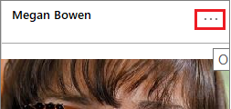
2. Select **Edit details** to display the **Tile details** window and make changes.

    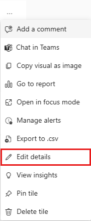

## Considerations and troubleshooting

* To make it easier to move the tile on your dashboard, add a title and an optional subtitle.
* If you'd like to embed content from a website, but the website doesn't provide embed code to copy and paste, see embed.ly for help with generating the embed code.
* Make sure security credentials aren't required to access the image file. For example, because OneDrive and SharePoint require authentication, images stored there can't be added to a dashboard this way.
* Images can't be in .svg format.

## Related content

* [Intro to dashboard tiles for Power BI designers](service-dashboard-tiles.md)

More questions? [Try the Power BI Community](https://community.powerbi.com/).
