# Create a Power BI dashboard from a report
You've read [Introduction to dashboards in Power BI](service-dashboards.md), and now you want to create your own. There are many different ways to create a dashboard. For example, you can create a dashboard from a report, from scratch, from a dataset, or by duplicating an existing dashboard.  

We start by creating a quick and easy dashboard that pins visualizations from a report that's already been built. 

After you complete this article, you'll have a good understanding of:
- The relationship between dashboards and reports
- How to open Editing view in the report editor
- How to pin tiles 
- How to navigate between a dashboard and a report 
 

> [!NOTE] 
> Dashboards are a feature of the Power BI service, not Power BI Desktop. Although you don't create dashboards in the Power BI mobile apps, you can [view and share](../consumer/mobile/mobile-apps-view-dashboard.md) there.
>
> 

## Video: Create a dashboard by pinning visuals and images from a report
Watch Amanda create a new dashboard by pinning visualizations from a report. Then, follow the steps in the next section, [Import a dataset with a report](#import-a-dataset-with-a-report), to try it out yourself using the Procurement Analysis sample.
    
> [!NOTE]  
> This video might use earlier versions of Power BI Desktop or the Power BI service.

<iframe width="560" height="315" src="https://www.youtube.com/embed/lJKgWnvl6bQ" frameborder="0" allowfullscreen></iframe>

## Import a dataset with a report
In this step-by-step, we import one of the Power BI sample datasets and use it to create our new dashboard. The sample we use is an Excel workbook with two PowerView sheets. When Power BI imports the workbook, it adds a dataset and a report to your workspace. The report is automatically created from the PowerView sheets.

1. Download the [Procurement Analysis sample](https://go.microsoft.com/fwlink/?LinkId=529784) Excel file. We recommend saving it in your OneDrive for Business.
2. Open the Power BI service in your browser (app.powerbi.com).
3. From the nav pane, select **My Workspace** and then select **Get Data**.

    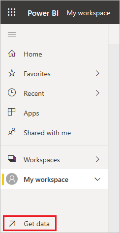
5. Under **Files**, select **Get**.

   
6. Navigate to the location where you saved the Procurement Analysis sample Excel file. Select it and choose **Connect**.

   
7. For this exercise, select **Import**.

    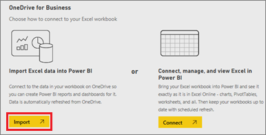
8. When the success message appears, select the **x** to dismiss it.

   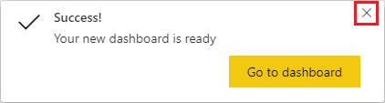

> [!TIP]
> Did you know? You can narrow the nav pane by selecting the icon with three lines at the top . That gives you more room for the report itself.

### Open the report and pin tiles to your dashboard
1. In the same workspace, select the **Procurement Analysis Sample** report to open it.

    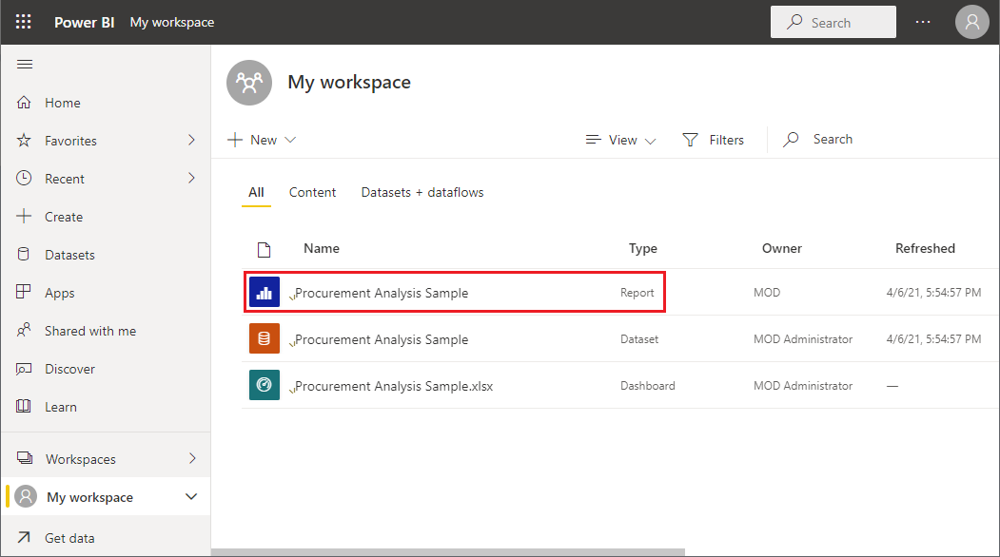
    The report opens in Reading view. Notice it has two tabs on the left: **Discount Analysis** and **Spend Overview**. Each tab represents a page of the report.

2. Select **More options (...)** > **Edit** to open the report in Editing view.

    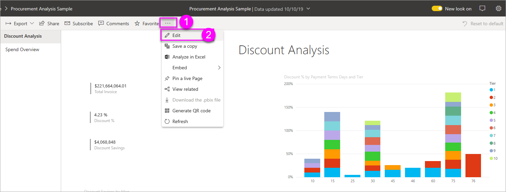
3. Hover over a visualization to reveal the options available. To add a visualization to a dashboard, select the pin icon .

    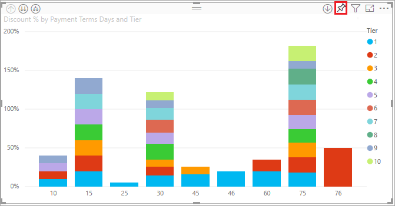
4. Because we're creating a new dashboard, select the option for **New dashboard** and give it a name.

    
5. When you select **Pin**, Power BI creates the new dashboard in the current workspace. After the **Pinned to dashboard** message appears, select **Go to dashboard**. If you're prompted to save the report, choose **Save**.

    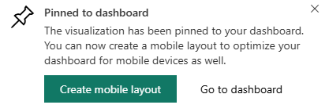

    Power BI opens the new dashboard. It has one tile: the visualization you just pinned.

   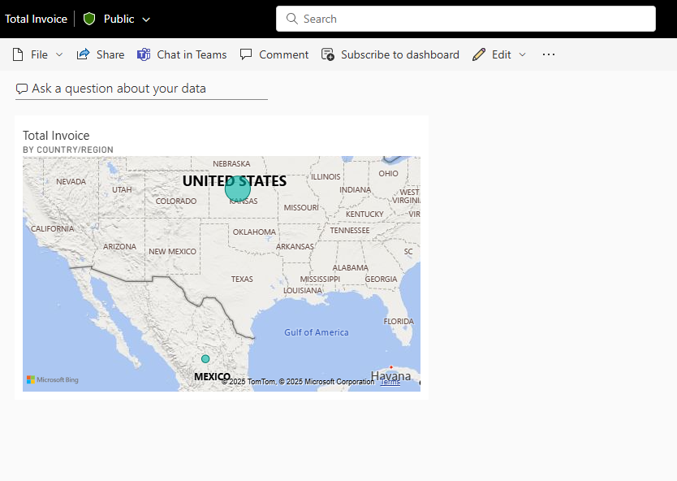
7. Select the tile to return to the report. Pin a few more tiles to the new dashboard. When the **Pin to dashboard** window displays, select **Existing dashboard**.  

   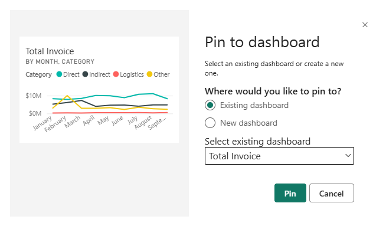

## Pin an entire report page to the dashboard
Instead of pinning one visual at a time, you can [pin an entire report page as a *live tile*](service-dashboard-pin-live-tile-from-report.md). Let's do it.

1. In the report editor, select the **Spend Overview** tab to open the second page of the report.

   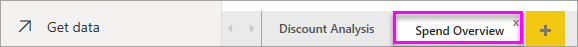

2. You want all of the visuals in the report on your dashboard. In the upper-right corner of the menubar, select **Pin to a dashboard**. On a dashboard, live page tiles update each time the page is refreshed.

   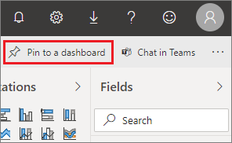

3. When the **Pin to dashboard** window appears, select **Existing dashboard**.

   

4. After the Success message appears, select **Go to dashboard**. There you see the tiles you pinned from the report. In the example below, we've pinned two tiles from page one of the report and one live tile, which is page two of the report.

   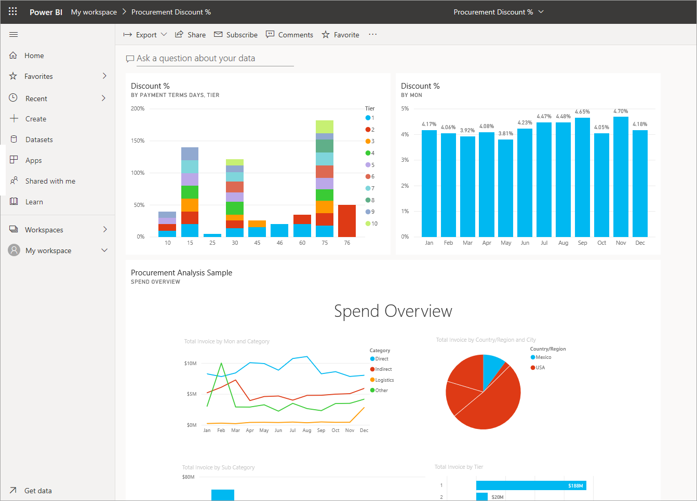

## Next steps
Congratulations on creating your first dashboard! Now that you have a dashboard, there's much more you can do with it. Follow one of the suggested articles below, or start exploring on your own: 

* [Resize and move tiles](service-dashboard-edit-tile.md)
* [All about dashboard tiles](service-dashboard-tiles.md)
* [Share your dashboard by creating an app](../collaborate-share/service-create-workspaces.md)
* [Power BI - Basic Concepts](../fundamentals/service-basic-concepts.md)
* [Tips for designing a great dashboard](service-dashboards-design-tips.md)

More questions? [Try the Power BI Community](https://community.powerbi.com/).
