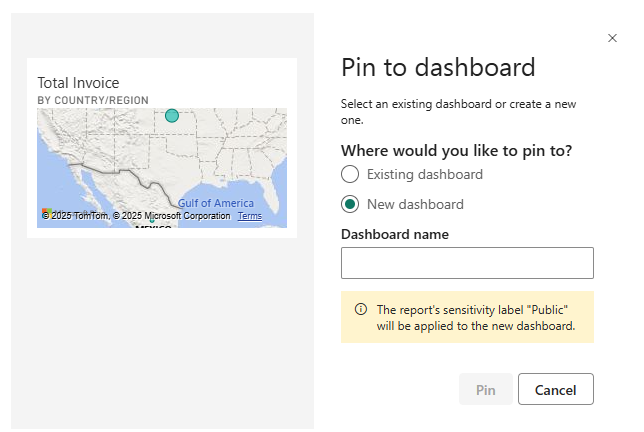
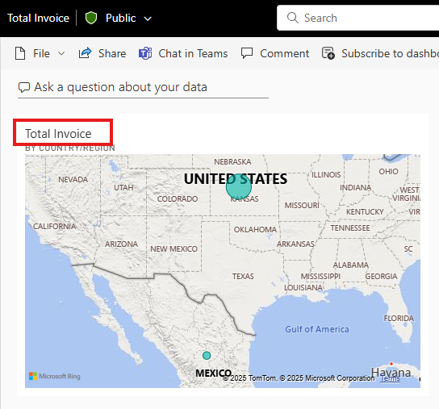

# Create a Power BI dashboard from a report

[!INCLUDE [applies-no-desktop-yes-service](../includes/applies-no-desktop-yes-service.md)]

You read [Introduction to dashboards in Power BI](service-dashboards.md), and now you want to create your own. There are many ways to create a dashboard. For example, you can create a dashboard from a report, from scratch, from a semantic model, or by duplicating an existing dashboard. In this article, you create a quick and easy dashboard that pins visualizations from an existing report.

After you complete this article, you'll understand:

- The relationship between dashboards and reports.
- How to pin tiles.
- How to navigate between a dashboard and a report.

> [!NOTE]
> Dashboards are a feature of the Power BI service, not Power BI Desktop. You can't create dashboards in the Power BI mobile apps, but you can [view and share](../consumer/mobile/mobile-apps-view-dashboard.md) them there.
>
>

## Pin tiles to a dashboard

You can use the following steps and the [Procurement Analysis sample](sample-procurement.md) to try pinning visualizations to a new dashboard for yourself.

1. Open the Procurement Analysis sample report and then select **Edit** to open the report in Editing view.

    

1. Hover over a visualization to and then to add a visualization to a dashboard, select the pin icon :::image type="icon" source="media/service-dashboard-create/power-bi-pin-icon.png":::.

    
1. Select whether to pin to an existing dashboard or new dashboard.

   - **Existing dashboard**: Select the name of the dashboard from the dropdown. Dashboards that are shared with you don't appear in the dropdown.
   - **New dashboard**: Enter the name of the new dashboard.

1. In this case, we select the option for **New dashboard** and enter a name. For this example the default "Total Invoice by Country/Region" name is used.

    

1. When you select **Pin**, Power BI creates the new dashboard in the current workspace. After the **Pinned to dashboard** message appears, select **Go to dashboard**. If you're prompted to save the report, select **Save**.

    

    Power BI opens the new dashboard, which has one tile: the visualization you pinned.

   

1. Select the tile to return to the report.

     

1. Pin a few more tiles to the new dashboard. When the **Pin to dashboard** window appears, select **Existing dashboard**.  

   

## Pin an entire report page

Another option is to pin an entire report page to a dashboard, which is an easy way to pin more than one visualization at a time. When you pin an entire page, the tiles are *live*. That is, you can interact with them there on the dashboard. Changes you make to any of the visualizations in the report editor, like adding a filter or changing the fields used in the chart, are reflected in the dashboard tile as well.  

For more information, see [Pin an entire report page](service-dashboard-pin-live-tile-from-report.md).

## Considerations and limitations

Some report formatting options or themes aren't applied to visuals when you pin them to a dashboard.
- Border, shadow, and background settings, as well as all title and subtitle formatting (aside from the text itself), are ignored in the pinned tile.
- For card visuals, the text used for the value is shown in dashboards using the 'DIN' font family, with black text. You can change the text color for all the tiles on a dashboard by [creating a custom dashboard theme](service-dashboard-themes.md).
- Conditional formatting isn't applied.

Certain interactivity/features are lost or limited.
- If you pin just a visual (rather than an entire report page), filters and slicers in the report may not persist or apply the same way on the tile.
- Button visuals that trigger bookmarks or clear or apply filters when you select them have no action in a dashboard tile. These actions only make sense within the context of a report. The tile is a snapshot/hyperlink, not full report functionality.
- If you’re a viewer (not creator) of a dashboard, you often cannot move or resize tiles. Dashboard tile refresh and behavior may depend on dataset refresh and cache.

Live changes in the report may not update the tile’s visual type.
- If you pinned a line chart, then later change the visual in the report to a bar chart, the dashboard tile still shows the original line-chart visual type (though data may refresh).
- Similarly, geometry or layout changes may not propagate.

Limitations with visual types, data size, and image sizes.
- Some custom visuals, certain slicer visuals, or unsupported visuals may not be pinnable.
- Visuals adjust their size to fit the size of the tile, which can result in differences in layout as if the visual were resized in the report.
- Because some visualizations use background images, pinning might not work if the background image is too large. Try reducing the image size or using image compression.
- While you can pin visuals from different reports or datasets to one dashboard, you cannot create new visuals on the dashboard itself that combine data from different underlying datasets in the way you can in a report.
- Custom fonts that aren’t part of Power BI’s supported font list aren’t applied on dashboards.

Dashboard theme and visual theme mismatches.
- When you pin a tile, you can choose to keep the report’s theme (so the visual looks as it did) or use the dashboard theme (so all tiles match). However, some tiles might lose formatting when the dashboard theme is applied.
- Some theme-level formatting (tile background color, tile border) may not apply in all cases (for example, pinned live report pages or certain tile types).
  
Dashboard limitations (beyond pinning) that impact pinned visuals.
- Dashboards are limited to one page (one canvas), whereas reports can have many pages.
- You cannot create dashboards in Power BI Desktop—only in the Power BI service.
- On a dashboard, filtering or slicing the canvas is not available in the same way as in a report: you cannot drop a slicer across tiles and have them all respond (unless each tile was pinned from a live page).

## Related content

Congratulations on creating your first dashboard. Now that you have a dashboard, there's more you can do with it. Start exploring on your own, or see one of the following articles:

- [Resize and move tiles](service-dashboard-edit-tile.md)
- [All about dashboard tiles](service-dashboard-tiles.md)
- [Share your dashboard by creating an app](../collaborate-share/service-create-distribute-apps.md)
- [Power BI - Basic Concepts](../fundamentals/service-basic-concepts.md)
 [Tips for designing a great dashboard](service-dashboards-design-tips.md)

More questions? [Try the Power BI Community](https://community.powerbi.com/).
