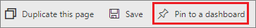
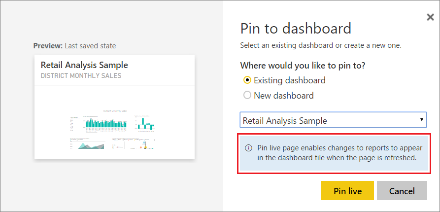
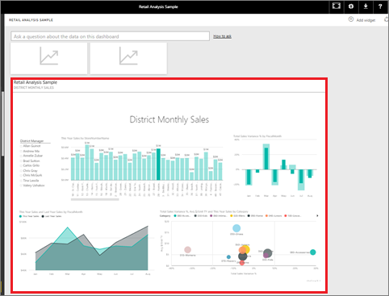

# Pin an entire report page, as a live tile, to a Power BI dashboard
Another way to add a new [dashboard tile](../consumer/end-user-tiles.md) is by pinning an entire report page. This is an easy way to pin more than one visualization at a time.  Also, when you pin an entire page, the tiles are *live*; you can interact with them right there on the dashboard. And changes you make to any of the visualizations back in the report editor, like adding a filter or changing the fields used in the chart, are reflected in the dashboard tile as well.  

Pinning live tiles from reports to dashboards is only available in Power BI service (app.powerbi.com).

> [!NOTE]
> You can't pin tiles from reports that are shared with you.
> 
> 

## Pin a report page
Watch Amanda pin a live report page to a dashboard and then follow the step-by-step instructions below the video to try it yourself.

> [!NOTE]  
> This video might use earlier versions of Power BI Desktop or the Power BI service.

<iframe width="560" height="315" src="https://www.youtube.com/embed/EzhfBpPboPA" frameborder="0" allowfullscreen></iframe>

1. Open a report in [Editing view](service-interact-with-a-report-in-editing-view.md).
2. With no visualizations selected, from the menu bar, select **Pin to a dashboard**.
   
    
3. Pin the tile to an existing dashboard or to a new dashboard. Notice the highlighted text: *Pin live page enables changes to reports to appear in the dashboard tile when the page is refreshed.*
   
   * Existing dashboard: select the name of the dashboard from the dropdown. Dashboards that have been shared with you will not appear in the dropdown.
   * New dashboard: type the name of the new dashboard.
     
     
4. Select **Pin live**. A Success message (near the top right corner) lets you know the page was added, as a tile, to your dashboard.

## Open the dashboard to see the pinned live tile
1. From the nav pane, select the dashboard with the new live tile. There, you can do things like [rename, resize, link, and move](service-dashboard-edit-tile.md) the pinned report page.  
2. Interact with the live tile.  In the screenshot below, selecting a bar on the column chart has cross-filtered and cross-highlighted the other visualizations on the tile.
   
    

## Next steps
[Dashboards in Power BI](../consumer/end-user-dashboards.md)

More questions? [Try the Power BI Community](https://community.powerbi.com/)
