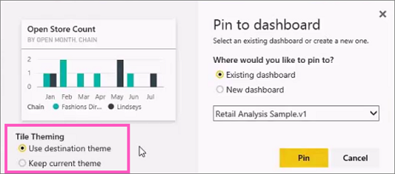
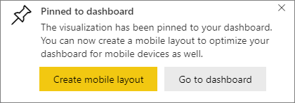

# Pin a tile to a Power BI dashboard from a report

One way to add a [dashboard tile](../consumer/end-user-tiles.md) is from within a [Power BI report](../consumer/end-user-reports.md). When you select one of these tiles, it opens in the report.

An entire report page can be pinned to a dashboard, which is called pinning a *live* tile. It's called a live tile because you can interact with the tile on the dashboard. Unlike with individual visualization tiles, changes made in the report are automatically synced with the dashboard. For more information, see [Pin an entire report page](#pin-an-entire-report-page).

You can't pin tiles from reports that have been shared with you or from Power BI Desktop. 

> [!TIP]
> Because some visualizations use background images, pinning might not work if the background image is too large. Try reducing the image size or using image compression.  
> 
> 

## Pin a tile from a report
Watch Amanda create a dashboard by pinning visuals and images from a Power BI report.
    

<iframe width="560" height="315" src="https://www.youtube.com/embed/lJKgWnvl6bQ" frameborder="0" allowfullscreen></iframe>

Now create your own dashboard by using one of the Power BI sample reports.

1. In the report, hover over the visualization you want to pin, and select the pin icon. . Power BI opens the **Pin to dashboard** screen.
   
     
2. Select whether to pin to an existing dashboard or new dashboard.
   
   * **Existing dashboard**: Select the name of the dashboard from the dropdown. Dashboards that have been shared with you won't appear in the dropdown.
   * **New dashboard**: Enter the name of the new dashboard.
3. In some cases, the item you're pinning might have a *theme* already applied. For example, visuals pinned from an Excel workbook. If so, select which theme to apply to the tile.
4. Select **Pin**.
   
   A success message (near the top-right corner) informs you the visualization was added, as a tile, to your dashboard.
   
   
5. From the nav pane, select the dashboard with the new tile. [Edit the tile display and behavior](service-dashboard-edit-tile.md) or select the tile to return to the report.

## Pin an entire report page
Another option is to pin an entire report page to a dashboard, which is an easy way to pin more than one visualization at a time. When you pin an entire page, the tiles are *live*. That is, you can interact with them there on the dashboard. Changes you make to any of the visualizations in the report editor, like adding a filter or changing the fields used in the chart, are reflected in the dashboard tile as well.  

For more information, see [Pin an entire report page](service-dashboard-pin-live-tile-from-report.md).

## Limitations
Some report formatting options or themes aren't applied to visuals when you pin them to a dashboard.
- Border, shadow, and background settings are ignored in the pinned tile.
- For card visuals, the text used for the value is shown in dashboards using the 'DIN' font family, with black text. You can change the text color for all the tiles on a dashboard by [creating a custom dashboard theme](service-dashboard-themes.md).
- Conditional formatting isn't applied.
- Visuals will adjust their size to fit the size of the tile. This can result in differences in layout as if the visual had been resized on the report.

## Next steps
- [Dashboards for Power BI service consumers](../consumer/end-user-dashboards.md)
- [Dashboard tiles in Power BI](../consumer/end-user-tiles.md)
- [Reports in Power BI](../consumer/end-user-reports.md)
- [Data refresh in Power BI](../connect-data/refresh-data.md)
- [Basic concepts for designers in the Power BI service](../fundamentals/service-basic-concepts.md)

More questions? [Try the Power BI Community](https://community.powerbi.com/)
