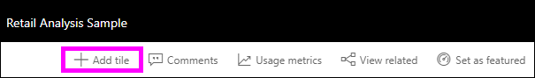
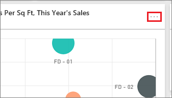
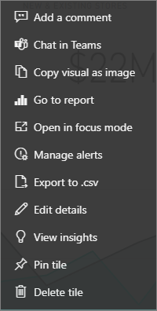

# Intro to dashboard tiles for Power BI designers

[!INCLUDE [applies-no-desktop-yes-service](../includes/applies-no-desktop-yes-service.md)]

A tile is a snapshot of your data, pinned to the dashboard. You can create tiles from a report, dashboard, the Q&A box, Excel, SQL Server Reporting Services (SSRS) reports, and more.  This screenshot shows many different tiles pinned to a dashboard.

Dashboards and dashboard tiles are a feature of Power BI service, not Power BI Desktop. You can't create dashboards on mobile devices but you can [view and share](../consumer/mobile/mobile-apps-view-dashboard.md) them there.

Besides pinning tiles, you can create standalone tiles directly on the dashboard by using the [Add tile](service-dashboard-add-widget.md) control. Standalone tiles include: text boxes, images, videos, streaming data, and web content.

Need help with understanding the building blocks that make up Power BI? See [Basic concepts for designers in the Power BI service](../fundamentals/service-basic-concepts.md).

> [!NOTE]
> If the original visualization used to create the tile changes, the tile doesn't change.  For example, if you pinned a line chart from a report and then you changed the line chart to a bar chart, the dashboard tile continues to show a line chart. The data refreshes, but the visualization type does not.
> 
> 

## Pin a tile
There are many different ways to add (pin) a tile to a dashboard. You can pin tiles from:

* [Power BI Q&A](service-dashboard-pin-tile-from-q-and-a.md)
* [A report](service-dashboard-create.md)
* [Another dashboard](service-pin-tile-to-another-dashboard.md)
* [Excel workbook on OneDrive for work or school](service-dashboard-pin-tile-from-excel.md)
* [Quick Insights](service-insights.md)
* [An on-premises paginated report in Power BI Report Server or SQL Server Reporting Services](/sql/reporting-services/pin-reporting-services-items-to-power-bi-dashboards)

You create standalone tiles for images, text boxes, videos, streaming data, and web content directly on the dashboard by using the [Add tile](service-dashboard-add-widget.md) control.

  

## Interact with tiles on a dashboard
After you've added a tile to a dashboard, you can move and resize it, or change its appearance and behavior.

### Move and resize a tile
Grab a tile and [move it around on the dashboard](service-dashboard-edit-tile.md). Hover and select the handle  to resize the tile.

### Hover over a tile to change the appearance and behavior
1. Hover over the tile to display the ellipsis.
   
    
2. Select the ellipsis to open the tile action menu.
   
    
   
    From here you can:
   
     * [Add comments to the dashboard](../consumer/end-user-comment.md).
     * [Open the report that was used to create this tile](../consumer/end-user-reports.md).  
     * [View in focus mode](../consumer/end-user-focus.md).   
     * [Export the data used in the tile](../visuals/power-bi-visualization-export-data.md).
     * [Edit the title and subtitle and add a hyperlink](service-dashboard-edit-tile.md). 
     * [Run insights](service-insights.md). 
     * [Pin the tile to another dashboard](service-pin-tile-to-another-dashboard.md).
     * [Delete the tile](service-dashboard-edit-tile.md).

3. To close the action menu, select a blank area in the dashboard.

### Select a tile
When you select a tile, what happens next depends on how you created the tile. Otherwise, selecting the tile takes you to the report, Excel Online workbook, on-premises Reporting Services report, or Q&A question that was used to create the tile. Or, if it has a [custom link](service-dashboard-edit-tile.md), selecting the tile takes you to that link.

> [!NOTE]
> An exception is video tiles created directly on the dashboard by using **Add tile**. Selecting a video tile (that was created this way) causes the video to play directly on the dashboard.   
> 
> 

## Considerations and troubleshooting

* If the report that was used to create the visualization wasn't saved, selecting the tile produces no action.
* If the tile was created from a workbook in Excel Online, you need at least Read permissions for that workbook. Otherwise, selecting the tile won't open the workbook in Excel Online.
* Say you create a tile directly on the dashboard by using **Add tile** and set a custom hyperlink for it. If so, when you select the title, subtitle, or tile, it opens that URL. Otherwise, by default, when you select a tile created directly on the dashboard for an image, web code, or text box, nothing happens.
* Tiles can be created from on-premises paginated reports in Power BI Report Server or SQL Server Reporting Services. If you don't have permission to access the on-premises report, selecting the tile takes you to a page indicating you don't have access (rsAccessDenied).
* Say you select a tile created from an on-premises paginated report in Power BI Report Server or SQL Server Reporting Services. If you don't have access to the network where the report server is located, selecting a tile created from that paginated report takes you to a page that indicates it can't locate the server (HTTP 404). Your device needs network access to the report server to view the report.
* If the original visualization that's used to create the tile changes, the tile doesn't change. For example, if you pin a line chart from a report and then you change the line chart to a bar chart, the dashboard tile continues to show a line chart. The data refreshes, but the visualization type doesn't.
* Some changes you make to a visual in a report aren't reflected in the tile you pin to a dashboard. For example, background color, width/height, and tooltips. Even if you turn tooltips off completely for a visual in a Power BI report, when you pin that visual to a dashboard in the Power BI service, the basic tooltip will still be displayed.

## Related content

- [Create a card (large number tile) for your dashboard](../visuals/power-bi-visualization-card.md)
- [Introduction to dashboards for Power BI designers](service-dashboards.md)  
- [Data refresh in Power BI](../connect-data/refresh-data.md)
- [Basic concepts for designers in the Power BI service](../fundamentals/service-basic-concepts.md)
- [Integrating Power BI tiles into Office documents](https://powerbi.microsoft.com/blog/integrating-power-bi-tiles-into-office-documents/)
- [Pin Reporting Services items to Power BI dashboards](/sql/reporting-services/pin-reporting-services-items-to-power-bi-dashboards)

More questions? [Try the Power BI Community](https://community.powerbi.com/).
