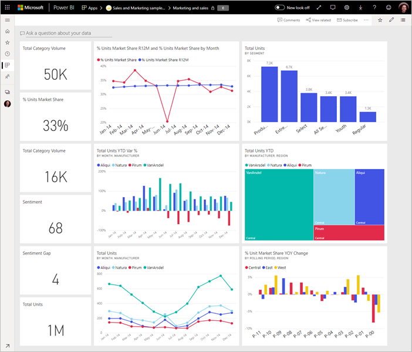

# Tips for designing a great Power BI dashboard
Now that you've created a dashboard and added some tiles, think about how to make your dashboard not just pretty, but also functional. In general, it means making the most important information stand out and making it clean and uncluttered.

> [!TIP]
> Like this dashboard? You can download it and related reports from AppSource. Go to **Get data** > **Services**. Search for **Microsoft Sample - Sales & Marketing** > **Get it now**.

Here are a few tips for dashboards.

## Dashboard design best practices video

Watch this video, [Dashboard design best practices in Power BI](https://www.youtube.com/watch?v=-tdkUYrzrio), for design tips from Marco Russo of SQLBI.com.

## Consider your audience
What are the key metrics that will help them make decisions? How will the dashboard be used? What learned or cultural assumptions may affect design choices? What information does your audience need to be successful?

Keep in mind that the dashboard is an overview, a single place to monitor the current state of the data. The dashboard is based on underlying reports and datasets, and those items often contain loads of details. Your readers can drill into the reports from your dashboard. So, don't put the detail on the dashboard unless that's what your readers need to monitor.

Where is the dashboard going to be displayed? If it's on a large monitor, you can put more content on it. But if readers view it on their tablets, a dashboard with fewer tiles is more readable.

## Tell a story on one screen
Because dashboards are meant to show important information at a glance, having all the tiles on one screen is best. Can you avoid scroll bars on your dashboard?

Is the dashboard too cluttered?  Remove all but essential information that's easily read and interpreted.

## Make use of full screen mode
When presenting a dashboard, display it in [full screen mode](../consumer/end-user-focus.md), without distractions.

## Accent the most important information
If the text and visualizations on your dashboard are all the same size, your readers will have a hard time focusing on what's most important. For example, card visualizations are a good way to display an important number prominently:  

But be sure to provide context.  

Read about [creating a tile with just a number](../visuals/power-bi-visualization-card.md).

## Place the most important information
Most people read from top to bottom. So, put the highest level of data at the top left corner, and show more detail as you move in the direction the audience uses for reading (left-to-right, top-to-bottom).

## Use the right visualization for the data
Avoid visualization variety for the sake of variety.  Visualizations should paint a picture and be easy to "read" and interpret.  For some data and visualizations, a simple graphic visualization is enough. But other data may call for a more-complex visualization - be sure to make use of titles and labels and other customization to help the reader.  

* Be careful using visuals that look pretty but are hard to read, such as 3-D charts. 
* It may be a disappointment to learn that pie charts, donut charts, gauges, and other circular chart types aren't a data visualization best practice. Pie charts are best if they have fewer than eight categories. Because humans can't compare values side by side, it’s harder to compare values in a pie chart than in bar and column charts. Pie charts can be good for viewing part-to-whole relationships rather than for comparing the parts. And gauge charts are great for displaying the current status in the context of a goal.
* Be consistent with chart scales on axes, chart dimension ordering, and also the colors used for dimension values within charts.
* Be sure to encode quantitative data nicely. Don’t exceed three or four numerals when displaying numbers. Display measures to one or two numerals left of the decimal point and scale for thousands or millions, that is, 3.4 million not 3,400,000.
* Don’t mix levels of precision and time. Make sure that time frames are well understood. Don’t have one chart that has last month next to filtered charts from a specific month of the year.
* Don’t mix large and small measures on the same scale, such as on a line or bar chart. For example, one measure can be in the millions and the other measure in the thousands. With such a large scale, it would be difficult to see the differences of the measure that's in the thousands. If you need to mix, choose a visualization that allows the use of a second axis.
* Don’t clutter your charts with data labels that aren't needed. The values in bar charts are usually understood without displaying the actual number.
* Pay attention to how [charts are sorted](../consumer/end-user-change-sort.md). If you want to draw attention to the highest or lowest number, sort by the measure. If you want people to quickly find a particular category within many other categories, sort by the axis.  

For more visualization-specific guidance, see [Visualization types in Power BI](../visuals/power-bi-visualization-types-for-reports-and-q-and-a.md).  

## Learn more about dashboard design
To master the art of excellent dashboard design, consider learning basic Gestalt Principles of visual perception and how to clearly communicate actionable information in context. Luckily, there's a plethora of resources already widely available and sprinkled within our blogs. A few of our favorite books include:

* *Information Dashboard Design* by Stephen Few  
* *Show Me the Numbers* by Stephen Few  
* *Now You See It* by Stephen Few  
* *Envisioning Information* by Edward Tufte  
* *Advanced Presentations* by Design by Andrew Abela   

## Next steps
[Create a dashboard from a report](service-dashboard-create.md)  
[Basic concepts for designers in the Power BI service](../fundamentals/service-basic-concepts.md)  
More questions? [Try the Power BI Community](https://community.powerbi.com/)
