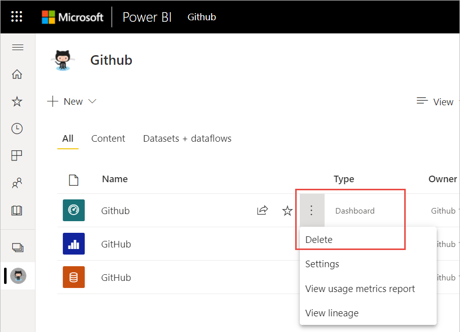
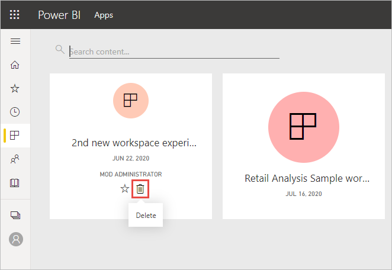
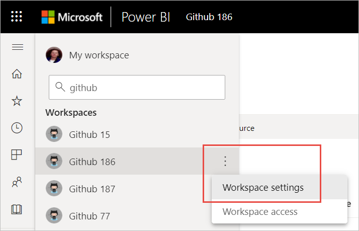
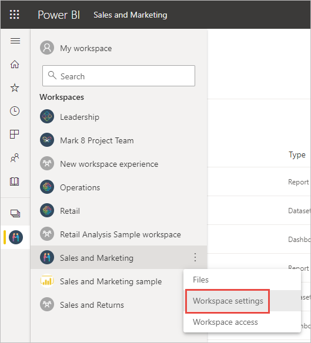
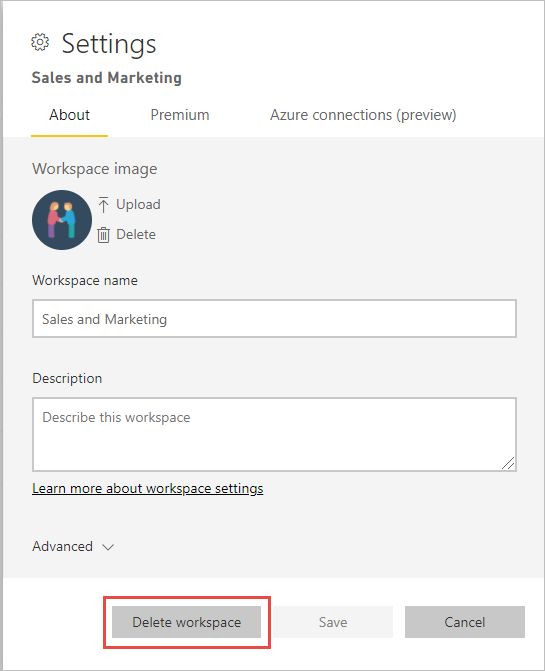

# Delete almost anything in the Power BI service
This article shows you how to delete a dashboard, report, workbook, dataset, app, visualization, or a workspace in the Power BI service. You can delete almost anything in the Power BI service, with some exceptions. 

## Delete a dashboard, report, dataset, or workbook

1. In your workspace, select the **All** tab.
1. Select **More options (...)** next to the asset you want to delete, and select **Delete**.

    

1. Select **Delete** to confirm the deletion.

## Remove an app from your app list page

You can easily remove apps from your apps list page. Removing an app doesn't delete the app for other members. Only an admin or member or a workspace can permanently delete the app from that workspace.

1. In the nav pane, select **Apps** to open the apps list page.
2. Hover over the app to delete, and select the Delete :::image type="icon" source="media/service-delete/power-bi-delete-report2.png" border="false":::  icon.

   

   If you remove an app accidentally, you have several options for getting it back.  You can ask the app creator to resend it, you can find the original email with the link to the app, you can check your [Notifications center](../consumer/end-user-notification-center.md) to see if the notification for that app is still listed, or you can check [your organization's AppSource](../consumer/end-user-apps.md).

## Remove or delete a workspace

Power BI has two different kinds of workspaces: the original, or *classic* workspaces, and the new workspaces. The processes for removing or deleting them are different. Read more about [new and classic workspaces](../collaborate-share/service-new-workspaces.md).

### Remove members from a new workspace

Only workspace admins can remove people from a new workspace. If you're an admin, you can remove yourself or anyone else. However, if you're the only admin for a workspace, Power BI won't let you remove yourself.

1. In the workspace list view, select **Access** in the upper-right corner.

    :::image type="content" source="media/service-delete/power-bi-select-access.png" alt-text="Screenshot of Select Access.":::

1. In the **Access** pane, select **More options (...)** next to the name of the person you want to remove, and select **Remove**.

    :::image type="content" source="media/service-delete/power-bi-access-remove.png" alt-text="Screenshot of In the Access pane, select Remove.":::

### Delete a new workspace

When you create one of the *new workspaces*, you don't create an associated Microsoft 365 group. If you're a workspace admin, you can delete a new workspace with no effect on any Microsoft 365 groups. Read more about [new and classic workspaces](../collaborate-share/service-new-workspaces.md).

As admin for a workspace, you can delete it, or remove others from it. When you delete it, the associated app is also deleted for all group members, and the app is removed from AppSource. 

1. From the nav pane, select **Workspaces**

2. Select **More options** (...) to the right of the workspace to be deleted and choose **Workspace settings**.

    

3. In the **Workspace settings** pane, select **Delete workspace** > **Delete**.

### Remove a classic workspace from your list

If you no longer want to be a member of a classic workspace, you can ***leave*** it and it will be removed from your list. Leaving a workspace leaves it in place for all other workspace members.  

> [!NOTE]
> If you are the only admin for the workspace, Power BI won't allow you to leave.
>

1. Start in the workspace you'd like to remove.

2. In the top-right corner, select **More options** (...) and choose **Leave workspace** > **Leave**.

      :::image type="content" source="media/service-delete/power-bi-leave-workspace.png" alt-text="Screenshot of More options, Leave workspace.":::

   > [!NOTE]
   > The options you see in the dropdown depend on whether you are an Admin or Member of that workspace.
   >

### Delete a classic workspace

> [!WARNING]
> When you create a *classic* workspace, you create a Microsoft 365 group. When you delete a classic workspace, you delete that Microsoft 365 group. The group is also deleted from other Microsoft 365 products like SharePoint and Microsoft Teams.
> 

Deleting a workspace is different from leaving a workspace. You have to be a workspace admin to delete it. When you delete it, the associated app is also deleted for all group members and removed from AppSource. However, if you're the only admin for a workspace, Power BI won't let you leave.

1. From the nav pane, select **Workspaces**.

2. Next to the workspace to be deleted, select **More options (...)** > **Workspace settings**.

    

3. In the **settings** pane, select **Delete workspace**, then confirm **Delete**.

    

## Considerations and limitations

- Removing a *dashboard* doesn't delete the underlying dataset or any reports associated with that dashboard.
- If you're the *owner of a dashboard or report*, you can remove it. If you've shared it with colleagues, removing it from your Power BI workspace removes it from their Power BI workspaces, too.
- If a *dashboard or report is shared with you*, you can't remove it.
- Deleting a report doesn't delete the dataset that the report is based on.  Any visualizations that you pinned to a dashboard from the report are also safe. They remain on the dashboard until you delete them individually.
- You can delete a *dataset*. However, deleting a dataset also deletes all reports and dashboard tiles that contain data from that dataset.
- You can remove *workbooks*. However, removing a workbook also removes all reports and dashboard tiles that contain data from this workbook. If a workbook is stored on OneDrive for Business, deleting it from Power BI doesn't delete it from OneDrive.
- If a *dashboard or report* is part of an organizational content pack. See [Remove your connection to an organizational content pack](../collaborate-share/service-organizational-content-pack-disconnect.md).
- If a *dataset* is part of one or more organizational content packs, the only way to delete it is to remove it from the content packs where it's being used, wait for it to be processed, and then try deleting it again.

## Next steps

This article covered how to delete the major building blocks of the Power BI service. Here are a few other things you can also delete.  

- [Remove your Featured dashboard](../consumer/end-user-featured.md)
- [Remove (unfavorite) a dashboard](../consumer/end-user-favorite.md)
- [Delete a dashboard tile](service-dashboard-edit-tile.md)

More questions? [Try the Power BI Community](https://community.powerbi.com/)