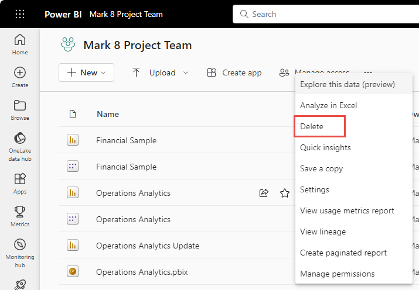

# Delete almost anything in the Power BI service

[!INCLUDE [applies-no-desktop-yes-service](../includes/applies-no-desktop-yes-service.md)]

This article shows you how to delete a dashboard, report, workbook, dataset, app, visualization, or a workspace in the Power BI service. You can delete almost anything in the Power BI service, with some exceptions. 

## Delete a dashboard, report, dataset, or workbook

1. In your workspace, select the **All** tab.
1. Select **More options (...)** next to the asset you want to delete, and select **Delete**.

    

1. Select **Delete** to confirm the deletion.

## Remove an app from your app list page

You can easily remove apps from your apps list page. Removing an app doesn't delete the app for other members. Only an admin or member or a workspace can permanently delete the app from that workspace.

1. In the nav pane, select **Apps** to open the apps list page.
2. Hover over the app to delete, select **More options (...)**, and then select **Delete**.

   

   If you remove an app accidentally, you have several options for getting it back.  You can ask the app creator to resend it, you can find the original email with the link to the app, you can check your Notifications center to see if the notification for that app is still listed, or you can check [your organization's AppSource](../consumer/end-user-apps.md).

## Remove members from a workspace

Only workspace admins can remove people from a workspace. If you're an admin, you can remove yourself or anyone else. However, if you're the only admin for a workspace, Power BI won't let you remove yourself.

1. In the workspace list view, select **Access** in the upper-right corner.

    :::image type="content" source="media/service-delete/power-bi-select-access.png" alt-text="Screenshot of Select Access.":::

1. In the **Access** pane, select **More options (...)** next to the name of the person you want to remove, and select **Remove**.

    :::image type="content" source="media/service-delete/power-bi-access-remove.png" alt-text="Screenshot of In the Access pane, select Remove.":::

## Delete a workspace

If you're a workspace admin, you can delete a workspace with no effect on any Microsoft 365 groups. As admin for a workspace, you can delete it, or remove others from it. When you delete it, the associated app is also deleted for all group members, and the app is removed from AppSource.

1. From the nav pane, select **Workspaces**

2. Select **More options** (...) to the right of the workspace to be deleted and choose **Workspace settings**.

    

3. In the **Workspace settings** pane, select **Delete workspace** > **Delete**.

## Considerations and limitations

- Removing a *dashboard* doesn't delete the underlying dataset or any reports associated with that dashboard.
- If you're the *owner of a dashboard or report*, you can remove it. If you've shared it with colleagues, removing it from your Power BI workspace removes it from their Power BI workspaces, too.
- If a *dashboard or report is shared with you*, you can't remove it.
- Deleting a report doesn't delete the dataset that the report is based on.  Any visualizations that you pinned to a dashboard from the report are also safe. They remain on the dashboard until you delete them individually.
- You can delete a *dataset*. However, deleting a dataset also deletes all reports and dashboard tiles that contain data from that dataset.
- You can remove *workbooks*. However, removing a workbook also removes all reports and dashboard tiles that contain data from this workbook. If a workbook is stored on OneDrive for work or school, deleting it from Power BI doesn't delete it from OneDrive.

## Next steps

This article covered how to delete the major building blocks of the Power BI service. Here are a few other things you can also delete.  

- [Remove your Featured dashboard](/power-bi/consumer/end-user-dashboards)
- [Remove (unfavorite) a dashboard](../consumer/end-user-favorite.md)
- [Delete a dashboard tile](service-dashboard-edit-tile.md)

More questions? [Try the Power BI Community](https://community.powerbi.com/)