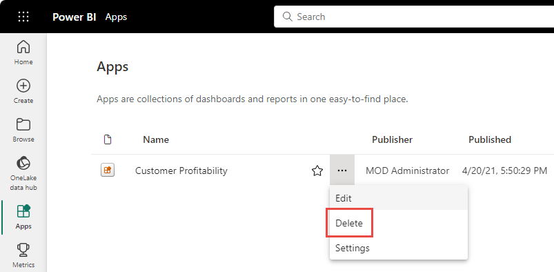

# Delete almost anything in Power BI service
This article shows you how to delete a dashboard, report, workbook, dataset, app, visualization, or a workspace in Power BI service. You can delete dashboards, reports, and datasets in the Power BI service, with some exceptions. 

## Delete a dashboard, report, dataset, or workbook

1. In your workspace, select the **All** tab.
1. Select **More options (...)** next to the asset you want to delete, and select **Delete**.

    

1. Select **Delete** to confirm the deletion.

## Delete a workspace

> [!WARNING]
> When you create a *classic* workspace, you create a Microsoft 365 group. When you delete a classic workspace, you delete that Microsoft 365 group. The group is also deleted from other Microsoft 365 products like SharePoint and Microsoft Teams.
> 
> However, when your create one of the *new workspaces*, you don't create an associated Microsoft 365 group. You can delete a new workspace with no effect on any Microsoft 365 groups. Read more about [new and classic workspaces](../collaborate-share/service-new-workspaces.md).

As the workspace author, you can delete it. When you delete it, the associated app is also deleted for all group members, and removed from AppSource. Deleting a workspace is different from leaving a workspace.

### Remove a workspace from your list
If you no longer want to be a member of a workspace, you can *leave* it. It's removed from your list. Leaving a workspace leaves it in place for all other workspace members.  

> [!IMPORTANT]
> If you're the only Admin for the workspace, Power BI doesn't allow you to leave.
>

1. Start in the workspace you'd like to remove.

2. In the top-right corner, select **More options** (...) and choose **Leave workspace** > **Leave**.

      :::image type="icon" source="media/service-delete/power-bi-leave-workspace.png" border="false":::

   > [!NOTE]
   > The options you see in the dropdown depend on your role in that workspace. See [Roles in the new workspaces](../collaborate-share/service-new-workspaces.md#roles-in-the-new-workspaces) for details.
   >

### Delete a workspace if you're an Admin
1. From the nav pane, select **Workspaces**

2. Select **More options** (...) to the right of the workspace to be deleted and choose **Workspace settings**.

    

3. In the **Workspace settings** pane, select **Delete workspace** > **Delete**.

## Delete or remove an App
Apps can be easily removed from your apps list page. But only an app Admin can permanently delete an app.

### Remove an app from your app list page
Deleting an app from your app list page doesn't delete the app for other members.

1. In the nav pane, select **Apps** to open the apps list page.
2. Hover over the app to delete, and select the Delete :::image type="icon" source="media/service-delete/power-bi-delete-report2.png" border="false":::  icon.

   

   If you remove an app accidentally, you have several options for getting it back.  You can ask the app creator to resend it, you can find the original email with the link to the app, you can check your [Notifications center](../consumer/end-user-notification-center.md) to see if the notification for that app is still listed, or you can check [your organization's AppSource](../consumer/end-user-apps.md).

## Considerations and limitations

- Removing a *dashboard* doesn't delete the underlying dataset or any reports associated with that dashboard.
- If you're the *owner of a dashboard or report*, you can remove it. If you've shared it with colleagues, removing it from your Power BI workspace removes it from their Power BI workspaces, too.
- If a *dashboard or report is shared with you*, you can't remove it.
- Deleting a report doesn't delete the dataset that the report is based on.  Any visualizations that you pinned to a dashboard from the report are also safe. They remain on the dashboard until you delete them individually.
- You can delete a *dataset*. However, deleting a dataset also deletes all reports and dashboard tiles that contain data from that dataset.
- You can remove *workbooks*. However, removing a workbook also removes all reports and dashboard tiles that contain data from this workbook. If a workbook is stored on OneDrive for Business, deleting it from Power BI doesn't delete it from OneDrive.
- If a *dashboard or report* is part of an [organizational content pack](../collaborate-share/service-organizational-content-pack-disconnect.md), you can't delete it using this method.  See [Remove your connection to an organizational content pack](../collaborate-share/service-organizational-content-pack-disconnect.md).
- If a *dataset* is part of one or more organizational content packs, the only way to delete it is to remove it from the content packs where it's being used, wait for it to be processed, and then try deleting it again.

## Next steps

This article covered how to delete the major building blocks of Power BI service. You can delete few other things in the Power BI service.  

- [Remove your Featured dashboard](../consumer/end-user-featured.md)
- [Remove (unfavorite) a dashboard](../consumer/end-user-favorite.md)
- [Delete a dashboard tile](service-dashboard-edit-tile.md)

More questions? [Try the Power BI Community](https://community.powerbi.com/)