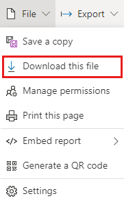
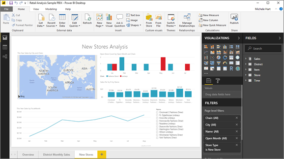

# Download a report from the Power BI service to Power BI Desktop (preview)
      
In Power BI Desktop, you can publish a report (a *.pbix* file) from your local computer to the Power BI service. Power BI reports can go the other direction as well: You can download a report from the Power BI service to Power BI Desktop. The extension for a Power BI report, in either case, is .pbix.

There are a few limitations to keep in mind, which are discussed in the [Considerations and troubleshooting](#considerations-and-troubleshooting) section of this article.

## Download the report as a .pbix file

You can only download reports [created with Power BI Desktop](/learn/modules/publish-share-power-bi/2-publish-reports) after November 23, 2016, and updated since then. If it was created before then, the **Download report** menu option in the Power BI service is grayed out.

To download the .pbix file, follow these steps:

1. In the Power BI service, open the report you want to download in [Editing view](./service-interact-with-a-report-in-editing-view.md).

2. From the top nav pane, select **File > Download report**.
   
3. While the report is downloading, a status banner displays the progress. When the file is ready, you're asked where to save the .pbix file. The default name of the file matches the title of the report.
   
4. If you haven't already, [install Power BI Desktop](../fundamentals/desktop-get-the-desktop.md), then open the .pbix file in Power BI Desktop.
   
    When you open the report in Power BI Desktop, you may see a warning message letting you know that some features available in the Power BI service report aren't available in Power BI Desktop.
   
    

5. The report editor in Power BI Desktop is similar to the report editor in the Power BI service.  
   
    

## Considerations and troubleshooting

There are a few important considerations and limitations associated with downloading a .pbix file from the Power BI service.

* To download the file, you must have edit access to the report.
* The report must have been created by using Power BI Desktop and *published* to the Power BI service, or the .pbix file must have been *uploaded* to the Power BI service.
* Reports must be published or updated after November 23, 2016. Reports published earlier aren't downloadable.
* This feature won't work with reports and downloadable samples originally created in the Power BI service, unless the report was created through the [quick create experience](./service-quick-create-report.md).
* Always use the latest version of Power BI Desktop when you open downloaded files. Downloaded .pbix files might not open in non-current versions of Power BI Desktop. For example, you cannot open downloaded .pbix files using a Desktop version that does not support information protection.
* If your administrator has turned off the ability to download data, this feature won't be visible in the Power BI service.
* Datasets with incremental refresh can't be downloaded to a .pbix file.
* Datasets enabled for [large models](../admin/service-premium-large-models.md) can't be downloaded to a .pbix file.
* Live connect reports can't be downloaded to a .pbix file.
* Downloading a .pbix file after deployment isn't supported as part of the [deployment pipeline (ALM)](./deployment-pipelines-process.md). 
* Usage metric reports can't be downloaded to a .pbix file
* Datasets modified by using the [XMLA endpoint](../admin/service-premium-connect-tools.md) can't be downloaded to a .pbix file.
* If you create a Power BI report based on a dataset in one workspace and publish to a different workspace, you and your users won't be able to download it. The download feature is currently not supported in this scenario.

## Next steps

View the **Guy in a Cube** one-minute video about this feature:

<iframe width="560" height="315" src="https://www.youtube.com/embed/ymWqU5jiUl0" frameborder="0" allowfullscreen></iframe>

Here are some additional articles that can help you learn to use the Power BI service:

* [Reports in Power BI](../consumer/end-user-reports.md)
* [Basic concepts for designers in the Power BI service](../fundamentals/service-basic-concepts.md)

After you've installed Power BI Desktop, see the following article to help you get up and running quickly:

* [Getting Started with Power BI Desktop](../fundamentals/desktop-getting-started.md)

More questions? [Try the Power BI Community](https://community.powerbi.com/).
