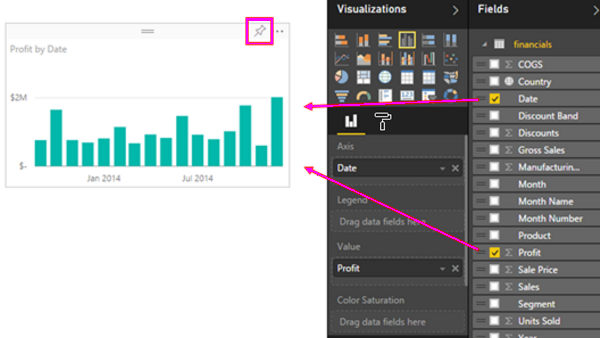
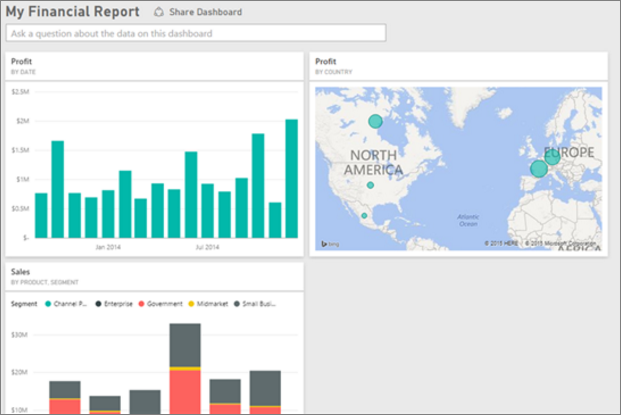

# Tutorial: From Excel workbook to stunning report in the Power BI service
Your manager wants to see a report on your latest sales figures combined with your last campaign impressions by the end of the day. But the latest data resides on various third-party systems and on files in your laptop. In the past, it’s taken hours to create visuals and format a report, and you’re beginning to feel anxious.

No worries. With Power BI, you can create a stunning report in no time.

In this tutorial, we’ll upload an Excel file from a local system, create a new report, and share it with colleagues, all from within Power BI. You'll learn how to:

> [!div class="checklist"]
> * Prepare your data in Excel.
> * Download sample data.
> * Build a report in the Power BI service.
> * Pin the visuals to a dashboard
> * Share the dashboard with your colleagues.

## Prepare your data in Excel
Let’s take a simple Excel file as an example. 

1. Before you can load your Excel file into Power BI, you must organize your data in a flat table. In a flat table, each column contains the same data type; for example, text, date, number, or currency. Your table should have a header row, but not any columns or rows that display totals.

   

2. Next, format your data as a table. In Excel, on the **Home** tab, in the **Styles** group, select **Format as Table**. 

3. Select a table style to apply to your worksheet. 

   Your Excel worksheet is now ready to load into Power BI.

   

## Upload your Excel file to the Power BI service
The Power BI service connects to many data sources, including Excel files that live on your computer. 

 > [!NOTE] 
 > To follow along with the rest of this tutorial, download the [Financial Sample workbook](https://go.microsoft.com/fwlink/?LinkID=521962).

1. To get started, sign in to the Power BI service. If you haven’t signed up, [you can do so for free](https://powerbi.com).
1. In **My workspace**, select **New** > **Upload a file**.

    image

1. Select **Local File**, browse to where you saved the Financial Sample Excel file, and select **Open**.
7. On the **Local File** page, select **Import**.

    Now you have a Financial Sample dataset. Power BI also automatically created a blank dashboard. If you don't see the dashboard, refresh your browser.

    image

2. You want to create a report. Still in **My workspace**, select **New** > **Report**.

   

3. In the **Select a dataset to create a report** dialog box, select your **Financial Sample** dataset > **Create**.

   

## Build your report
 
Power BI opens in Editing view and displays the report canvas. On the right side are the **Visualizations**, **Filters**, and **Fields** panes. Your Excel workbook table data appears in the **Fields** pane. At the top is the name of the table, **financials**. Under that, Power BI lists the column headings as individual fields.

You see the Sigma symbols in the Fields list? Power BI has detected that those fields are numeric. Power BI also indicates a geographic field with a globe symbol.

1. To have more room for the report canvas, select **Hide the navigation pane**, and minimize the **Filters** pane.

    image 

1. Now you can begin to create visualizations. Let's say your manager wants to see profit over time. In the **Fields** pane, drag **Profit** to the report canvas. 

   By default, Power BI displays a column chart with one column. 

    image

3. Drag **Date** to the report canvas. 

   Power BI updates the column chart to show profit by date.

   

    December 2014 was the most profitable month.
   
    > [!TIP]
    > If your chart doesn't look like you expect, check your aggregations. For example, in the **Values** well, select the **Profit** field you just added and ensure the data is being aggregated the way you'd like it. In this example, we're using **Sum**.
    > 

### Create a map

Your manager wants to know which countries are the most profitable. Impress your manager with a map visualization. 

1. Select a blank area on your report canvas. 

2. From the **Fields** pane, drag the **Country** field to your report canvas, then drag the **Profit** field to the map.

   Power BI creates a map visual with bubbles representing the relative profit of each location.

   

    Looks like the European countries are outperforming the North American countries.

### Create a visual showing sales

What about displaying a visual showing sales by product and market segment? Easy. 

1. Select the blank canvas.

1. In the **Fields** pane, select the **Sales**, **Product**, and **Segment** fields. 
   
   Power BI creates a clustered column chart. 

2. Change the type of chart by choosing one of the icons in the **Visualizations** menu. For instance, change it to a **Stacked column chart**. 

   

3. To sort the chart, select **More options** (...) > **Sort by**.

### Spruce up the visuals

Make the following changes on the **Format** tab in the Visualizations pane.

:::image type="content" source="media/desktop-excel-stunning-report/power-bi-format-tab-visualizations.png" alt-text="Screenshot of the Format tab in the Visualizations pane.":::

1. Select the **Profit by Date** column chart. In the **Title** section, change **Text size** to **16 pt**. Toggle **Shadow** to **On**. 

1. Select the **Sales by Product and Segment** stacked column chart. In the **Title** section, change title **Text size** to **16 pt**. Toggle **Shadow** to **On**.

1. Select Select the **Profit by Country** map. In the **Map styles** section, change **Theme** to **Grayscale**. In the **Title** section, change title **Text size** to **16 pt**. Toggle **Shadow** to **On**.

### Pin to a dashboard

Now you can create your dashboard and pin all of your visuals to it. 

1. Hover over a visual and select **Pin visual**.

   

1. You need to save your report before you can pin a visual to the dashboard. Give your report a name and select **Save**.

You’re now ready to share it with your colleagues.
## Share your dashboard
Let's say you want to share your dashboard with your manager. You can share your dashboard and underlying report with any colleague who has a Power BI account. They can interact with your report, but can't save changes.

1. To share your report, at the top of the dashboard, select **Share**.

   

   Power BI displays the **Share dashboard** page. 

2. Enter the email addresses of the recipients in the **Enter email addresses** box and add a message in the box below it. 

3. To allow recipients to share your dashboard with others, select **Allow recipients to share your dashboard**. Select **Share**.

   

## Next steps

* [Get started with the Power BI service](../fundamentals/service-get-started.md)
* [Get started with Power BI Desktop](../fundamentals/desktop-getting-started.md)
* [Basic concepts for designers in the Power BI service](../fundamentals/service-basic-concepts.md)

More questions? [Try the Power BI Community](https://community.powerbi.com/).
