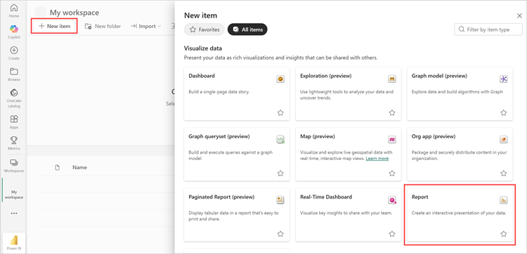
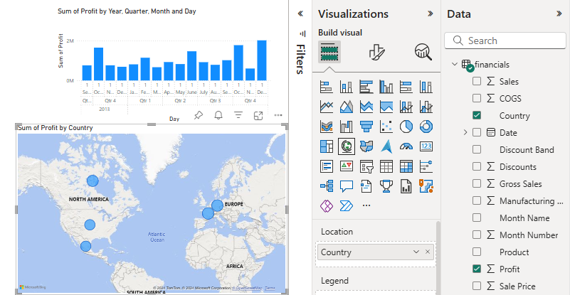
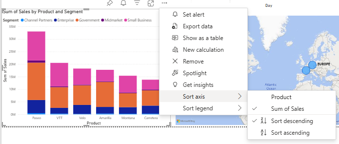

# Tutorial: From Excel workbook to a report in the Power BI service to Microsoft Teams
Your manager wants to see a report on your latest sales and profit figures by the end of the day. But the latest data is in files on your laptop. In the past, it’s taken hours to create a report, and you’re beginning to feel anxious.

No worries. With Power BI, you can create a stunning report and share it in Microsoft Teams in no time!

:::image type="content" source="media/service-from-excel-to-stunning-report/power-bi-financial-report-service.png" alt-text="Screenshot of finished Financial Sample report":::

In this tutorial, we upload an Excel file, create a new report, and share it with colleagues in Microsoft Teams, all from within Power BI. You'll learn how to:

> [!div class="checklist"]
> * Prepare your data in Excel.
> * Download sample data.
> * Build a report in the Power BI service.
> * Pin the report visuals to a dashboard.
> * Share a link to the dashboard.
> * Share the dashboard in Microsoft Teams

## Prerequisites
- [Sign up for the Power BI service](../fundamentals/service-self-service-signup-for-power-bi.md). 
- Download the [Financial Sample workbook](https://go.microsoft.com/fwlink/?LinkID=521962) and save it your computer or to OneDrive for Business.

## Prepare data in Excel
Let’s take a simple Excel file as an example. 

1. Before you can load your Excel file into Power BI, you must organize your data in a flat table. In a flat table, each column contains the same data type; for example, text, date, number, or currency. Your table should have a header row, but not any columns or rows that display totals.

   

2. Next, format your data as a table. In Excel, on the **Home** tab, in the **Styles** group, select **Format as Table**. 

3. Select a table style to apply to your worksheet. 

   Your Excel worksheet is now ready to load into Power BI.

   

## Upload your Excel file to the Power BI service
The Power BI service connects to many data sources, including Excel files that live on your computer.

1. To get started, sign in to the Power BI service. If you haven’t signed up, [you can do so for free](https://powerbi.com).
1. In **My workspace**, select **New** > **Upload a file**.

    :::image type="content" source="media/service-from-excel-to-stunning-report/power-bi-new-upload.png" alt-text="Screenshot of the Upload a file option.":::

1. Select **Local File**, browse to where you saved the Financial Sample Excel file, and select **Open**.
7. On the **Local File** page, select **Import**.

    Now you have a Financial Sample dataset. Power BI also automatically created a blank dashboard. If you don't see the dashboard, refresh your browser.

    :::image type="content" source="media/service-from-excel-to-stunning-report/power-bi-financial-dataset.png" alt-text="Screenshot of My Workspace with Financial Sample dataset.":::

2. You want to create a report. Still in **My workspace**, select **New** > **Report**.

   

3. In the **Select a dataset to create a report** dialog box, select your **Financial Sample** dataset > **Create**.

   

## Build your report
 
The report opens in Editing view and displays the blank report canvas. On the right are the **Visualizations**, **Filters**, and **Fields** panes. Your Excel workbook table data appears in the **Fields** pane. At the top is the name of the table, **financials**. Under that, Power BI lists the column headings as individual fields.

You see the Sigma symbols in the Fields list? Power BI has detected that those fields are numeric. Power BI also indicates a geographic field with a globe symbol.

1. To have more room for the report canvas, select **Hide the navigation pane**, and minimize the **Filters** pane.

    :::image type="content" source="media/service-from-excel-to-stunning-report/power-bi-hide-nav-pane.png" alt-text="Screenshot of minimizing the navigation pane."::: 

1. Now you can begin to create visualizations. Let's say your manager wants to see profit over time. In the **Fields** pane, drag **Profit** to the report canvas. 

   By default, Power BI displays a column chart with one column. 

    :::image type="content" source="media/service-from-excel-to-stunning-report/power-bi-profit-column.png" alt-text="Screenshot of column chart with one column.":::

3. Drag **Date** to the report canvas. 

   Power BI updates the column chart to show profit by date.

   

    December 2014 was the most profitable month.
   
    > [!TIP]
    > If your chart values don't look as you expect, check your aggregations. For example, in the **Values** well, select the **Profit** field you just added and ensure the data is being aggregated the way you'd like it. In this example, we're using **Sum**.
    > 

### Create a map

Your manager wants to know which countries are the most profitable. Impress your manager with a map visualization. 

1. Select a blank area on your report canvas. 

2. From the **Fields** pane, drag the **Country** field to your report canvas, then drag the **Profit** field to the map.

   Power BI creates a map visual with bubbles representing the relative profit of each location.

   

    Looks like the European countries are outperforming the North American countries.

### Create a visual showing sales

What about displaying a visual showing sales by product and market segment? Easy. 

1. Select the blank canvas.

1. In the **Fields** pane, select the **Sales**, **Product**, and **Segment** fields. 
   
   Power BI creates a clustered column chart. 

2. Change the type of chart by choosing one of the icons in the **Visualizations** menu. For instance, change it to a **Stacked column chart**. 

   

3. To sort the chart, select **More options** (...) > **Sort by**.

### Spruce up the visuals

Make the following changes on the **Format** tab in the Visualizations pane.

:::image type="content" source="media/desktop-excel-stunning-report/power-bi-format-tab-visualizations.png" alt-text="Screenshot of the Format tab in the Visualizations pane.":::

1. Select the **Profit by Date** column chart. In the **Title** section, change **Text size** to **16 pt**. Toggle **Shadow** to **On**. 

1. Select the **Sales by Product and Segment** stacked column chart. In the **Title** section, change title **Text size** to **16 pt**. Toggle **Shadow** to **On**.

1. Select the **Profit by Country** map. In the **Map styles** section, change **Theme** to **Grayscale**. In the **Title** section, change title **Text size** to **16 pt**. Toggle **Shadow** to **On**.

## Pin to a dashboard

Now you can pin all of your visuals to the blank dashboard that Power BI created by default. 

1. Hover over a visual and select **Pin visual**.

   

1. You need to save your report before you can pin a visual to the dashboard. Give your report a name and select **Save**.
1. Pin each visual to the dashboard that Power BI created, **Financial Sample.xlsx**.
1. When you pin the last visual, select **Go to dashboard**.
1. Power BI added a placeholder Financial Sample.xlsx tile to the dashboard automatically. Select **More options (...)** > **Delete tile**.

    :::image type="content" source="media/service-from-excel-to-stunning-report/power-bi-tile-more-options.png" alt-text="Screenshot of More options for a tile.":::

1. Rearrange and resize the tiles any way you want.

The dashboard and report are ready.

## Share a link to your dashboard

Now it's time to share your dashboard with your manager. You can share your dashboard and underlying report with any colleague who has a Power BI account. They can interact with your report, but can't save changes. If you allow it, they can reshare with others, or build a new report based on the underlying dataset.

1. To share your report, at the top of the dashboard, select **Share**.

   

2. In the **Share dashboard** screen, enter the email addresses of the recipients in the **Enter a name or email addresses** field, and add an optional message.

3. Select the option to **Send an email notification**. Decide which of these other options you want, if any:

    - **Allow recipients to share this dashboard**
    - **Allow recipients to build content with the data associated with this dashboard**

   

1. Select **Grant access**.

## Share to Microsoft Teams

You can also share reports and dashboards directly to your colleagues in Microsoft Teams.

1. To share in Teams, at the top of the dashboard, select **Chat in Teams**.

   

2. Power BI displays the **Share to Teams** dialog. Enter the name of a person, group, or channel and select **Share**. 
   
    :::image type="content" source="media/service-from-excel-to-stunning-report/power-bi-share-teams-dialog.png" alt-text="Screenshot of the Share to Teams dialog":::

3. The link appears in the **Posts** for that person, group, or channel.

   

## Next steps

* Now that you've created a basic report in the Power BI service, how about creating a report in Power BI Desktop? Try the tutorial, [From Excel workbook to stunning report in Power BI Desktop](desktop-excel-stunning-report.md).

More questions? [Try the Power BI Community](https://community.powerbi.com/).
