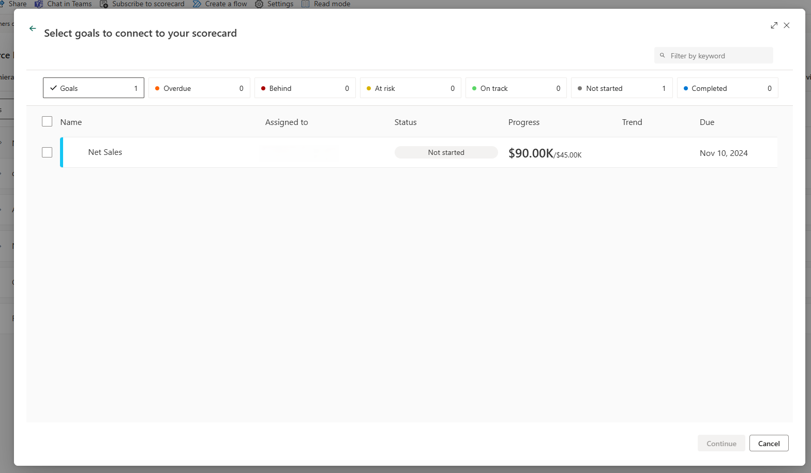

# Create linked goals in the Power BI service (preview)

[!INCLUDE [applies-no-desktop-yes-service](../includes/applies-no-desktop-yes-service.md)]

With linked goals, you can show the same metric on multiple scorecards, across multiple workspaces. All check-ins, edits, and updates are reflected in all the metric locations, so you don't have to create duplicate goals to track the same thing. For example, in many organizations, the leadership team has a scorecard, and each department has its own scorecard with goals from the leadership team, along with other goals that are relevant to their department. With this feature, you can now link such goals to any number of scorecards and get them to be in sync automatically.

If you link multiple goals at once, the parent-child relationships and the goals’ order from the source scorecard are preserved in the destination scorecard. And you can use the **Set For All** option to apply permissions to descendant goals on the source scorecard, even if there are linked goals in between the parent and descendants.

## Permissions

Say you have build access to a scorecard, meaning you can build content with the data associated with the scorecard. You can link goals from that scorecard to any scorecards you have edit access to. Only users who have view access to the source metric can see the linked metric.

## Create a linked goal

1. Open a scorecard and select **Edit**
1. Select the **New** button.
1. Select **Link to existing metric (preview)**.

    :::image type="content" source="media/service-goals-linked-goals/linked-goals-1.png" alt-text="Screenshot of the option to link a metric in a scorecard.":::

1. Select the scorecard that contains the metric you’d like to link from the list provided.

:::image type="content" source="media/service-goals-linked-goals/linked-goals-2.png" alt-text="Screenshot showing a list of the scorecards." lightbox="media/service-goals-linked-goals/linked-goals-2.png":::

1. Select the metric(s) you’d like to include in this scorecard.

    

1. Select **Continue**. The linked metric(s) appear on this scorecard.

## Check-in and edit a linked goal

You can add check-ins right from the linked goal if you have permission to check in on the source goal. Check-ins are reflected in all scorecards that contain the linked goal and source metric.

You can make edits only in the source . You can navigate from the linked metric to the source metric. Select **Go to source metric** from the overflow menu of the linked metric.

:::image type="content" source="media/service-goals-linked-goals/linked-goals-4.png" alt-text="Screenshot showing option to go to source metric.":::

Edits are reflected in all scorecards that contain the linked metric.

## Linked goal details

You can see the name and link to the source scorecard in the Details pane.

:::image type="content" source="media/service-goals-linked-goals/linked-goals-5.png" alt-text="Screenshot showing details of the linked metric in Details pane.":::

You can also see this information in the Connections pane.

:::image type="content" source="media/service-goals-linked-goals/linked-goals-6.png" alt-text="Screenshot showing details of the linked metric in Connections pane.":::

## Linked goals considerations

### Linked goals and hierarchies

If you filter your scorecard by a hierarchy, linked goals aren't filtered. They continue showing their original value. Check-ins to linked goals aren't allowed on a hierarchical child scorecard.

### Linked goals and rollups

If you link a rollup goal onto a different scorecard, it continues to show its calculated value from the source scorecard and doesn't take into account any child goals on the destination scorecard. Additionally, if a linked goal is the child of a rollup goal, the linked metric isn't included in the parent's calculation.

## Related content

- [Get started with goals in Power BI](service-goals-introduction.md)
- [Create scorecards and manual goals in Power BI](service-goals-create.md)
- [Create connected goals in Power BI](service-goals-create-connected.md)

More questions? [Try the Power BI Community](https://community.powerbi.com/).
