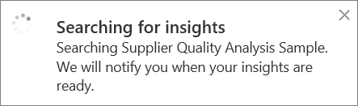
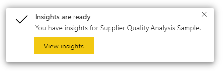
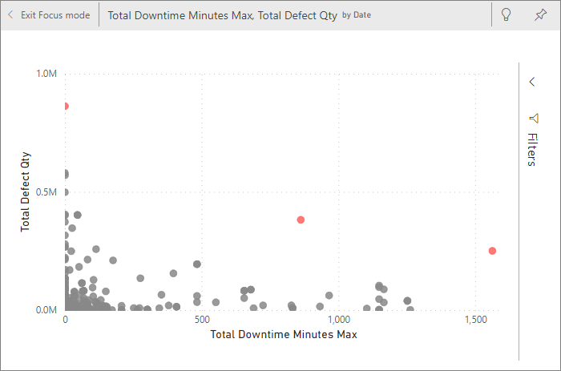
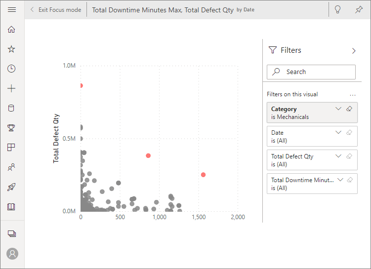
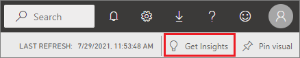
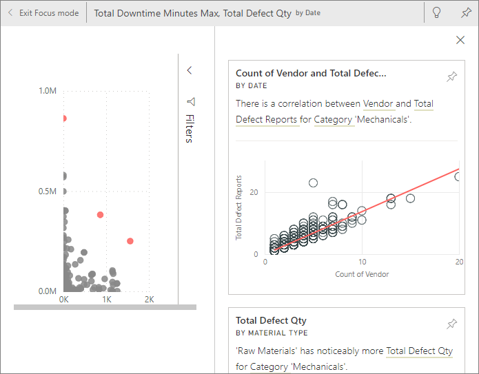

# Generate data insights on your semantic model automatically with Power BI

[!INCLUDE [applies-no-desktop-yes-service](../includes/applies-no-desktop-yes-service.md)]

Do you have a new semantic model and aren't sure where to start? Need to build a dashboard quickly? Want to look for insights you might have missed?

Run quick insights to generate interesting visualizations based on your data. This article explains how to run quick insights on an entire semantic model (quick insights). You can also run [quick insights on a specific dashboard tile](../consumer/end-user-insights.md) (scoped insights). You can even run insights on an insight!

> [!NOTE]
> The insights feature doesn't work with DirectQuery, streaming, and PUSH datasets; it only works with data uploaded to Power BI.
>
> Row-level security (RLS) isn't supported by quick insights, even in import mode.
>

We built the insights feature on a growing [set of advanced analytical algorithms](../consumer/end-user-insight-types.md) that we developed with Microsoft Research. We continue to use these algorithms to help more people to find insights in their data in new and intuitive ways. You might also be interested in learning how to [optimize your data for quick insights](service-insights-optimize.md).

## Run quick insights on a semantic model

Watch Amanda run quick insights on a semantic model and open an insight in Focus mode. Amanda pins an insight as a tile on the dashboard, then gets insights for a dashboard tile.

> [!NOTE]
> This video might use earlier versions of Power BI Desktop or the Power BI service.

> [!VIDEO https://www.youtube.com/embed/et_MLSL2sA8]

Now it's your turn. Explore insights by using the [Supplier Quality Analysis sample](sample-supplier-quality.md).

1. Choose the workspace where the semantic model is located. From the **Semantic models + dataflows** tab, select **More options** (...) next to the semantic model, and then choose **Get quick insights**.

    
2. Power BI uses [various algorithms](../consumer/end-user-insight-types.md) to search for trends in your semantic model.

    
3. Within seconds, your insights are ready. Select **View insights** to display visualizations.

    

    > [!NOTE]
    > Some semantic models can't generate insights because the data isn't statistically significant. For more information, see [Optimize your data for Power BI quick insights](service-insights-optimize.md).
    >

4. The visualizations display in a special **Quick Insights** canvas with up to 32 separate insight cards. Each card has a chart or graph plus a short description.

    :::image type="content" source="media/service-insights/power-bi-insights.png" alt-text="Screenshot of the Quick Insights canvas." lightbox="media/service-insights/power-bi-insights.png":::

## Interact with the insight cards

1. Hover over a card and select the pin icon to add the visualization to a dashboard.

    :::image type="content" source="media/service-insights/power-bi-insights-pin-icon.png" alt-text="Screenshot of a card, highlighting the pin icon.":::
    * Pin the visualization to the dashboard of your choice.
    :::image type="content" source="media/service-insights/power-bi-pin-menu.png" alt-text="Screenshot of the Pin to dashboard dialog.":::

2. Go to the dashboard where you added the visualization.

    :::image type="content" source="media/service-insights/power-bi-insights-go-to-dashboard.png" alt-text="Screenshot of the Pinned to dashboard dialog, highlighting Go to dashboard.":::

3. Hover over the pinned card, select **More options** (...), and then choose **View insights**.

    The insight screen opens in Focus mode.

    
4. In Focus mode you can:

   * Filter the visualizations. If the **Filters** pane isn't already open, expand it by selecting the arrow on the right side of the window.

       
   * Pin the insight card to a dashboard by selecting the pin icon or **Pin visual**.
   * Run insights on the card itself, which is often referred to as *scoped insights*. In the top-right corner, select the light bulb icon :::image type="icon" source="media/service-insights/power-bi-bulb-icon.png"::: or **Get Insights**.

       

     The insight displays on the left. New cards, based solely on the data in that single insight, display along the right.

       
5. To return to the original insights canvas, in the top-left corner, select **Exit Focus mode**.

## Related content

- [Optimize your data for Power BI quick insights](service-insights-optimize.md).
- [Types of Insights supported by Power BI](../consumer/end-user-insight-types.md).

More questions? [Ask the Power BI Community](https://community.powerbi.com/).
