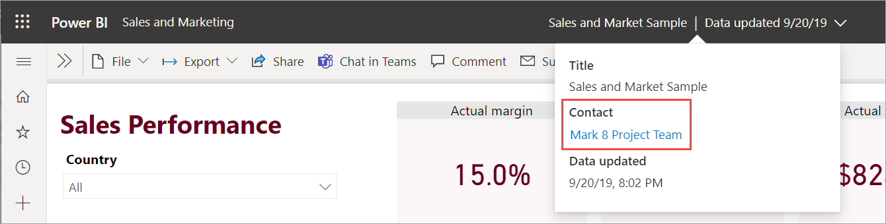
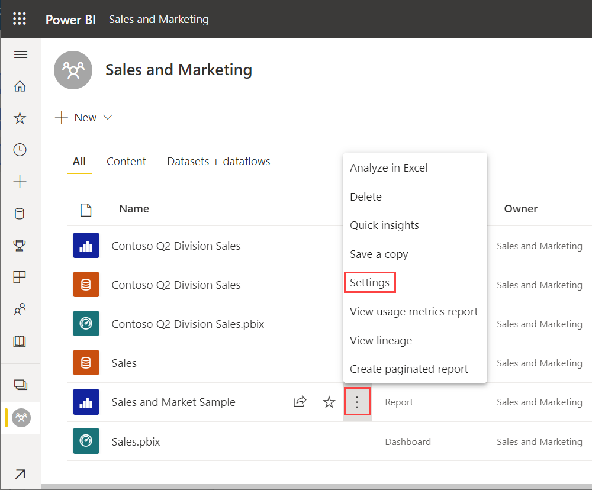
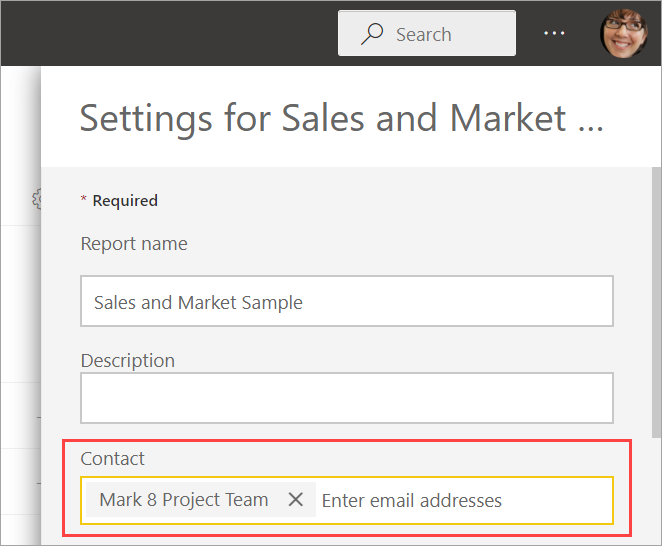

# Set contact information for reports and dashboards in the Power BI service

This article shows how to set contact information for a dashboard or report in the Power BI service. You can set contact information for items in a classic or new workspace, but not for items in your My Workspace. The contact information is in the card you see when you select the name of a report or dashboard in the black header bar.

You can add multiple users or groups to the contact for an item. They can be:
* A person
* A Microsoft 365 group
* An email enabled security group
* A distribution list

However, we recommend adding just one person or group. See the [Considerations and limitations](#considerations-and-limitations) section in the article for details. 

The contact list information is also used in other places. For example, it is shown in some error scenarios in the error dialog box. Automated email messages related to the item, like access requests, are sent to the contact list. 

## Send email to the contact for a report or dashboard

To see the report or dashboard contact information, select the item name in the black header bar at the top. 

 

When you select the contact, Power BI creates an email so you can ask questions or get help. 

 

## Set contact information for a report or dashboard

By default the person who creates a report or dashboard is the contact for it. If you set a value, it overrides that default. You can of course remove all the people or groups from the contact list. When you do this, for classic workspaces, the Microsoft 365 group for the workspace will be shown. For new workspaces, the [workspace contact list](../collaborate-share/service-create-the-new-workspaces.md#create-a-contact-list) is shown. If the workspace contact list isn't set, then workspace admins are shown.

1. In a workspace, select the **All** tab.
2. Locate the desired item, select **More options (...)** > **Settings**.

     

3. Locate the **Contact** input field and set a value.

     

## Considerations and limitations

* You can set any user or group in the contact list, but they're not automatically granted permission to the item. Use sharing or give users who need it access to the workspace through a role. 
* The report or dashboard contact information doesn’t get pushed into apps when you [publish an app](../collaborate-share/service-create-distribute-apps.md). By default, the contact name for dashboards and reports in an app is the workspace name, which is not a mailto link. The new app navigation experience provides a support URL you configure to help manage feedback from app users.
* Why do we recommend listing only one contact? If a dashboard or report has multiple contacts, when someone opens the report header and selects the link to email the contacts, some email clients separate the names with commas instead of semicolons. The resulting email address won't work.

## Next steps

More questions? [Try the Power BI Community](https://community.powerbi.com/)
